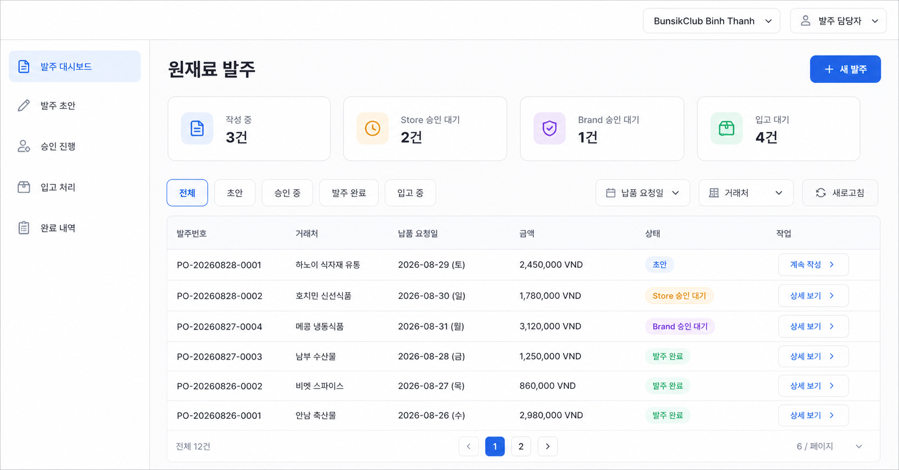
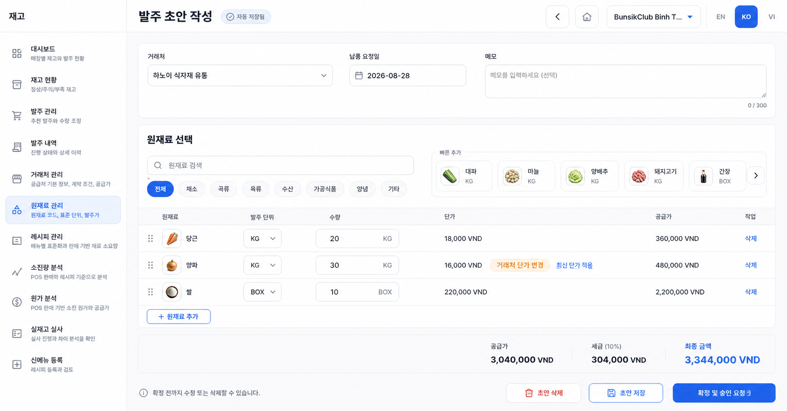
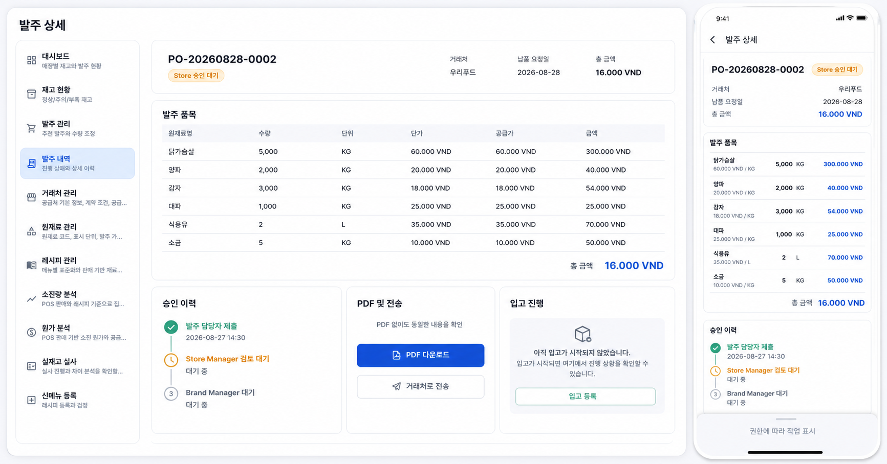
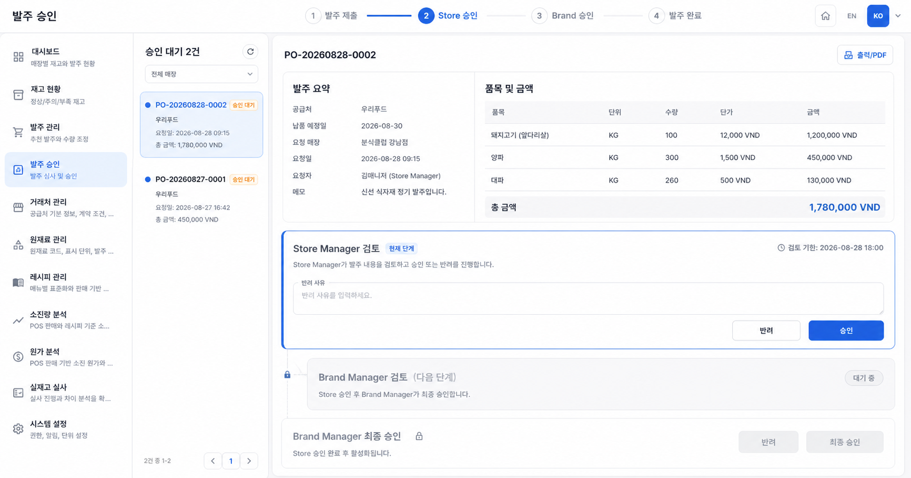
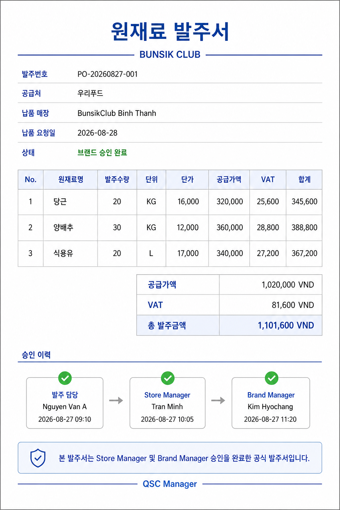
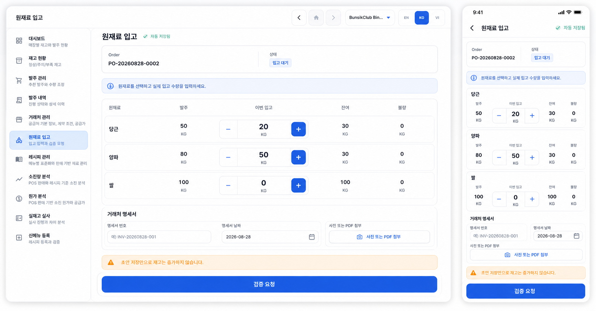
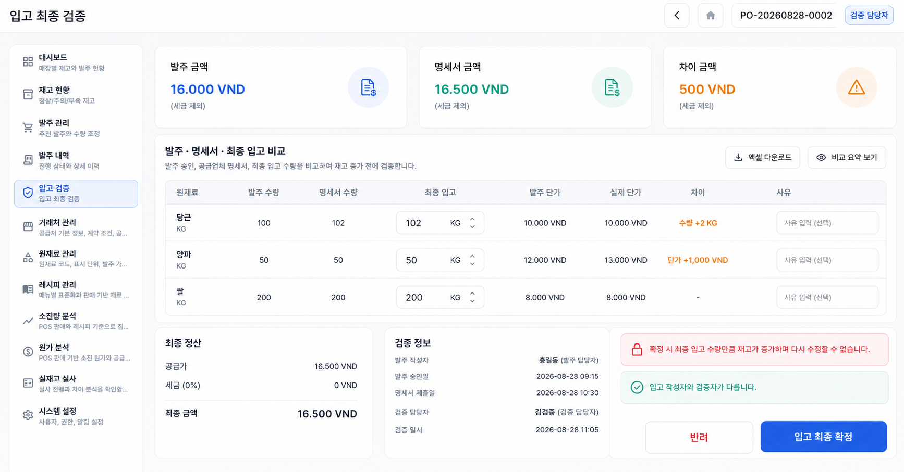
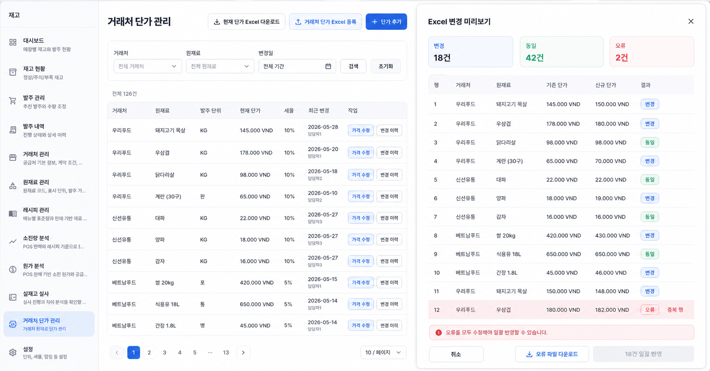

# Screen Mockups Report: Inventory Purchase Approval and Receiving

Date: 2026-08-27
Status: Implemented as the responsive `/inventory-orders` workflow in the
working tree; mockups remain the visual acceptance reference
Generation method: OpenAI built-in image generation, `ui-mockup` prompt set
Style reference: Current POS inventory purchase-history screen supplied by the
user

## Screen Coverage

| # | Screen | Primary actor | Core decision represented |
| --- | --- | --- | --- |
| 1 | Inventory orderer dashboard | Kitchen inventory orderer | Dedicated store-scoped work queue and new-order entry |
| 2 | Purchase draft editor | Kitchen inventory orderer | Editable/deletable draft, inline price awareness, submit for approval |
| 3 | Shared responsive order detail | All workflow roles | Same canonical data on web/mobile without requiring PDF |
| 4 | Sequential approval | Store/Brand Manager | Store approval must precede Brand approval |
| 5 | Approved PDF | All workflow roles | Downloadable approved artifact; email/Zalo explicitly deferred |
| 6 | Auto-created receiving draft | Physical receiver | First quantity creates/resumes draft; draft never increases stock |
| 7 | Final receipt verification | Independent verifier | Statement double-check; only final confirmation increases stock |
| 8 | Supplier prices and Excel | Purchasing / authorized manager | Quick single edit, previewed atomic bulk update, price history entry point |

## 1. Inventory Orderer Dashboard

- Separates draft, Store approval, Brand approval, ordered, and receiving work.
- Keeps the kitchen account away from the full administrator workspace.
- `새 발주`, `계속 작성`, and `상세 보기` are the primary actions.

## 2. Purchase Draft Editor

- The orderer selects ingredients and directly enters quantity and unit price.
- Edit and delete remain available only before `확정 및 승인 요청`.
- A changed supplier default is visible but never silently overwrites the draft.
- The orderer may explicitly apply the latest supplier price.

## 3. Shared Order Detail: Web and Mobile

- The orderer, Store Manager, Brand Manager, and legal-entity accounting verifier use the
  same order read model.
- Lines, totals, approval history, PDF/delivery state, and receipt progress are
  available without downloading a PDF.
- Mobile uses cards rather than hiding financial or approval information.
- Role and status determine the available action bar; a deep link never widens
  store or brand access.

## 4. Store then Brand Approval

- A stepper makes the required order explicit: submit, Store approval, Brand
  approval, supplier order.
- Store Manager can approve or return with a reason.
- Brand Manager actions remain locked until Store approval completes.
- Brand approval freezes the official purchase-order snapshot.

## 5. Approved PDF

- PDF becomes available after final approval and includes both approval records.
- Brand approval changes the operational state directly to `ordered`.
- Email and Zalo delivery are not part of the current release and will be added
  later as separate integrations.

## 6. Auto-created Receiving Draft: Web and Mobile

- There is no separate `입고 초안 생성` button.
- Entering the first valid ingredient quantity creates or resumes the open draft
  and later edits auto-save.
- Statement number/date and photo/PDF evidence can be attached in the same flow.
- The warning clearly states that draft saving does not increase inventory.

## 7. Final Receipt Verification

- Compares approved quantity/price, supplier statement, and final accepted
  quantity/actual price on one screen.
- Quantity and price discrepancies are highlighted and require a reason.
- The system checks that the draft recorder and verifier are different people.
- Only `입고 최종 확정` atomically increases stock and freezes the payable
  basis; confirmation is irreversible without an audited adjustment.

## 8. Supplier Price and Excel Management

- `가격 수정` provides a prominent single-item edit path.
- The dedicated price workbook is separate from the full ingredient-master
  workbook.
- Import preview separates changed, unchanged, and error rows.
- Bulk apply stays disabled until every error is fixed, then applies atomically.
- `변경 이력` is the entry point for effective-dated price audit records.

## Prompt Set Summary

All eight prompts requested production-oriented Flutter web/mobile POS mockups,
using the supplied screen only as a style reference. Shared constraints were:

- bright white and cool-gray enterprise UI with rounded cards;
- restrained royal-blue primary actions and mint/amber status colors;
- Korean-first readable typography and realistic VND data;
- no logo, watermark, decorative illustration, or speculative functionality;
- PDF treated as an approved export artifact, not the primary review surface;
- no inventory increase during receipt draft entry;
- explicit sequential Store then Brand approval;
- explicit preview before Excel price changes are applied.

The screen-specific primary prompts were: orderer dashboard, editable order
draft, shared responsive order detail, sequential approval, approved PDF and
dispatch, quantity-triggered receipt draft, independent final receipt
verification, and supplier-price/Excel management.

## Review Notes

- These images validate information architecture and interaction priority. They
  are not pixel-accurate implementation specifications.
- Final copy must use the repository's Korean/English/Vietnamese localization
  resources rather than text embedded in these bitmap mockups.
- Final implementation must reuse existing POS components and verify responsive
  behavior with widget/visual tests.
