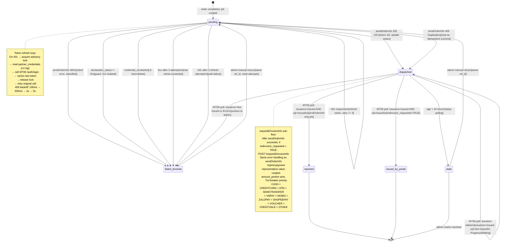
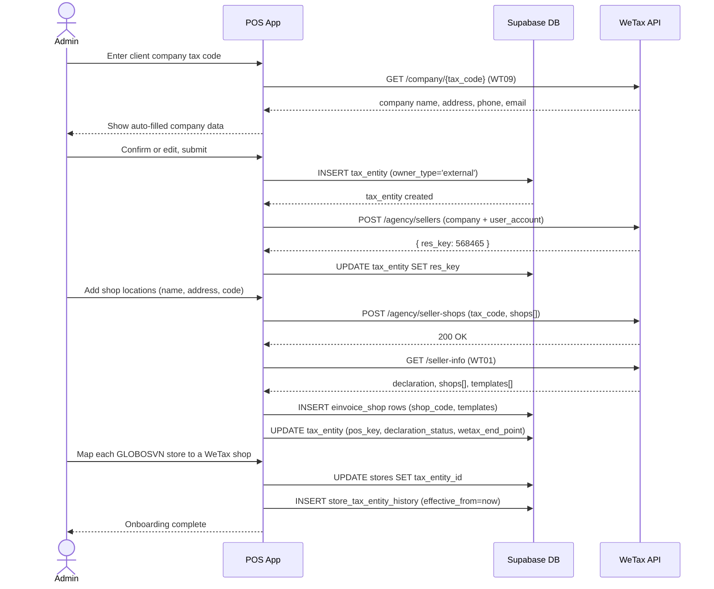
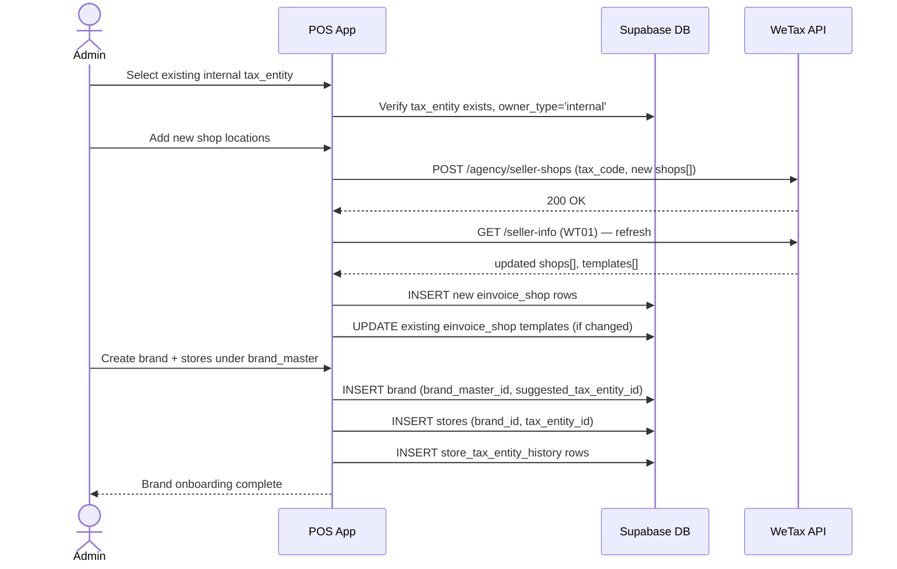
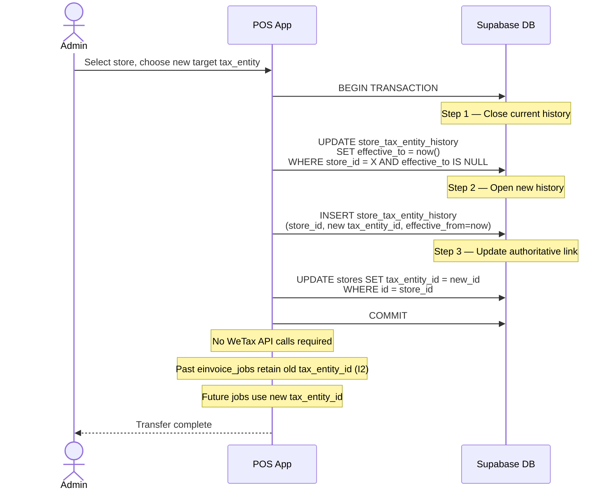
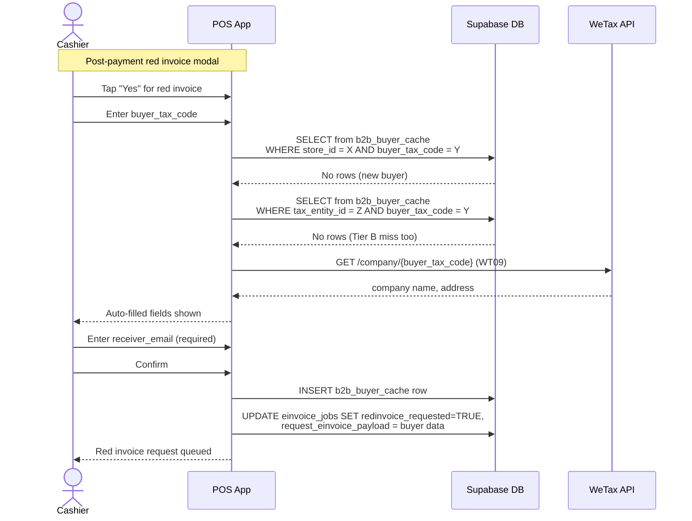
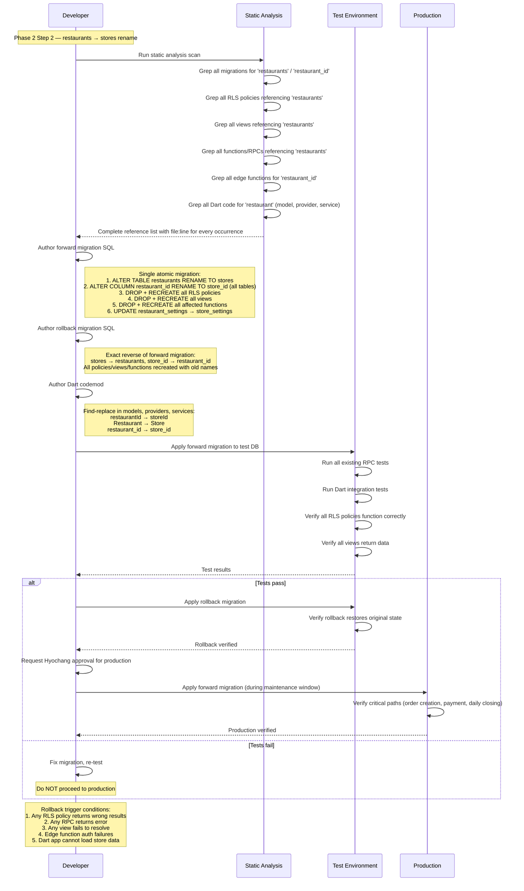

# Phase 1 — Architecture Design

> This document is the architectural blueprint for Stage 1. It contains **no SQL, no TypeScript, no Dart**. All implementation belongs to Phase 2. References to the scope document use "see scope Section X.Y" format.

---

## 1. Domain ERD

The ERD covers all Stage 1 entities: 10 new tables, 5 modified tables, and relevant existing tables. Entities are grouped into three visual clusters: organizational hierarchy (operational axis), tax/einvoice domain (tax axis), and order/payment domain (crossing).

```mermaid
erDiagram
    %% ── Organizational hierarchy (operational axis) ──

    hq ||--o{ brand_master : "owns"
    brand_master ||--o{ brand : "groups"
    brand ||--o{ store : "operates"

    %% ── Tax axis ──

    tax_entity ||--o{ einvoice_shop : "registers"
    tax_entity ||--o{ store_tax_entity_history : "tracked in"
    store ||--o{ store_tax_entity_history : "tracked in"

    %% ── Dual-axis anchor ──

    store }o--|| tax_entity : "reports to (current)"

    %% ── Credential domain ──

    partner_credentials ||--o{ partner_credential_access_log : "audited by"

    %% ── Einvoice domain ──

    einvoice_jobs }o--|| orders : "dispatches for"
    einvoice_jobs }o--|| tax_entity : "snapshot at creation"
    einvoice_jobs }o--|| einvoice_shop : "snapshot at creation"
    einvoice_jobs ||--o{ einvoice_events : "audit trail"

    %% ── Order/payment domain (crossing) ──

    store ||--o{ orders : "placed at"
    orders ||--o{ order_items : "contains"
    orders ||--o{ payments : "settled by (1:N)"
    order_items }o--|| menu_items : "sourced from"

    %% ── B2B cache ──

    b2b_buyer_cache }o--|| store : "scoped to"
    b2b_buyer_cache }o--|| tax_entity : "cross-lookup via"

    %% ── Supporting ──

    brand }o--o| tax_entity : "suggested default"
    store ||--o{ menu_items : "offers"
    store ||--o{ daily_closings : "reconciles"

    %% ── Entity definitions ──

    hq {
        uuid id PK
        text name
        timestamptz created_at
    }

    brand_master {
        uuid id PK
        uuid hq_id FK
        text type "internal | external"
        text name
        timestamptz created_at
    }

    brand {
        uuid id PK
        uuid brand_master_id FK
        text code UK
        text name
        text logo_url
        uuid suggested_tax_entity_id FK "nullable, UI default"
        timestamptz created_at
    }

    store {
        uuid id PK
        uuid brand_id FK
        uuid tax_entity_id FK "NOT NULL, authoritative tax anchor"
        text name
        text address
        text slug
        text operation_mode
        text store_type "direct | external"
        boolean is_active
        timestamptz created_at
    }

    tax_entity {
        uuid id PK
        text tax_code UK
        text owner_type "internal | external"
        text einvoice_provider "wetax"
        text pos_key "from WT01"
        text declaration_status "gates dispatch, must be 5"
        text wetax_end_point "for lookup_url"
        text data_source "VNPT_EPAY"
        text res_key "from agency/sellers response"
        timestamptz created_at
    }

    einvoice_shop {
        uuid id PK
        uuid tax_entity_id FK
        text provider_shop_code "from WT01"
        text shop_name
        jsonb templates "array of form_no, serial_no, status_code"
        timestamptz created_at
    }

    store_tax_entity_history {
        uuid id PK
        uuid store_id FK
        uuid tax_entity_id FK
        timestamptz effective_from
        timestamptz effective_to "NULL = current"
        text reason "sale, restructure, etc"
    }

    partner_credentials {
        uuid id PK
        text data_source "VNPT_EPAY"
        text auth_mode "password_jwt | api_key"
        text user_id "plaintext login ID"
        bytea password_aes_encrypted "vendor AES256 ciphertext"
        bytea password_envelope_dek "DEK-encrypted plaintext"
        integer kek_version
        text api_key_encrypted "nullable, future"
        timestamptz last_verified_at
        timestamptz created_at
    }

    partner_credential_access_log {
        uuid id PK
        uuid credential_id FK
        text accessor_role "e.g. wetax-dispatcher"
        text operation "decrypt | token_refresh"
        text ip_address
        timestamptz accessed_at
    }

    einvoice_jobs {
        uuid ref_id PK "UUIDv7, immutable"
        uuid order_id FK
        uuid tax_entity_id FK "snapshot"
        uuid einvoice_shop_id FK "snapshot"
        boolean redinvoice_requested
        text status "pending|dispatched|reported|issued_by_portal|failed_terminal|stale"
        jsonb send_order_payload "immutable snapshot"
        jsonb request_einvoice_payload "nullable"
        text sid "from sendOrderInfo response"
        text cqt_report_status "from WT06"
        text issuance_status "from WT06"
        text lookup_url "from WT06"
        text cqt_code "from WT06"
        text error_classification
        text error_message
        integer dispatch_attempts
        timestamptz last_dispatch_at
        timestamptz polling_next_at
        timestamptz created_at
    }

    einvoice_events {
        uuid id PK
        uuid job_ref_id FK
        text event_type "dispatch_attempt|poll_result|status_change|retry|manual_retry"
        text old_status
        text new_status
        jsonb details "request/response snapshots, error info"
        timestamptz created_at
    }

    orders {
        uuid id PK
        uuid store_id FK
        uuid table_id FK
        text sales_channel "dine_in|takeaway|delivery"
        text status "pending|confirmed|serving|completed|cancelled"
        integer guest_count
        uuid created_by FK
        text notes
        timestamptz created_at
        timestamptz updated_at
    }

    order_items {
        uuid id PK
        uuid store_id FK
        uuid order_id FK
        uuid menu_item_id FK
        text item_type "standard|buffet_base|a_la_carte"
        text label
        numeric unit_price
        integer quantity
        text status "pending|preparing|ready|served|cancelled"
        numeric vat_rate "snapshot at order creation, immutable (I11)"
        numeric vat_amount "snapshot, immutable"
        numeric total_amount_ex_tax "snapshot, immutable"
        numeric paying_amount_inc_tax "snapshot, immutable"
        text notes
        timestamptz created_at
    }

    payments {
        uuid id PK
        uuid store_id FK
        uuid order_id FK "no longer UNIQUE — 1:N"
        numeric amount
        text method "CASH|CREDITCARD|ATM|MOMO|ZALOPAY|VNPAY|SHOPEEPAY|BANKTRANSFER|VOUCHER|CREDITSALE|OTHER"
        numeric amount_portion "portion of order total"
        boolean is_revenue
        uuid processed_by FK
        text proof_photo_url
        timestamptz proof_photo_taken_at
        uuid proof_photo_by FK
        boolean proof_required
        text settlement_status "pending|matched|disputed"
        uuid settlement_batch_id
        text notes
        timestamptz created_at
    }

    menu_items {
        uuid id PK
        uuid store_id FK
        uuid category_id FK
        text name
        text description
        numeric price
        text vat_category "food | alcohol"
        boolean is_available
        boolean is_visible_public
        integer sort_order
        timestamptz created_at
        timestamptz updated_at
    }

    b2b_buyer_cache {
        uuid store_id PK_FK
        text buyer_tax_code PK
        text tax_id "same as buyer_tax_code, field alignment"
        text tax_company_name
        text tax_address
        text tax_buyer_name
        text receiver_email "NOT NULL"
        text receiver_email_cc
        timestamptz first_used_at
        timestamptz last_used_at
        integer use_count
        integer email_bounce_count
        timestamptz last_verified_at
        uuid tax_entity_id FK "denormalized for Tier B lookup"
    }

    wetax_reference_values {
        text category PK "payment-methods|tax-rates|currency"
        text code PK
        text description
        timestamptz fetched_at
    }

    daily_closings {
        uuid id PK
        uuid store_id FK
        date closing_date
        uuid closed_by FK
        integer orders_total
        integer orders_completed
        integer orders_cancelled
        numeric payments_total
        numeric payments_cash
        numeric payments_card
        numeric payments_pay
        text notes
        timestamptz created_at
    }
```

### ERD notes

- **Dual-axis anchors:** `store.tax_entity_id` is the crossing point. Operational queries resolve through `brand → store`; tax queries resolve through `tax_entity → store`.
- **Snapshot FKs on einvoice_jobs:** `tax_entity_id` and `einvoice_shop_id` are captured at job creation time and never updated, preserving invariant I2.
- **payments 1:N:** The former `UNIQUE(order_id)` constraint is removed. `SUM(amount_portion) = orders.total_amount` is enforced by invariant I12.
- **Existing tables not shown:** `users`, `tables`, `menu_categories`, `attendance_logs`, `inventory_*`, `qc_*`, `fingerprint_templates`, `staff_wage_configs`, `payroll_records`, `restaurant_settings` (→ `store_settings`), `external_sales`, `audit_logs` — these are unchanged in Stage 1 and connect via `store_id`.

---

## 2. Dual-Axis RLS Plan

### 2.1 Axis definitions

| Axis | Scope | JWT claim | Helper function |
|------|-------|-----------|-----------------|
| **Operational** | hq → brand_master → brand → store | `accessible_store_ids uuid[]` | `user_accessible_stores(uid)` |
| **Tax** | tax_entity → einvoice_shop | `accessible_tax_entity_ids uuid[]` | `user_accessible_tax_entities(uid)` |

### 2.2 Per-table RLS matrix

| Table | Axis | Read policy | Write policy | JWT claims used |
|-------|------|-------------|--------------|-----------------|
| **hq** | None (super_admin only) | `is_super_admin()` | `is_super_admin()` | role |
| **brand_master** | Operational | `is_super_admin() OR EXISTS(SELECT 1 FROM brands b JOIN stores s ON s.brand_id = b.id WHERE b.brand_master_id = brand_master.id AND s.id = ANY(jwt_accessible_store_ids()))` | `is_super_admin()` | `accessible_store_ids` |
| **brand** | Operational | `is_super_admin() OR EXISTS(SELECT 1 FROM stores s WHERE s.brand_id = brand.id AND s.id = ANY(jwt_accessible_store_ids()))` | `is_super_admin()` | `accessible_store_ids` |
| **store** | Both (OR) | `is_super_admin() OR id = ANY(jwt_accessible_store_ids()) OR tax_entity_id = ANY(jwt_accessible_tax_entity_ids())` | `is_super_admin() OR (id = ANY(jwt_accessible_store_ids()) AND jwt_role() IN ('admin'))` | `accessible_store_ids`, `accessible_tax_entity_ids` |
| **tax_entity** | Tax | `is_super_admin() OR id = ANY(jwt_accessible_tax_entity_ids())` | `is_super_admin()` | `accessible_tax_entity_ids` |
| **einvoice_shop** | Tax | `is_super_admin() OR tax_entity_id = ANY(jwt_accessible_tax_entity_ids())` | `is_super_admin()` | `accessible_tax_entity_ids` |
| **store_tax_entity_history** | Both (OR) | `is_super_admin() OR store_id = ANY(jwt_accessible_store_ids()) OR tax_entity_id = ANY(jwt_accessible_tax_entity_ids())` | `is_super_admin()` (append via RPC only) | both |
| **partner_credentials** | **Isolated** | DENY ALL (only `wetax_dispatcher` Postgres role) | `is_super_admin()` (initial setup only) | none — role-based |
| **partner_credential_access_log** | **Isolated** | `is_super_admin()` (audit read only) | DENY ALL (only `wetax_dispatcher` role INSERTs) | role |
| **einvoice_jobs** | Both (OR) | `is_super_admin() OR store_id_from_order(order_id) = ANY(jwt_accessible_store_ids()) OR tax_entity_id = ANY(jwt_accessible_tax_entity_ids())` | Service role / dispatcher only (INSERT via RPC, UPDATE via dispatcher) | both |
| **einvoice_events** | Tax | `is_super_admin() OR job_ref_id IN (SELECT ref_id FROM einvoice_jobs WHERE tax_entity_id = ANY(jwt_accessible_tax_entity_ids()))` | DENY ALL (only dispatcher INSERTs) | `accessible_tax_entity_ids` |
| **orders** | Operational | `is_super_admin() OR store_id = ANY(jwt_accessible_store_ids())` | `is_super_admin() OR (store_id = ANY(jwt_accessible_store_ids()) AND jwt_role() IN ('admin','cashier','waiter'))` | `accessible_store_ids` |
| **order_items** | Operational | `is_super_admin() OR store_id = ANY(jwt_accessible_store_ids())` | same as orders | `accessible_store_ids` |
| **payments** | Operational | `is_super_admin() OR store_id = ANY(jwt_accessible_store_ids())` | `is_super_admin() OR (store_id = ANY(jwt_accessible_store_ids()) AND jwt_role() IN ('admin','cashier'))` | `accessible_store_ids` |
| **menu_items** | Operational | `is_super_admin() OR store_id = ANY(jwt_accessible_store_ids())` | `is_super_admin() OR (store_id = ANY(jwt_accessible_store_ids()) AND jwt_role() IN ('admin'))` | `accessible_store_ids` |
| **b2b_buyer_cache** | Both (OR) | `is_super_admin() OR store_id = ANY(jwt_accessible_store_ids()) OR tax_entity_id = ANY(jwt_accessible_tax_entity_ids())` | `store_id = ANY(jwt_accessible_store_ids())` | both |
| **wetax_reference_values** | None | All authenticated users (read-only cache) | Service role only (background sync) | none |
| **daily_closings** | Operational | `is_super_admin() OR store_id = ANY(jwt_accessible_store_ids())` | SECURITY DEFINER RPC only | `accessible_store_ids` |
| **users** | Operational | `is_super_admin() OR store_id = ANY(jwt_accessible_store_ids())` | varies by role | `accessible_store_ids` |
| **tables** | Operational | `is_super_admin() OR store_id = ANY(jwt_accessible_store_ids())` | admin only, store-scoped | `accessible_store_ids` |
| **menu_categories** | Operational | `is_super_admin() OR store_id = ANY(jwt_accessible_store_ids())` | admin only, store-scoped | `accessible_store_ids` |
| **attendance_logs** | Operational | `is_super_admin() OR store_id = ANY(jwt_accessible_store_ids())` | store-scoped | `accessible_store_ids` |
| **inventory_items** | Operational | `is_super_admin() OR store_id = ANY(jwt_accessible_store_ids())` | store-scoped | `accessible_store_ids` |
| **audit_logs** | None (admin+) | `jwt_role() IN ('admin','super_admin')` | append-only via RPCs | role |
| **store_settings** | Operational | `is_super_admin() OR store_id = ANY(jwt_accessible_store_ids())` | admin only | `accessible_store_ids` |

### 2.3 RLS helper function pseudocode

```
FUNCTION jwt_accessible_store_ids() RETURNS uuid[]
  RETURN (auth.jwt() -> 'app_metadata' ->> 'accessible_store_ids')::uuid[]

FUNCTION jwt_accessible_tax_entity_ids() RETURNS uuid[]
  RETURN (auth.jwt() -> 'app_metadata' ->> 'accessible_tax_entity_ids')::uuid[]

FUNCTION jwt_role() RETURNS text
  RETURN auth.jwt() -> 'app_metadata' ->> 'role'

FUNCTION is_super_admin() RETURNS boolean
  RETURN jwt_role() = 'super_admin'
```

These are IMMUTABLE SECURITY DEFINER functions that read from the JWT, not from tables. This eliminates per-query table lookups (resolves Phase 0 concern C-03).

---

## 3. JWT Claims Design (Resolves C-03)

### 3.1 Claim shape

```json
{
  "app_metadata": {
    "role": "admin",
    "user_id": "uuid-of-public-users-row",
    "accessible_store_ids": ["uuid-store-1", "uuid-store-2"],
    "accessible_tax_entity_ids": ["uuid-tax-entity-1"],
    "hq_id": "uuid-of-hq"
  }
}
```

| Field | Type | Source | Notes |
|-------|------|--------|-------|
| `role` | string | `users.role` | Single role per user |
| `user_id` | uuid | `users.id` | Public users table PK |
| `accessible_store_ids` | uuid[] | Computed (see below) | All stores the user can access via operational axis |
| `accessible_tax_entity_ids` | uuid[] | Computed (see below) | All tax entities the user can access |
| `hq_id` | uuid | `users.hq_id` or derived | For super_admin: all access; for others: scoping |

### 3.2 Auth hook function responsibility

A Supabase auth hook function (`compute_user_claims`) runs at login time. It:

1. **Queries `users`** for `role`, `store_id` (the user's primary store assignment)
2. **Computes `accessible_store_ids`:**
   - For `super_admin`: empty array (RLS `is_super_admin()` short-circuits; no need to enumerate)
   - For `admin` / `master_admin`: all stores under brands the user can manage (query: `users.store_id` → `store.brand_id` → all stores with that `brand_id`; for master_admin: all brands under the same `brand_master`)
   - For `cashier` / `waiter` / `kitchen`: single-element array `[users.store_id]`
3. **Computes `accessible_tax_entity_ids`:**
   - For roles with tax-axis access (admin, master_admin, super_admin): `SELECT DISTINCT tax_entity_id FROM stores WHERE id = ANY(accessible_store_ids)`
   - For operational-only roles (cashier, waiter, kitchen): empty array
4. **Writes to `auth.users.raw_app_meta_data`** via `UPDATE auth.users SET raw_app_meta_data = computed_claims WHERE id = auth_uid`

### 3.3 Performance expectation

| Metric | Before (current) | After (JWT claims) |
|--------|-------------------|---------------------|
| Lookups per RLS evaluation | 1 query to `users` table per row check | 0 queries (JWT in-memory) |
| Auth hook cost at login | None | 2–3 queries (users + stores + brands), ~5ms |
| Worst case for super_admin | N/A (single check) | N/A (is_super_admin short-circuits) |

### 3.4 Refresh strategy

**Primary: logout/login.** When a user's permissions change (e.g., assigned to a new store, role change), the change is written to the `users` table. The user's JWT claims become stale but the change takes effect on next login.

**Hot refresh (recommended for admin actions):** After an admin changes a user's role or store assignment, the admin UI calls a SECURITY DEFINER RPC `refresh_user_claims(target_user_id)` which re-runs the same computation and updates `raw_app_meta_data`. The target user's next API call uses the new claims. Supabase propagates `app_metadata` changes to subsequent JWTs automatically on token refresh.

**Recommendation:** Hot refresh is the default for admin-initiated changes. Logout/login is the fallback for edge cases (e.g., store transfer affecting many users simultaneously).

### 3.5 Migration path for existing users

Existing users have no `app_metadata`. Migration strategy:

1. Deploy the auth hook function
2. Run a one-time migration script that calls `refresh_user_claims(user_id)` for every active user
3. After migration, all existing users have populated claims
4. New users get claims at account creation time (the `create_staff_user` edge function calls the hook after creating the user record)

---

## 4. Credential Security L1–L5

### 4.1 L1 — Envelope encryption

**Purpose:** Protect the WeTax master credential at rest.

**Architecture:**

```
┌─────────────────────────────────────┐
│  Supabase Vault                     │
│  ┌───────────────────────────────┐  │
│  │  KEK (AES-256-GCM key)       │  │
│  │  secret name: wetax_kek_v1   │  │
│  └───────────────────────────────┘  │
└─────────────────────────────────────┘
         │ encrypts
         ▼
┌─────────────────────────────────────┐
│  partner_credentials row            │
│  ┌───────────────────────────────┐  │
│  │  password_envelope_dek        │  │
│  │  (DEK encrypted by KEK)       │  │
│  └───────────────────────────────┘  │
│  ┌───────────────────────────────┐  │
│  │  password_aes_encrypted       │  │
│  │  (vendor AES256 ciphertext)   │  │
│  │  Sent to WT00 verbatim        │  │
│  └───────────────────────────────┘  │
│  kek_version = 1                    │
└─────────────────────────────────────┘
```

**Column layout:**

| Column | Content | Usage |
|--------|---------|-------|
| `user_id` | Plaintext login email | Low sensitivity, sent to WT00 as-is |
| `password_aes_encrypted` | Vendor-specified AES256 ciphertext of the plaintext password | Sent to WT00 verbatim for authentication. POS never decrypts this. |
| `password_envelope_dek` | DEK-encrypted copy of the plaintext password (for emergency recovery if vendor AES procedure must be re-applied) | Only accessed during KEK rotation or emergency recovery |
| `kek_version` | Integer tracking which KEK version encrypted the DEK | Enables rotation without downtime |

**DEK/KEK generation:**

1. **KEK:** Generated via `SELECT vault.create_secret('random-256-bit-key', 'wetax_kek_v1')`. Stored entirely within Supabase Vault (never leaves Vault boundary).
2. **DEK:** Randomly generated per credential row (one row in Stage 1). The DEK encrypts the plaintext password. Then the DEK itself is encrypted by the KEK and stored in `password_envelope_dek`.
3. **Rotation procedure:**
   - Generate new KEK: `vault.create_secret(new_key, 'wetax_kek_v2')`
   - Decrypt DEK with old KEK, re-encrypt DEK with new KEK
   - Update `password_envelope_dek` and `kek_version` atomically
   - Delete old KEK from Vault after verification: `vault.update_secret('wetax_kek_v1', ...)`
   - Zero old KEK material from memory immediately

### 4.2 L2 — Access path isolation

**Dedicated Postgres role:** `wetax_dispatcher`

**Privilege grants:**
- `GRANT SELECT ON partner_credentials TO wetax_dispatcher` — read only
- `GRANT INSERT ON partner_credential_access_log TO wetax_dispatcher` — write log only
- `GRANT SELECT, UPDATE ON einvoice_jobs TO wetax_dispatcher`
- `GRANT INSERT ON einvoice_events TO wetax_dispatcher`
- `GRANT USAGE ON SCHEMA vault TO wetax_dispatcher` — for KEK access

**RLS enforcement:**
- `partner_credentials` has a policy: `USING (current_setting('role') = 'wetax_dispatcher')` — only the dispatcher role can read
- Even `service_role` cannot bypass this (RLS is FORCE enabled on this table)
- `anon` and `authenticated` roles have zero grants on `partner_credentials`

### 4.3 L3 — Memory lifetime minimization

**Dispatcher's token caching strategy:**

1. On first dispatch or after token expiry: read `partner_credentials` (triggers L4 log)
2. Extract `user_id` and `password_aes_encrypted` (no decryption of envelope — the AES ciphertext is used as-is for WT00)
3. Call WT00 `/auth/login` → receive `access_token` and `expires_in`
4. Cache `access_token` in a Postgres `unlogged` table or Deno `Map` within the edge function runtime
5. Set `refresh_at = now() + expires_in - 15 minutes`
6. Zero the `password_aes_encrypted` value from the local variable immediately after the WT00 call
7. Subsequent API calls use only the cached `access_token`
8. On 401 response or `refresh_at` reached: re-read credential, repeat

**Key insight:** The dispatcher never handles the plaintext password. It only handles the vendor-encrypted ciphertext (`password_aes_encrypted`), which is already opaque. The `password_envelope_dek` is never read during normal operation.

### 4.4 L4 — Access logging

**Trigger mechanism:** Explicit INSERT in the dispatcher code, not a database trigger. Rationale: database triggers on SELECT do not exist in PostgreSQL; the log must be written by the accessing code.

**Log row schema:**

```
partner_credential_access_log (
  id             uuid PK DEFAULT gen_random_uuid(),
  credential_id  uuid NOT NULL REFERENCES partner_credentials(id),
  accessor_role  text NOT NULL,          -- 'wetax_dispatcher'
  operation      text NOT NULL,          -- 'read_for_login', 'read_for_rotation', 'token_refresh'
  context        jsonb,                  -- { function: 'wetax-dispatcher', trigger: 'pending_job', job_ref_id: '...' }
  ip_address     text,
  accessed_at    timestamptz NOT NULL DEFAULT now()
)
```

**Immutability:** RLS on this table blocks all UPDATE and DELETE. Only INSERT from `wetax_dispatcher` role.

### 4.5 L5 — Revocation

**Hard-delete procedure:**

1. Hyochang (super_admin) initiates revocation from admin UI
2. System calls a SECURITY DEFINER RPC `revoke_wetax_credential(credential_id)`
3. RPC performs: `DELETE FROM partner_credentials WHERE id = credential_id`
4. Cascade implications: no FK cascade — `einvoice_jobs` and `einvoice_events` are not FK-linked to `partner_credentials` (they only reference `tax_entity_id`)
5. After deletion, the dispatcher will fail on next credential read → all pending jobs move to `failed_terminal` with reason `credential_revoked`
6. The access log rows are NOT deleted (they are the audit trail of past access)
7. Vault KEK remains (it protects nothing after deletion, but retaining it allows audit reconstruction)

**Re-provisioning:** After revocation, a new credential row is inserted (new DEK, same or rotated KEK). All dispatchers pick up the new credential automatically on next read.

---

## 5. Dispatcher State Machine



### State definitions

| State | Meaning | Terminal? | Polling? |
|-------|---------|-----------|----------|
| `pending` | Job created, awaiting dispatch | No | No |
| `dispatched` | sendOrderInfo accepted by WeTax | No | Yes |
| `reported` | CQT report confirmed (no red invoice) | Yes | No |
| `issued_by_portal` | Red invoice issued and CQT-reported | Yes | No |
| `failed_terminal` | Unrecoverable error, needs human action | No (retryable) | No |
| `stale` | Polling timeout (>24h without resolution) | No (retryable) | No |

### Error classifications stored on failed_terminal jobs

| Classification | Trigger | Retryable? |
|----------------|---------|------------|
| `client_error` | 400 response | No (payload issue) |
| `auth_failure` | 401 after 3 refresh attempts | Yes (after credential fix) |
| `server_error` | 5xx after 3 retries | Yes |
| `network_error` | Connection timeout/refused after 3 retries | Yes |
| `declaration_not_accepted` | I10 guard failed | Yes (after tax_entity update) |
| `credential_revoked` | No credential row found | Yes (after re-provisioning) |
| `duplicate_resolved` | 409 with non-duplicate message | No |
| `issuance_error` | WT06 reports issuance failure | No (portal action needed) |

---

## 6. WT06 Polling Schedule and Batching

### 6.1 Polling interval table (from scope Section 6.5)

| Job age | Poll interval | Rationale |
|---------|---------------|-----------|
| 0–30 seconds | 10 seconds | Catch fast issuances (most complete within seconds) |
| 30s–2 minutes | 30 seconds | Allow WeTax processing time |
| 2–10 minutes | 2 minutes | Reduce load, most jobs resolved by now |
| 10–30 minutes | 10 minutes | Unusual delay, lower frequency |
| 30 min–2 hours | 30 minutes | Potential backend queue at WeTax |
| 2–24 hours | 2 hours | Long-tail, likely needs investigation |
| >24 hours | Stop polling → `stale` | Human intervention required |

### 6.2 Batch size limits

The WT06 `/pos/invoices-status` endpoint accepts an array of `ref_id` strings (see truth table Section 4). No explicit batch size limit is documented in the OpenAPI spec.

**Design decision:** Set batch size to **50 ref_ids per request**.

- **Rationale:** Conservative limit that avoids potential undocumented server-side limits. At Vietnam F&B scale (a busy store does ~200 orders/day), 50 covers the realistic maximum of concurrent `dispatched` jobs per store. If validation in Phase 2 shows the endpoint accepts larger batches, this can be increased.
- **If batch > 50:** Split into multiple sequential requests with 200ms delay between.

### 6.3 Prioritization rules

When multiple jobs are eligible for polling:

1. **Youngest jobs first** — newer jobs are more likely to resolve quickly
2. **Group by `data_source`** — all Stage 1 jobs share `VNPT_EPAY`, so this is a no-op now but future-proofs for multiple data sources
3. **Group by `tax_entity_id`** — batch ref_ids that belong to the same tax entity (they share the same token)
4. **Skip jobs whose `polling_next_at > now()`** — respect the interval schedule

### 6.4 Trigger mechanism: pg_cron

**Recommendation: pg_cron**, not edge function trigger.

| Option | Pros | Cons |
|--------|------|------|
| **pg_cron** | Runs inside the database, no cold start, reliable scheduling, can access tables directly | Limited to SQL/PL/pgSQL; cannot make HTTP calls directly |
| **Edge function on schedule** | Can make HTTP calls to WeTax directly | Cold start latency, requires external cron trigger (Supabase cron or external service) |

**Chosen approach:** Hybrid.
- **pg_cron** runs every 10 seconds: selects eligible jobs (`status = 'dispatched'` AND `polling_next_at <= now()`), groups them into batches, and calls a `net.http_post` (pg_net extension) to the `wetax-poller` edge function with the batch of ref_ids
- **`wetax-poller` edge function** receives the batch, calls WT06, and writes results back via `service_role` Supabase client
- This combines pg_cron's reliable scheduling with edge functions' ability to make external HTTP calls

**pg_cron schedule:** `SELECT cron.schedule('wetax-poll', '10 seconds', $$SELECT poll_eligible_jobs()$$)`

Note: pg_cron's minimum interval is 1 minute in standard Supabase. If 10-second granularity is needed, the `poll_eligible_jobs()` function itself batches and dispatches multiple calls within a single invocation, using `pg_net` for async HTTP. Alternatively, the edge function can self-schedule via `setTimeout` patterns. **This is an open question — see Section 13.**

---

## 7. Onboarding Sequence Diagrams

### 7.1 New external customer onboarding (scope Section 7.1)



### 7.2 New internal brand onboarding (scope Section 7.2)



### 7.3 Store sale / tax entity transfer (scope Section 7.3)



### 7.4 First-time buyer in checkout flow (scope Section 7.4)



---

## 8. Failure Boundaries

### 8.1 External dependency failure matrix

| Failure mode | Impact on payments | Impact on einvoice_jobs | Recovery | Alert |
|---|---|---|---|---|
| **WeTax API unreachable (network)** | None (P6: payment independent) | `pending` jobs stay pending; dispatcher retries with backoff (3 attempts → `failed_terminal`) | Automatic retry; manual retry from admin dashboard | After 3 failures: admin notification |
| **WeTax 5xx** | None | Same as network — retry with exponential backoff | Automatic; escalate if persistent (>5 consecutive failures across jobs) | Threshold: 5 consecutive 5xx across any jobs within 10 minutes |
| **WeTax 401 mid-session** | None | Single-flight token refresh: acquire advisory lock → read credential (L4 log) → WT00 login → cache new token → release lock → retry original call. Max 3 refresh attempts per dispatch cycle. | Automatic | After 3 failed refreshes: `failed_terminal` with `auth_failure` classification |
| **WeTax 409 on WT00** | None | "Duplicate" 409 on sendOrderInfo → treat as success. 409 on WT00 login → backoff: 100ms → 500ms → 2s → 5s → give up. | Automatic backoff | After 5s backoff failure: log and retry on next cycle |
| **Supabase DB unreachable** | **Yes — payments blocked.** `process_payment` RPC cannot execute. | Jobs cannot be created or updated | POS shows "Database unavailable" error. No offline payment support in Stage 1 (see open question OQ-01). | Immediate — Supabase monitoring |
| **Supabase Storage unreachable** | Payment succeeds but proof photo upload fails | No impact on einvoice_jobs | Photo queued locally (device storage). Background upload worker retries every 30 seconds with exponential backoff up to 5 minutes. `payments.proof_photo_url` remains NULL until upload succeeds. | Daily reconciliation report flags payments missing proof photos |
| **Network loss at tablet** | **Blocked** — cannot reach Supabase to execute `process_payment` RPC | No job creation possible while offline | When connectivity restores, cashier retries payment. No offline payment mode in Stage 1. Proof photos queued locally. | Tablet-level connectivity indicator in UI |
| **Token expired + WeTax also down** | None | Dispatcher cannot refresh token AND cannot dispatch. Jobs stay in `pending`. On next cycle when either WeTax recovers or token cache is still valid: normal flow resumes. | Automatic — dispatcher is idempotent, retries on next cycle | Same as "WeTax unreachable" alert |
| **`process_payment` RPC failure mid-transaction** | **Full rollback.** PostgreSQL transaction guarantees atomicity. Payment INSERT, order status UPDATE, table release, inventory deduction, and einvoice_job INSERT all roll back together. | No job created (rolled back) | Cashier receives error, retries payment. No partial state possible. | RPC error logged to `audit_logs` (if the log INSERT itself is outside the transaction; otherwise also rolled back — recommend a separate error log table or Supabase edge function error reporting) |

### 8.2 Cascade failure scenario

**Worst case: Supabase DB down during peak service.**

- Payments cannot be processed (blocking)
- Orders can be viewed from client cache but not created
- No einvoice_jobs created
- When DB recovers: all pending customer payments are processed normally; dispatcher picks up new jobs

**Mitigation (Stage 1):** Accept the limitation. DB availability is Supabase's responsibility. The POS is a connected application; offline mode is deferred to a future stage.

**Worst case: WeTax down for 24+ hours.**

- All payments succeed normally (P6)
- `pending` jobs accumulate, dispatcher retries periodically
- After 3 failed attempts per job: `failed_terminal`
- Admin dashboard shows growing list of failed jobs
- When WeTax recovers: admin triggers bulk manual retry
- Legal compliance: Vietnamese law requires reporting within the business day; extended WeTax outage may require manual reporting to tax authority (outside POS scope)

---

## 9. Edge Function Inventory

### 9.1 wetax-dispatcher

| Property | Value |
|----------|-------|
| **Name** | `wetax-dispatcher` |
| **Responsibility** | Dispatch `pending` einvoice_jobs: call sendOrderInfo, optionally requestEinvoiceInfo, handle responses, manage token lifecycle |
| **Trigger** | pg_cron every 1 minute → calls this function. Also callable on-demand from admin "Retry" button. |
| **Postgres role** | `wetax_dispatcher` (dedicated, L2 isolation) |
| **Tables read** | `einvoice_jobs` (pending jobs), `partner_credentials` (token/credential), `tax_entity` (declaration_status check), `einvoice_shop` (template selection), `stores` (store_code), `payments` (representative method selection) |
| **Tables write** | `einvoice_jobs` (status, sid, attempts), `einvoice_events` (audit), `partner_credential_access_log` (L4) |
| **External APIs** | `POST /auth/login` (WT00), `POST /pos/sendOrderInfo`, `POST /pos/requestEinvoiceInfo` |
| **Retry/idempotency** | Same `ref_id` on retry (I8). 409 Duplicate = success. Exponential backoff: 1s → 4s → 16s (3 attempts). |
| **Logging** | Every dispatch attempt → `einvoice_events` row. Token refresh → `partner_credential_access_log` row. Edge function logs to Supabase dashboard. |

### 9.2 wetax-poller

| Property | Value |
|----------|-------|
| **Name** | `wetax-poller` |
| **Responsibility** | Batch-poll WT06 for `dispatched` jobs, update job status based on response |
| **Trigger** | pg_cron via `pg_net` call (see Section 6.4). Every 10 seconds (or 1 minute with internal batching). |
| **Postgres role** | `wetax_dispatcher` (shares role for token access) |
| **Tables read** | `einvoice_jobs` (dispatched jobs, polling_next_at), `partner_credentials` (token) |
| **Tables write** | `einvoice_jobs` (cqt_report_status, issuance_status, lookup_url, cqt_code, status, polling_next_at), `einvoice_events` |
| **External APIs** | `POST /pos/invoices-status` (WT06), `POST /auth/login` (WT00, if token expired) |
| **Retry/idempotency** | Polling is inherently idempotent — same ref_ids return same status. If WT06 fails, jobs retain current state and are re-polled next cycle. |
| **Logging** | Each poll batch → single `einvoice_events` row per job with status change. |

### 9.3 wetax-onboarding

| Property | Value |
|----------|-------|
| **Name** | `wetax-onboarding` |
| **Responsibility** | Handle onboarding API calls: agency/sellers, agency/seller-shops, seller-info (WT01), company lookup (WT09) |
| **Trigger** | On-demand from admin UI (HTTP call) |
| **Postgres role** | `service_role` (onboarding is admin-initiated, not automated) |
| **Tables read** | `tax_entity`, `einvoice_shop`, `partner_credentials` (for auth token) |
| **Tables write** | `tax_entity` (res_key, declaration_status, pos_key, wetax_end_point), `einvoice_shop` (new rows, template updates), `partner_credential_access_log` |
| **External APIs** | `POST /agency/sellers`, `POST /agency/seller-shops`, `GET /seller-info` (WT01), `GET /company/{tax_code}` (WT09), `POST /auth/login` (WT00) |
| **Retry/idempotency** | Agency/sellers may 409 if seller already exists — treat as success and proceed to seller-shops. WT01 is a read — naturally idempotent. |
| **Logging** | Onboarding steps logged to `audit_logs`. |

### 9.4 wetax-daily-close

| Property | Value |
|----------|-------|
| **Name** | `wetax-daily-close` |
| **Responsibility** | Call WT08 `/pos/shops/inform-closing-store` with day's order count per store |
| **Trigger** | pg_cron at configured closing time per store (default: 23:00 ICT) |
| **Postgres role** | `wetax_dispatcher` |
| **Tables read** | `stores` (active stores), `einvoice_shop` (store_code), `orders` (count for the day), `partner_credentials` (token), `daily_closings` |
| **Tables write** | `einvoice_events` (log the WT08 call), `daily_closings` (update with WT08 result if discrepancy reported) |
| **External APIs** | `POST /pos/shops/inform-closing-store` (WT08), `POST /auth/login` (WT00 if needed) |
| **Retry/idempotency** | WT08 with same `closing_date` + `store_code` is naturally idempotent (same count for same day). Retry on failure up to 3 times. |
| **Logging** | Each WT08 call → `einvoice_events` row. |

### 9.5 Existing functions requiring modification

| Function | Current | Change |
|----------|---------|--------|
| `create_staff_user` | Creates auth.users + public.users | Add: call `refresh_user_claims()` after user creation to populate JWT claims |
| `generate_delivery_settlement` | Biweekly settlement | No change for Stage 1 (C-04: identify canonical function and deprecate duplicate in Phase 2 Step 3) |

### 9.6 wetax-reference-sync (new, low-priority)

| Property | Value |
|----------|-------|
| **Name** | `wetax-reference-sync` |
| **Responsibility** | Refresh `wetax_reference_values` cache from commons/* endpoints |
| **Trigger** | pg_cron weekly (Sunday 03:00 ICT) |
| **Postgres role** | `service_role` |
| **Tables write** | `wetax_reference_values` (UPSERT) |
| **External APIs** | `GET /commons/payment-methods`, `GET /commons/tax-rates`, `GET /commons/currency` |

---

## 10. UI Component Tree

### 10.1 Checkout flow (scope Section 8.1)

```
CheckoutScreen
├── OrderSummaryPanel
│   ├── OrderItemsList
│   │   └── OrderItemRow (label, qty, unit_price, vat_rate badge, line_total)
│   ├── OrderTotalsSection
│   │   ├── SubtotalExTax
│   │   ├── VatBreakdown (grouped by rate: 8% food, 10% alcohol)
│   │   └── GrandTotalIncTax
│   └── PaymentMethodSelector
│       ├── MethodChip (CASH, CREDITCARD, ATM, MOMO, etc.)
│       ├── HybridPaymentToggle → HybridPaymentSplitForm
│       │   └── PaymentSplitRow[] (method, amount_portion)
│       └── ProofRequiredIndicator (shows camera icon for non-cash)
├── PayButton (single primary action)
│   └── onPressed → processPayment RPC
└── PostPaymentRedInvoiceModal (appears after successful payment)
    ├── PromptText ("Does the customer need a red invoice?")
    ├── NoButton (default focus, dismisses modal)
    └── YesButton → navigates to RedInvoiceRequestForm
```

### 10.2 Red invoice request flow (scope Section 8.2)

```
RedInvoiceRequestForm
├── BuyerTaxCodeInput
│   ├── AutocompleteDropdown
│   │   ├── Tier A results (current store's b2b_buyer_cache)
│   │   └── Tier B results (same tax_entity, other stores)
│   └── onNewTaxCode → WT09BackgroundLookup
├── AutoFilledFields (read-only until edited)
│   ├── CompanyNameField (tax_company_name)
│   ├── CompanyAddressField (tax_address)
│   └── BuyerNameField (tax_buyer_name, optional)
├── ReceiverEmailField (required, validated)
├── ReceiverEmailCcField (optional)
└── SubmitButton
    └── onPressed → INSERT/UPDATE b2b_buyer_cache
                  → UPDATE einvoice_jobs SET redinvoice_requested=TRUE
```

**Autocomplete mechanics:**
1. Cashier types tax code → debounced query (300ms)
2. Query 1: `SELECT * FROM b2b_buyer_cache WHERE store_id = current AND buyer_tax_code LIKE input%`
3. Query 2 (if Query 1 < 3 results): `SELECT * FROM b2b_buyer_cache WHERE tax_entity_id = current_tax_entity AND buyer_tax_code LIKE input% AND store_id != current`
4. Results merged, Tier A shown first with "(this store)" label, Tier B with "(other store)" label
5. On select: all fields auto-fill from cache row
6. On new code (no cache hit): fire WT09 in background, show spinner on company name field

### 10.3 Payment proof photo capture (scope Section 8.5)

```
PaymentProofCaptureModal
├── CameraPreview (device camera feed)
├── CaptureButton
│   └── onPressed → capture JPEG, compress (80%, max 1200×1600)
├── PreviewImage (shows captured photo)
├── RetakeButton
├── ConfirmButton
│   └── onPressed → queue for upload
└── OfflineIndicator (shown when no connectivity)

PaymentProofUploadWorker (background service)
├── LocalQueue (SQLite or shared_preferences)
│   └── QueueItem { payment_id, store_id, tax_entity_id, image_bytes, created_at }
├── UploadLoop
│   ├── Check connectivity
│   ├── Upload to Supabase Storage: payment-proofs/{tax_entity_id}/{store_id}/{YYYY-MM-DD}/{payment_id}.jpg
│   ├── On success: UPDATE payments SET proof_photo_url, proof_photo_taken_at
│   └── On failure: retry in 30s, backoff up to 5min
└── QueueStatusIndicator (badge showing pending uploads count)
```

### 10.4 Admin failed-jobs dashboard (scope Section 8.4)

```
FailedJobsDashboard
├── FilterBar
│   ├── DateRangePicker
│   ├── StoreDropdown
│   └── ErrorClassificationDropdown
├── FailedJobsList
│   └── FailedJobRow
│       ├── TimestampCell
│       ├── StoreNameCell
│       ├── OrderIdCell
│       ├── ErrorClassificationBadge
│       ├── ErrorMessageText (truncated, expandable)
│       └── ActionButtons
│           ├── RetryButton (disabled if classification=duplicate_resolved)
│           ├── MarkResolvedButton
│           └── OpenInPortalButton (opens lookup_url)
└── SummaryBar
    ├── TotalFailedCount
    ├── TotalStaleCount
    └── OldestUnresolvedAge
```

### 10.5 Daily reconciliation report (scope Section 8.6)

```
DailyReconciliationReport
├── DateSelector
├── StoreSelectorDropdown
├── SummaryCards
│   ├── TotalCompletedOrders
│   ├── TotalAmount (by payment method breakdown)
│   ├── MissingProofPhotosCount (warning badge if > 0)
│   └── FailedEinvoiceJobsCount (warning badge if > 0)
├── WT08ReconciliationSection
│   ├── POSOrderCount
│   ├── WT08ReportedCount
│   └── DiscrepancyAlert (if counts differ)
└── PaymentMethodBreakdownTable
    └── MethodRow (method, count, total_amount, proof_complete_pct)
```

---

## 11. Migration Sequence Diagram (Phase 2 Step 2 — Rename)

This is the most dangerous Phase 2 step: renaming `restaurants` → `stores` across the entire codebase.



### Rollback decision criteria

| Signal | Action |
|--------|--------|
| RPC errors in first 5 minutes post-deploy | Immediate rollback |
| RLS denying legitimate access | Immediate rollback |
| Edge function failures | Investigate first (may be deployment timing); rollback if persistent |
| Dart app errors (build failures) | Deploy Dart rollback; SQL rollback if Dart cannot be fixed quickly |
| No errors after 30 minutes | Rollback SQL can be archived (not deleted) |

---

## 12. VAT Calculation Logic

### 12.1 Pure function signature

```
FUNCTION derive_vat_rate(vat_category text) RETURNS numeric
  IF vat_category = 'food' THEN RETURN 8.00
  IF vat_category = 'alcohol' THEN RETURN 10.00
  RAISE EXCEPTION 'Invalid vat_category: %', vat_category
```

This is a SQL IMMUTABLE function. The mapping is:
- `food` → 8% (current Vietnamese reduced rate for food/non-alcoholic beverages)
- `alcohol` → 10% (standard rate for alcohol and beer)

### 12.2 Where the calculation happens

Inside the `process_payment` RPC (or its upstream order-creation flow), within the same transaction that creates order_items:

```
FOR EACH order_item:
  1. Look up menu_item.vat_category
  2. vat_rate = derive_vat_rate(vat_category)
  3. total_amount_ex_tax = unit_price × quantity  (prices are VAT-inclusive in Vietnam)
     — CORRECTION: Vietnamese prices are typically VAT-inclusive (giá đã bao gồm VAT)
     — Therefore: total_amount_ex_tax = (unit_price × quantity) / (1 + vat_rate/100)
     — Rounded to 2 decimal places (ROUND(..., 2))
  4. vat_amount = (unit_price × quantity) - total_amount_ex_tax
  5. paying_amount_inc_tax = unit_price × quantity  (the actual amount charged)
  6. Write vat_rate, vat_amount, total_amount_ex_tax, paying_amount_inc_tax to order_items row
```

**Important:** Vietnamese retail pricing convention is VAT-inclusive. The `menu_items.price` field stores the customer-facing price (including VAT). The calculation extracts the tax component, not adds it.

### 12.3 How order_items snapshot fields are populated

| Field | Formula | Immutable after |
|-------|---------|-----------------|
| `vat_rate` | `derive_vat_rate(menu_items.vat_category)` | Order creation |
| `paying_amount_inc_tax` | `unit_price × quantity` | Order creation |
| `total_amount_ex_tax` | `paying_amount_inc_tax / (1 + vat_rate/100)` | Order creation |
| `vat_amount` | `paying_amount_inc_tax - total_amount_ex_tax` | Order creation |

These four fields are populated during order creation (when items are added) and become immutable once the order reaches `completed` status (I11).

### 12.4 What happens when vat_category mapping changes (I11 enforcement)

Scenario: Government changes food VAT from 8% to 10%.

1. Super admin updates the `derive_vat_rate` function (single SQL `CREATE OR REPLACE`)
2. All **new** orders created after the change use the new rate
3. All **existing** order_items retain their original `vat_rate` snapshot — I11 guarantees immutability
4. Historical `sendOrderInfo` payloads (stored in `einvoice_jobs.send_order_payload`) remain consistent with the order_items they were built from
5. No retroactive recalculation occurs. Tax reports for past periods remain correct.

**Menu-level change:** If a store owner changes a menu item from `food` to `alcohol` (e.g., classifies a cocktail correctly):
- Future orders for that item use `alcohol` → 10%
- Past orders retain whatever rate was snapshotted at order creation time
- The menu_items row updates `vat_category`; no cascade to order_items

### 12.5 Test cases

| Scenario | Items | Expected VAT breakdown |
|----------|-------|------------------------|
| **Pure food order** | 2× Phở (50,000đ each, food) | paying=100,000; ex_tax=92,593 (100000/1.08); vat=7,407 at 8% |
| **Pure alcohol order** | 3× Bia Saigon (30,000đ each, alcohol) | paying=90,000; ex_tax=81,818 (90000/1.10); vat=8,182 at 10% |
| **Mixed order** | 1× Phở (50,000đ, food) + 1× Bia (30,000đ, alcohol) | food line: paying=50,000; ex_tax=46,296; vat=3,704 at 8%. alcohol line: paying=30,000; ex_tax=27,273; vat=2,727 at 10%. sendOrderInfo: list_product has 2 items, each with own vat_rate. |
| **Buffet + alcohol** | 1× Buffet base (300,000đ, food) + 1× Soju (80,000đ, alcohol) | food line at 8%, alcohol line at 10%. Two separate list_product entries. |

### 12.6 Mapping to sendOrderInfo payload

```
For each order_item → one list_product entry:
  item_code  = menu_item.id (or store-specific code if assigned)
  item_name  = order_items.label
  unit_price = order_items.unit_price
  quantity   = order_items.quantity
  uom        = "EA" (default; Vietnamese F&B uses per-item pricing)
  total_amount  = order_items.total_amount_ex_tax
  vat_rate      = order_items.vat_rate (number: 8 or 10)
  vat_amount    = order_items.vat_amount
  paying_amount = order_items.paying_amount_inc_tax
```

---

## 13. Open Questions

### RESOLVABLE IN PHASE 2 TESTING

| # | Question | Resolution path |
|---|----------|-----------------|
| OQ-01 | **Offline payment support.** The POS currently cannot process payments when Supabase is unreachable. Should Stage 1 include a local SQLite fallback for payment recording? | Scope v1.1 does not mention offline payments. Recommendation: defer to Stage 2. Note in failure boundaries (Section 8) as a known limitation. |
| OQ-02 | **pg_cron minimum interval.** Supabase's standard pg_cron supports 1-minute minimum intervals. The polling schedule in Section 6 requires 10-second granularity for young jobs. | Test in Phase 2: use pg_net within a 1-minute cron job to fire multiple batched requests. Alternative: edge function with Deno.cron or self-scheduling via setTimeout. |
| OQ-03 | **`sale_price` field semantics.** sendOrderInfo's `list_product[].sale_price` is undescribed (U-01). How does it relate to `paying_amount` and `total_amount`? | Phase 2 test: send payload with and without `sale_price`, observe behavior. If ignored, omit it. |
| OQ-04 | **WT06 response `error_message` field.** PDF documents it but OpenAPI does not (DISC-19). | Phase 2: check actual WT06 response for a failed job. |
| OQ-05 | **WT01 input parameter.** Is `tax_code` a query parameter, or derived from JWT? (DISC-26) | Phase 2: test GET /seller-info with and without `?tax_code=X`. |
| OQ-06 | **pos_number and order_id types.** number in sendOrderInfo, string in requestEinvoiceInfo (DISC-08, DISC-09). | Phase 2: test both endpoints with both types. Likely both accept either. |
| OQ-07 | **sendOrderInfo actual response shape.** OpenAPI shows generic `ApiResponse200` with `data: null`, but PDF WT03 returns `ref_id`, `sid`, `status` (DISC-14). | Phase 2: capture actual response. If `sid` is returned, store it on einvoice_jobs. |
| OQ-08 | **vat_rate format.** Number (8) or string ("8%")? (DISC-13) | Phase 2: test with numeric value. OpenAPI is authoritative. |
| OQ-09 | **`total_order_count` type for WT08.** Number or string? (DISC-23) | Phase 2: send as string (OpenAPI schema type). |
| OQ-10 | **sendOrderInfo response for `sid`.** The dispatcher needs `sid` for WT06 polling. If sendOrderInfo returns only `data: null`, how do we get the `sid`? | Phase 2: test actual response. Fallback: use `ref_id` for WT06 polling (WT06 accepts ref_ids). |

### REQUIRES HYOCHANG DECISION

| # | Question | Context | Recommendation |
|---|----------|---------|----------------|
| OQ-11 | **Price storage convention confirmation.** Are `menu_items.price` values VAT-inclusive (giá đã bao gồm VAT) as assumed in Section 12? | This affects all VAT calculations. Vietnamese F&B convention is VAT-inclusive, but the POS codebase has no documentation on this. | Assume VAT-inclusive (Vietnamese standard). If wrong, the VAT extraction formula flips to addition. Ask Hyochang to confirm. |
| OQ-12 | **Maintenance window for rename migration.** Phase 2 Step 2 (restaurants → stores) requires a maintenance window. What is acceptable downtime? | The migration touches every table, view, function, and policy. Estimate: 2–5 minutes for SQL, plus Dart deploy. | Recommend off-peak hours (e.g., 3–5 AM ICT on a weekday). |
| OQ-13 | **Daily close timing per store.** WT08 should fire at end-of-business. Is this configurable per store or a global setting? | Scope says "configured per store" but doesn't specify the configuration mechanism. | Add `closing_time` column to `stores` (or `store_settings`), default 23:00 ICT. |
| OQ-14 | **Which settlement edge function is canonical?** C-04 flags `generate-settlement` and `generate_delivery_settlement` as duplicates. | Phase 0 audit identified this. Needs explicit deprecation decision. | Keep `generate_delivery_settlement` (newer, VN timezone), deprecate `generate-settlement`. |

### REQUIRES VENDOR CLARIFICATION

| # | Question | Context | Blocks |
|---|----------|---------|--------|
| OQ-15 | **AES256 password encryption procedure.** Mode (CBC/GCM?), IV handling, key distribution. | Scope Section 11 Item 1. Hard blocker for Phase 2 credential implementation. | Phase 2 Step 4 (partner_credentials setup) |
| OQ-16 | **Partner onboarding process.** Steps for GLOBOSVN to become a registered WeTax partner, production credential provisioning. | Scope Section 11 Item 2. Blocks production deployment. | Production go-live |
| OQ-17 | **`data_source` values.** Does WeTax accept values other than `VNPT_EPAY`? | Scope Section 11 Item 3 (optional). Does not block Stage 1. | Nothing (informational) |

### Design decisions made without explicit scope guidance

| # | Decision | Rationale |
|---|----------|-----------|
| DD-01 | **WT06 batch size: 50 ref_ids.** | Conservative limit; no documented server limit. Can increase after Phase 2 testing. |
| DD-02 | **Polling trigger: pg_cron + pg_net → edge function (hybrid).** | Combines reliable scheduling with HTTP call capability. See Section 6.4. |
| DD-03 | **JWT claims in `app_metadata` (not `raw_user_meta_data`).** | `app_metadata` is server-side only, cannot be modified by client. `raw_user_meta_data` is client-writable — security risk. |
| DD-04 | **Hot refresh via `refresh_user_claims` RPC.** | Better UX than requiring logout/login after admin changes. |
| DD-05 | **`wetax_dispatcher` Postgres role shared between dispatcher and poller.** | Both need credential access and job table access. Separate roles would add complexity without security benefit (same trust boundary). |
| DD-06 | **Proof photo storage path: `payment-proofs/{tax_entity_id}/{store_id}/{YYYY-MM-DD}/{payment_id}.jpg`.** | Partitioned by tax entity and store for access control, by date for lifecycle management. |
| DD-07 | **Vietnamese prices assumed VAT-inclusive.** | Industry standard in Vietnam F&B. Flagged as OQ-11 for Hyochang confirmation. |
| DD-08 | **b2b_buyer_cache autocomplete debounce: 300ms.** | Standard UX pattern for search-as-you-type. |
| DD-09 | **Offline proof photo retry: 30s initial, backoff to 5min max.** | Aggressive enough to not lose photos, conservative enough to not drain battery. |

---

*Phase 1 complete. Awaiting Hyochang review before proceeding to Phase 2.*
