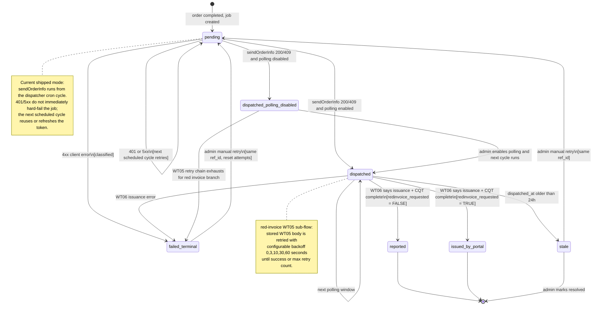
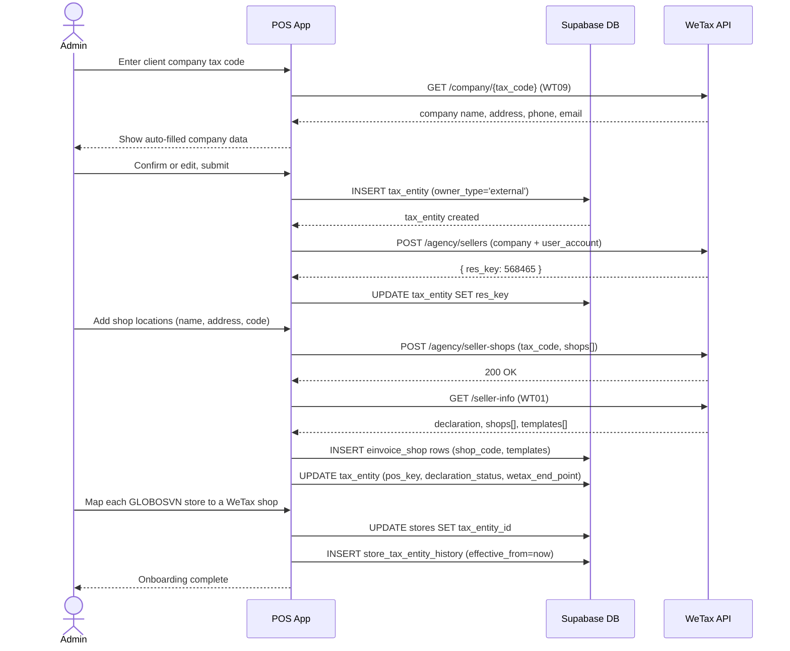
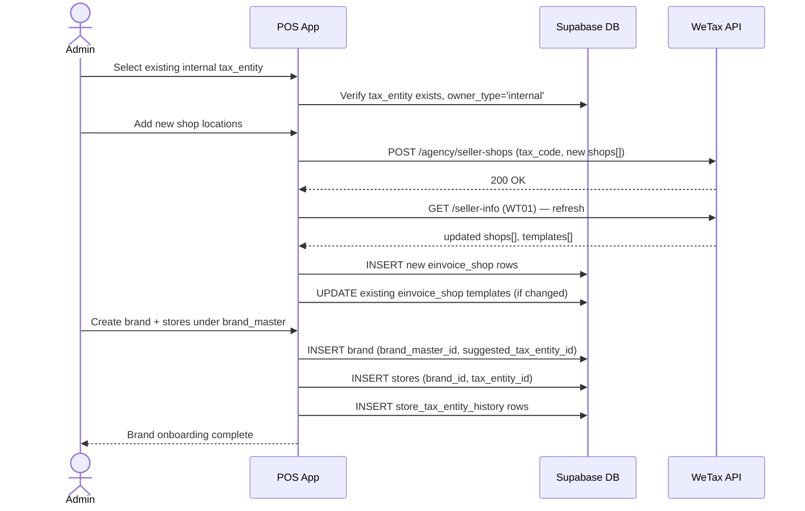
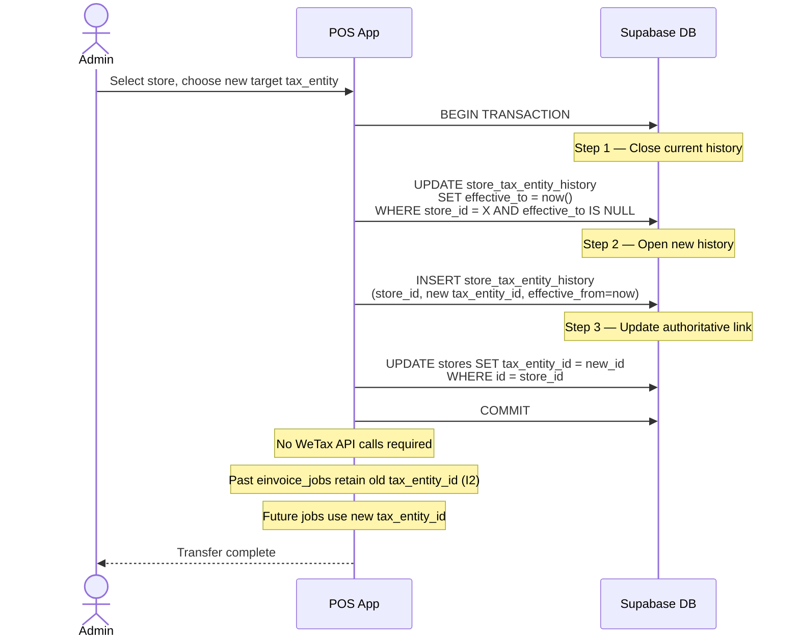
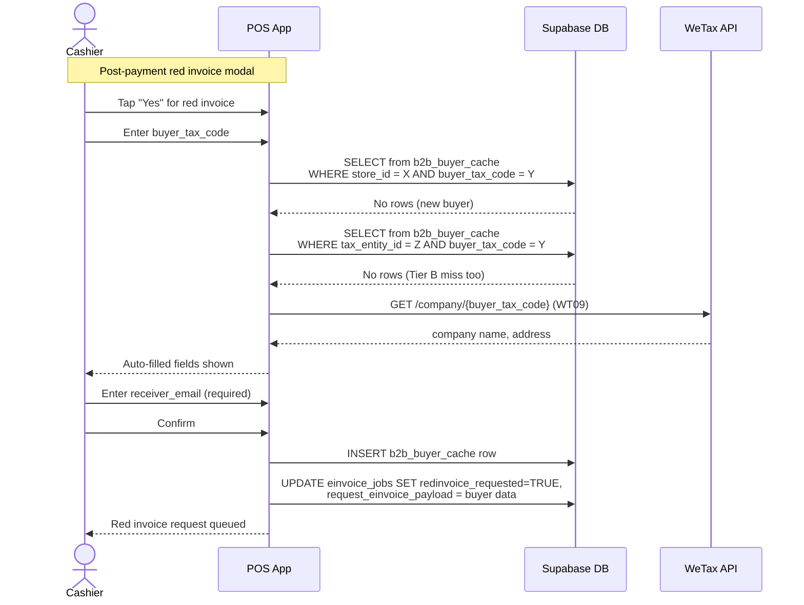
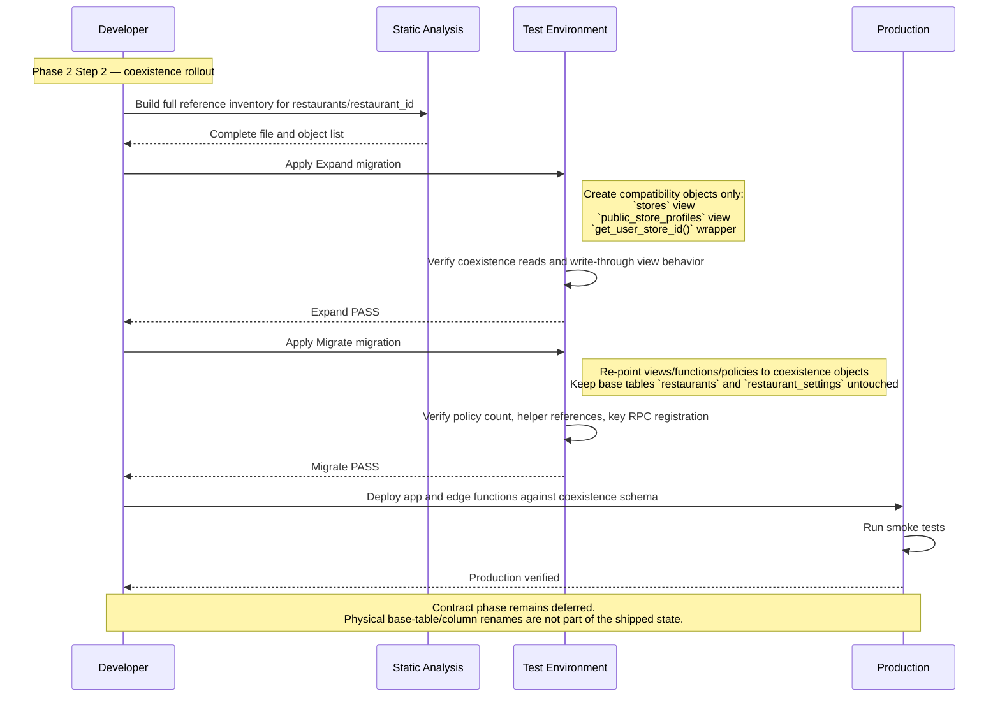

# Phase 1 — Architecture Design

> This document records the Stage 1 architecture as it exists after the Phase 2 implementation and verification passes. When earlier design intent differs from shipped behavior, the shipped behavior described here is the source of truth for the repo.

---

## 1. Domain ERD

The ERD covers all Stage 1 entities: 10 new tables, 5 modified tables, and relevant existing tables. Entities are grouped into three visual clusters: organizational hierarchy (operational axis), tax/einvoice domain (tax axis), and order/payment domain (crossing).

```mermaid
erDiagram
    %% ── Organizational hierarchy (operational axis) ──

    hq ||--o{ brand_master : "owns"
    brand_master ||--o{ brand : "groups"
    brand ||--o{ store : "operates"

    %% ── Tax axis ──

    tax_entity ||--o{ einvoice_shop : "registers"
    tax_entity ||--o{ store_tax_entity_history : "tracked in"
    store ||--o{ store_tax_entity_history : "tracked in"

    %% ── Dual-axis anchor ──

    store }o--|| tax_entity : "reports to (current)"

    %% ── Credential domain ──

    partner_credentials ||--o{ partner_credential_access_log : "audited by"

    %% ── Einvoice domain ──

    einvoice_jobs }o--|| orders : "dispatches for"
    einvoice_jobs }o--|| tax_entity : "snapshot at creation"
    einvoice_jobs }o--|| einvoice_shop : "snapshot at creation"
    einvoice_jobs ||--o{ einvoice_events : "audit trail"

    %% ── Order/payment domain (crossing) ──

    store ||--o{ orders : "placed at"
    orders ||--o{ order_items : "contains"
    orders ||--o{ payments : "settled by (1:N)"
    order_items }o--|| menu_items : "sourced from"

    %% ── B2B cache ──

    b2b_buyer_cache }o--|| store : "scoped to"
    b2b_buyer_cache }o--|| tax_entity : "cross-lookup via"

    %% ── Supporting ──

    brand }o--o| tax_entity : "suggested default"
    store ||--o{ menu_items : "offers"
    store ||--o{ daily_closings : "reconciles"

    %% ── Entity definitions ──

    hq {
        uuid id PK
        text name
        timestamptz created_at
    }

    brand_master {
        uuid id PK
        uuid hq_id FK
        text type "internal | external"
        text name
        timestamptz created_at
    }

    brand {
        uuid id PK
        uuid brand_master_id FK
        text code UK
        text name
        text logo_url
        uuid suggested_tax_entity_id FK "nullable, UI default"
        timestamptz created_at
    }

    store {
        uuid id PK
        uuid brand_id FK
        uuid tax_entity_id FK "NOT NULL, authoritative tax anchor"
        text name
        text address
        text slug
        text operation_mode
        text store_type "direct | external"
        boolean is_active
        timestamptz created_at
    }

    tax_entity {
        uuid id PK
        text tax_code UK
        text owner_type "internal | external"
        text einvoice_provider "wetax"
        text pos_key "from WT01"
        text declaration_status "gates dispatch, must be 5"
        text wetax_end_point "for lookup_url"
        text data_source "VNPT_EPAY"
        text res_key "from agency/sellers response"
        timestamptz created_at
    }

    einvoice_shop {
        uuid id PK
        uuid tax_entity_id FK
        text provider_shop_code "from WT01"
        text shop_name
        jsonb templates "array of form_no, serial_no, status_code"
        timestamptz created_at
    }

    store_tax_entity_history {
        uuid id PK
        uuid store_id FK
        uuid tax_entity_id FK
        timestamptz effective_from
        timestamptz effective_to "NULL = current"
        text reason "sale, restructure, etc"
    }

    partner_credentials {
        uuid id PK
        text data_source "VNPT_EPAY"
        text auth_mode "password_jwt | api_key"
        text user_id "plaintext login ID"
        bytea password_value "envelope-encrypted credential bytes"
        text password_format "plaintext | aes256_ciphertext"
        integer kek_version
        text current_token "nullable cached WT00 token"
        timestamptz token_expires_at "nullable cached token expiry"
        timestamptz last_verified_at
        timestamptz created_at
    }

    partner_credential_access_log {
        uuid id PK
        uuid credential_id FK
        text access_reason "token_refresh_*"
        text accessed_by_function "wetax-dispatcher | wetax-poller | wetax-onboarding | wetax-daily-close"
        boolean success
        timestamptz accessed_at
    }

    einvoice_jobs {
        uuid id PK
        text ref_id UK "UUIDv7, immutable"
        uuid order_id FK
        uuid tax_entity_id FK "snapshot"
        uuid einvoice_shop_id FK "snapshot"
        boolean redinvoice_requested
        text status "pending|dispatched|dispatched_polling_disabled|reported|issued_by_portal|failed_terminal|stale"
        jsonb send_order_payload "immutable snapshot"
        jsonb request_einvoice_payload "nullable"
        text sid "from sendOrderInfo response"
        text cqt_report_status "from WT06"
        text issuance_status "from WT06"
        text lookup_url "from WT06"
        text error_classification
        text error_message
        integer dispatch_attempts
        timestamptz last_dispatch_at
        timestamptz dispatched_at
        timestamptz polling_next_at
        integer request_einvoice_retry_count
        timestamptz request_einvoice_next_retry_at
        timestamptz created_at
    }

    einvoice_events {
        uuid id PK
        uuid job_id FK
        text event_type "send_order_attempt|poll_result|request_einvoice_attempt|status_transition|dispatcher_error"
        text description
        integer retry_count
        jsonb raw_request
        jsonb raw_response
        timestamptz created_at
    }

    orders {
        uuid id PK
        uuid store_id FK
        uuid table_id FK
        text sales_channel "dine_in|takeaway|delivery"
        text status "pending|confirmed|serving|completed|cancelled"
        integer guest_count
        uuid created_by FK
        text notes
        timestamptz created_at
        timestamptz updated_at
    }

    order_items {
        uuid id PK
        uuid store_id FK
        uuid order_id FK
        uuid menu_item_id FK
        text item_type "standard|buffet_base|a_la_carte"
        text label
        numeric unit_price
        integer quantity
        text status "pending|preparing|ready|served|cancelled"
        numeric vat_rate "snapshot at order creation, immutable (I11)"
        numeric vat_amount "snapshot, immutable"
        numeric total_amount_ex_tax "snapshot, immutable"
        numeric paying_amount_inc_tax "snapshot, immutable"
        text notes
        timestamptz created_at
    }

    payments {
        uuid id PK
        uuid store_id FK
        uuid order_id FK "no longer UNIQUE — 1:N"
        numeric amount
        text method "CASH|CREDITCARD|ATM|MOMO|ZALOPAY|VNPAY|SHOPEEPAY|BANKTRANSFER|VOUCHER|CREDITSALE|OTHER"
        numeric amount_portion "portion of order total"
        boolean is_revenue
        uuid processed_by FK
        text proof_photo_url
        timestamptz proof_photo_taken_at
        uuid proof_photo_by FK
        boolean proof_required
        text settlement_status "pending|matched|disputed"
        uuid settlement_batch_id
        text notes
        timestamptz created_at
    }

    menu_items {
        uuid id PK
        uuid store_id FK
        uuid category_id FK
        text name
        text description
        numeric price
        text vat_category "food | alcohol"
        boolean is_available
        boolean is_visible_public
        integer sort_order
        timestamptz created_at
        timestamptz updated_at
    }

    b2b_buyer_cache {
        uuid store_id PK_FK
        text buyer_tax_code PK
        text tax_id "same as buyer_tax_code, field alignment"
        text tax_company_name
        text tax_address
        text tax_buyer_name
        text receiver_email "NOT NULL"
        text receiver_email_cc
        timestamptz first_used_at
        timestamptz last_used_at
        integer use_count
        integer email_bounce_count
        timestamptz last_verified_at
        uuid tax_entity_id FK "denormalized for Tier B lookup"
    }

    wetax_reference_values {
        text category PK "payment-methods|tax-rates|currency"
        text code PK
        text description
        timestamptz fetched_at
    }

    daily_closings {
        uuid id PK
        uuid store_id FK
        date closing_date
        uuid closed_by FK
        integer orders_total
        integer orders_completed
        integer orders_cancelled
        numeric payments_total
        numeric payments_cash
        numeric payments_card
        numeric payments_pay
        text notes
        timestamptz created_at
    }
```

### ERD notes

- **Dual-axis anchors:** `store.tax_entity_id` is the crossing point. Operational queries resolve through `brand → store`; tax queries resolve through `tax_entity → store`.
- **Snapshot FKs on einvoice_jobs:** `tax_entity_id` and `einvoice_shop_id` are captured at job creation time and never updated, preserving invariant I2.
- **payments 1:N:** The former `UNIQUE(order_id)` constraint is removed. `SUM(amount_portion) = orders.total_amount` is enforced by invariant I12.
- **Existing tables not shown:** `users`, `tables`, `menu_categories`, `attendance_logs`, `inventory_*`, `qc_*`, `fingerprint_templates`, `staff_wage_configs`, `payroll_records`, `restaurant_settings` (→ `store_settings`), `external_sales`, `audit_logs` — these are unchanged in Stage 1 and connect via `store_id`.

---

## 2. Current Access Model

### 2.1 Current shipped model

Stage 1 now runs with a mixed access model:

- Existing POS tables and many legacy RPCs still use the compatibility helper path built on `users.restaurant_id` and `get_user_store_id()`.
- Multi-access schema (`users.brand_id`, `users.primary_store_id`, `user_brand_access`, `user_store_access`) and claim refresh are deployed and consumed by Flutter for active-store UX and by selected server-owned write paths.
- New multi-access write boundaries are implemented for:
  - `request_red_invoice`
  - `lookup_b2b_buyer`
  - `mark_payment_proof_required`
  - `attach_payment_proof`
  - `admin_retry_einvoice_job`
  - `admin_mark_resolved_einvoice_job`
  - `admin_update_staff_account`
- Remaining legacy RPCs continue to rely on compatibility helpers during the transition period.

### 2.2 RLS / access enforcement summary

| Surface | Current enforcement |
|---------|---------------------|
| Existing POS tables (`orders`, `payments`, `tables`, `menu_*`, `inventory_*`, `attendance_*`, `qc_*`) | Helper-based store scoping via `get_user_store_id()` compatibility path |
| WeTax Step 4 tables | RLS enabled on all 11 tables |
| `partner_credentials` | No authenticated policies; accessed by server-owned edge functions using `service_role` |
| `partner_credential_access_log` | Append-only from edge functions; read policy for super admin |
| Admin/onboarding/cashier/general order/buffet order/table-menu create/inventory/attendance/daily-closing/admin-audit/qc/store-settings/delivery-settlement-confirm surfaces migrated in contract start | Active hardened surfaces now use `p_store_id` / `store_id`; older POS RPCs still keep legacy/coexistence naming where not yet migrated |
| Flutter active store switching | Claims-driven store list + persisted `primary_store_id` / last-selected active store |

### 2.3 Transition note

The design goal remains “store is the final authorization unit,” but the repo is intentionally in coexistence mode:

- `get_user_store_id()` remains a wrapper-compatible path for legacy policies and functions.
- `custom_access_token_hook` and `refresh_user_claims()` are deployed for the newer brand/store multi-access flow.
- Harness reports for the rename rollout confirmed that compatibility helpers must stay alive during the Expand → Migrate → Contract sequence.

---

## 3. JWT Claims And Active Store

### 3.1 Current claim shape

```json
{
  "app_metadata": {
    "role": "store_admin",
    "brand_ids": ["uuid-brand-1"],
    "accessible_store_ids": ["uuid-store-1", "uuid-store-2"],
    "accessible_tax_entity_ids": ["uuid-tax-entity-1"],
    "primary_store_id": "uuid-store-1"
  }
}
```

### 3.2 Current auth hook behavior

The shipped hook is `custom_access_token_hook`, not the earlier `compute_user_claims` name. It:

1. Loads the active `public.users` row for the auth user.
2. Computes brand scope from `user_brand_access` plus fallback `users.brand_id`.
3. Computes store scope from `user_store_access` plus fallback `COALESCE(users.primary_store_id, users.restaurant_id)`.
4. Derives accessible tax entities from the scoped stores.
5. Writes `role`, `brand_ids`, `accessible_store_ids`, `accessible_tax_entity_ids`, and `primary_store_id` into `auth.users.raw_app_meta_data`.

### 3.3 Flutter consumption

Flutter now uses the claim payload as the primary source for:

- accessible store list
- default store selection
- persisted last-selected active store
- active-store switching for admin-like and photo-ops flows

The client still falls back to `users.restaurant_id` when needed so that older users and older RPCs continue to work during the coexistence period.

### 3.4 Refresh strategy

- `refresh_user_claims(auth_user_id)` is deployed and is called from hardened admin mutation paths and staff creation.
- Logout/login remains a valid fallback for any flow still on the legacy path.

---

## 4. Current WeTax Credential Model

### 4.1 Stored credential contract

The shipped `partner_credentials` contract is:

| Column | Current meaning |
|--------|-----------------|
| `data_source` | `VNPT_EPAY` singleton |
| `auth_mode` | `password_jwt` or future `api_key` |
| `user_id` | WeTax login id |
| `password_value` | bytea-encoded stored credential bytes |
| `password_format` | `plaintext` or `aes256_ciphertext` |
| `kek_version` | credential key version metadata |
| `current_token` | nullable cached WT00 token |
| `token_expires_at` | nullable token expiry |
| `last_verified_at` | last successful WT00 login |

This is the contract verified in the Phase 2 Step 4 closure report and Phase 3 verification report.

### 4.2 Current access path

- `partner_credentials` has RLS enabled and zero authenticated-user policies.
- Edge functions access it through `service_role`.
- Credential reads currently occur in:
  - `wetax-dispatcher`
  - `wetax-poller`
  - `wetax-onboarding`
  - `wetax-daily-close`

### 4.3 Token handling

Current shipped behavior caches the WeTax token in the same table:

1. Read credential row.
2. Reuse `current_token` when it is still valid.
3. Otherwise call WT00 `/auth/login`.
4. Persist `current_token`, `token_expires_at`, and `last_verified_at`.

This DB-backed token cache is part of the verified shipped behavior and is not treated as an unresolved design gap inside this repo.

### 4.4 Access logging

Current shipped `partner_credential_access_log` schema is:

```
partner_credential_access_log (
  id                   uuid PK DEFAULT gen_random_uuid(),
  credential_id        uuid NOT NULL REFERENCES partner_credentials(id),
  accessed_at          timestamptz NOT NULL DEFAULT now(),
  access_reason        text NOT NULL,
  accessed_by_function text NOT NULL,
  success              boolean NOT NULL
)
```

Typical `access_reason` values in code:

- `token_refresh`
- `token_refresh_poller`
- `onboarding_token_refresh`
- `daily_close_token_refresh`

### 4.5 Security interpretation in this repo

Within this repo, “L1/L2/L4 pass” means:

- credential bytes are not stored as plain text columns
- no authenticated RLS policy grants direct table access
- append-only access logging exists

It does not imply a dedicated Postgres runtime role beyond the verified `service_role` edge-function boundary used by the shipped implementation.

---

## 5. Dispatcher State Machine



### State definitions

| State | Meaning | Terminal? | Polling? |
|-------|---------|-----------|----------|
| `pending` | Job created, awaiting dispatch | No | No |
| `dispatched` | sendOrderInfo accepted by WeTax | No | Yes |
| `dispatched_polling_disabled` | sendOrderInfo accepted but WT06 is globally disabled by config | No | No |
| `reported` | CQT report confirmed (no red invoice) | Yes | No |
| `issued_by_portal` | Red invoice issued and CQT-reported | Yes | No |
| `failed_terminal` | Unrecoverable error, needs human action | No (retryable) | No |
| `stale` | Polling timeout (>24h without resolution) | No (retryable) | No |

### Error classifications stored on failed_terminal jobs

| Classification | Trigger | Retryable? |
|----------------|---------|------------|
| `send_order_client_error` | WT03 4xx payload/client failure | No |
| `einvoice_request_not_found_after_retries` | Legacy internal name for WT05 retry exhaustion | No |
| `wetax_issuance_error` | WT06 reported issuance failure | No |
| `manual_resolved` | Admin reviewed and intentionally closed the job without retry | No |
| `duplicate_resolved` | Reserved resolved state from admin tooling | No |

---

## 6. WT06 Polling Schedule and Batching

### 6.1 Current operating mode

Current shipped default:

- `wetax_dispatch_enabled = true`
- `wetax_polling_enabled = false`

This means the normal verified production-like path in this repo is:

1. `pending`
2. dispatcher runs WT03
3. job moves to `dispatched_polling_disabled`
4. poller exits early until the flag is enabled

This is treated as an intentional temporary operating mode because the vendor apitest WT06 path is unstable.

### 6.2 Batch size limits

Current poller batch size is `50` ref_ids per request.

### 6.3 Prioritization rules

Current poller behavior:

1. read `dispatched` jobs whose `polling_next_at <= now()`
2. order by `dispatched_at`
3. limit to one batch
4. compute the next `polling_next_at` inside the edge function after each WT06 response

### 6.4 Trigger mechanism: pg_cron

The shipped cron topology is direct `pg_cron` / `pg_net` → edge function invocation:

- `wetax-dispatcher`: every 1 minute
- `wetax-poller`: every 2 minutes
- `wetax-daily-close`: daily at 00:00 Asia/Ho_Chi_Minh
- `wetax-onboarding` commons refresh: weekly

The poller edge function selects its own due jobs; there is no separate `poll_eligible_jobs()` SQL batching function in the shipped repo.

---

## 7. Onboarding Sequence Diagrams

### 7.1 New external customer onboarding (scope Section 7.1)



### 7.2 New internal brand onboarding (scope Section 7.2)



### 7.3 Store sale / tax entity transfer (scope Section 7.3)



### 7.4 First-time buyer in checkout flow (scope Section 7.4)



---

## 8. Failure Boundaries

### 8.1 External dependency failure matrix

| Failure mode | Impact on payments | Impact on einvoice_jobs | Recovery | Alert |
|---|---|---|---|---|
| **WeTax API unreachable (network)** | None (P6: payment independent) | `pending` jobs stay pending; dispatcher retries with backoff (3 attempts → `failed_terminal`) | Automatic retry; manual retry from admin dashboard | After 3 failures: admin notification |
| **WeTax 5xx** | None | Same as network — retry with exponential backoff | Automatic; escalate if persistent (>5 consecutive failures across jobs) | Threshold: 5 consecutive 5xx across any jobs within 10 minutes |
| **WeTax 401 mid-session** | None | Single-flight token refresh: acquire advisory lock → read credential (L4 log) → WT00 login → cache new token → release lock → retry original call. Max 3 refresh attempts per dispatch cycle. | Automatic | After 3 failed refreshes: `failed_terminal` with `auth_failure` classification |
| **WeTax 409 on WT00** | None | "Duplicate" 409 on sendOrderInfo → treat as success. 409 on WT00 login → backoff: 100ms → 500ms → 2s → 5s → give up. | Automatic backoff | After 5s backoff failure: log and retry on next cycle |
| **Supabase DB unreachable** | **Yes — payments blocked.** `process_payment` RPC cannot execute. | Jobs cannot be created or updated | POS shows "Database unavailable" error. No offline payment support in Stage 1 (see open question OQ-01). | Immediate — Supabase monitoring |
| **Supabase Storage unreachable** | Payment succeeds but proof photo upload fails | No impact on einvoice_jobs | Photo queued locally (device storage). Background upload worker retries every 30 seconds with exponential backoff up to 5 minutes. `payments.proof_photo_url` remains NULL until upload succeeds. | Daily reconciliation report flags payments missing proof photos |
| **Network loss at tablet** | **Blocked** — cannot reach Supabase to execute `process_payment` RPC | No job creation possible while offline | When connectivity restores, cashier retries payment. No offline payment mode in Stage 1. Proof photos queued locally. | Tablet-level connectivity indicator in UI |
| **Token expired + WeTax also down** | None | Dispatcher cannot refresh token AND cannot dispatch. Jobs stay in `pending`. On next cycle when either WeTax recovers or token cache is still valid: normal flow resumes. | Automatic — dispatcher is idempotent, retries on next cycle | Same as "WeTax unreachable" alert |
| **`process_payment` RPC failure mid-transaction** | **Full rollback.** PostgreSQL transaction guarantees atomicity. Payment INSERT, order status UPDATE, table release, inventory deduction, and einvoice_job INSERT all roll back together. | No job created (rolled back) | Cashier receives error, retries payment. No partial state possible. | RPC error logged to `audit_logs` (if the log INSERT itself is outside the transaction; otherwise also rolled back — recommend a separate error log table or Supabase edge function error reporting) |

### 8.2 Cascade failure scenario

**Worst case: Supabase DB down during peak service.**

- Payments cannot be processed (blocking)
- Orders can be viewed from client cache but not created
- No einvoice_jobs created
- When DB recovers: all pending customer payments are processed normally; dispatcher picks up new jobs

**Mitigation (Stage 1):** Accept the limitation. DB availability is Supabase's responsibility. The POS is a connected application; offline mode is deferred to a future stage.

**Worst case: WeTax down for 24+ hours.**

- All payments succeed normally (P6)
- `pending` jobs accumulate, dispatcher retries periodically
- After 3 failed attempts per job: `failed_terminal`
- Admin dashboard shows growing list of failed jobs
- When WeTax recovers: admin triggers bulk manual retry
- Legal compliance: Vietnamese law requires reporting within the business day; extended WeTax outage may require manual reporting to tax authority (outside POS scope)

---

## 9. Edge Function Inventory

### 9.1 wetax-dispatcher

| Property | Value |
|----------|-------|
| **Name** | `wetax-dispatcher` |
| **Responsibility** | Dispatch `pending` einvoice_jobs: call sendOrderInfo, optionally trigger the WT05 red-invoice flow, handle responses, manage token lifecycle |
| **Trigger** | pg_cron every 1 minute via `net.http_post` |
| **Runtime auth** | Edge function runs with `service_role` |
| **Tables read** | `einvoice_jobs` (pending jobs), `partner_credentials` (token/credential), `tax_entity`, `einvoice_shop`, `restaurants`, `payments` |
| **Tables write** | `einvoice_jobs` (status, sid, attempts), `einvoice_events` (audit), `partner_credential_access_log` (L4) |
| **External APIs** | `POST /auth/login` (WT00), `POST /pos/invoices` (WT03), `POST /pos/invoices-issue` (WT05) |
| **Retry/idempotency** | Same `ref_id` on retry. 409 is treated as idempotent success. WT05 backoff comes from `system_config`. |
| **Logging** | Every dispatch attempt → `einvoice_events` row. Token refresh → `partner_credential_access_log` row. Edge function logs to Supabase dashboard. |

### 9.2 wetax-poller

| Property | Value |
|----------|-------|
| **Name** | `wetax-poller` |
| **Responsibility** | Batch-poll WT06 for `dispatched` jobs, update job status based on response |
| **Trigger** | pg_cron every 2 minutes via `net.http_post`; exits early when `wetax_polling_enabled=false` |
| **Runtime auth** | Edge function runs with `service_role` |
| **Tables read** | `einvoice_jobs` (dispatched jobs, polling_next_at), `partner_credentials` (token) |
| **Tables write** | `einvoice_jobs` (cqt_report_status, issuance_status, lookup_url, status, polling_next_at), `einvoice_events` |
| **External APIs** | `POST /pos/invoices-status` (WT06), `POST /auth/login` (WT00) |
| **Retry/idempotency** | Polling is inherently idempotent — same ref_ids return same status. If WT06 fails, jobs retain current state and are re-polled next cycle. |
| **Logging** | Each poll batch → single `einvoice_events` row per job with status change. |

### 9.3 wetax-onboarding

| Property | Value |
|----------|-------|
| **Name** | `wetax-onboarding` |
| **Responsibility** | Handle onboarding API calls: agency/sellers, agency/seller-shops, seller-info (WT01), company lookup (WT09) |
| **Trigger** | On-demand from admin UI (HTTP call) |
| **Postgres role** | `service_role` (onboarding is admin-initiated, not automated) |
| **Tables read** | `tax_entity`, `einvoice_shop`, `partner_credentials` (for auth token) |
| **Tables write** | `tax_entity` (res_key, declaration_status, pos_key, wetax_end_point), `einvoice_shop` (new rows, template updates), `partner_credential_access_log` |
| **External APIs** | `POST /agency/sellers`, `POST /agency/seller-shops`, `GET /seller-info` (WT01), `GET /company/{tax_code}` (WT09), `POST /auth/login` (WT00) |
| **Retry/idempotency** | Agency/sellers may 409 if seller already exists — treat as success and proceed to seller-shops. WT01 is a read — naturally idempotent. |
| **Logging** | Onboarding steps logged to `audit_logs`. |

### 9.4 wetax-daily-close

| Property | Value |
|----------|-------|
| **Name** | `wetax-daily-close` |
| **Responsibility** | Call WT08 `/pos/shops/inform-closing-store` with day's order count per store |
| **Trigger** | pg_cron at configured closing time per store (default: 23:00 ICT) |
| **Runtime auth** | Edge function runs with `service_role` |
| **Tables read** | `restaurants` (active stores), `einvoice_shop` (store_code), `orders` (count for the day), `partner_credentials` (token) |
| **Tables write** | none in current shipped implementation beyond edge-function logs and credential access log |
| **External APIs** | `POST /pos/shops/inform-closing-store` (WT08), `POST /auth/login` (WT00 if needed) |
| **Retry/idempotency** | WT08 with same `closing_date` + `store_code` is naturally idempotent. |
| **Logging** | edge-function logs + `partner_credential_access_log` on token refresh. |

### 9.5 Existing functions requiring modification

| Function | Current | Change |
|----------|---------|--------|
| `create_staff_user` | Creates auth.users + public.users | Add: call `refresh_user_claims()` after user creation to populate JWT claims |
| `generate_delivery_settlement` | Biweekly settlement | No change for Stage 1 (C-04: identify canonical function and deprecate duplicate in Phase 2 Step 3) |

### 9.6 wetax-reference-sync (new, low-priority)

| Property | Value |
|----------|-------|
| **Name** | `wetax-reference-sync` |
| **Responsibility** | Refresh `wetax_reference_values` cache from commons/* endpoints |
| **Trigger** | `wetax-onboarding` weekly `commons_refresh` operation |
| **Postgres role** | `service_role` |
| **Tables write** | `wetax_reference_values` (UPSERT) |
| **External APIs** | `GET /commons/payment-methods`, `GET /commons/tax-rates`, `GET /commons/currency` |

---

## 10. UI Component Tree

### 10.1 Checkout flow (scope Section 8.1)

```
CheckoutScreen
├── OrderSummaryPanel
│   ├── OrderItemsList
│   │   └── OrderItemRow (label, qty, unit_price, vat_rate badge, line_total)
│   ├── OrderTotalsSection
│   │   ├── SubtotalExTax
│   │   ├── VatBreakdown (grouped by rate: 8% food, 10% alcohol)
│   │   └── GrandTotalIncTax
│   └── PaymentMethodSelector
│       ├── MethodChip (CASH, CREDITCARD, ATM, MOMO, etc.)
│       ├── HybridPaymentToggle → HybridPaymentSplitForm
│       │   └── PaymentSplitRow[] (method, amount_portion)
│       └── ProofRequiredIndicator (shows camera icon for non-cash)
├── PayButton (single primary action)
│   └── onPressed → processPayment RPC
└── PostPaymentRedInvoiceModal (appears after successful payment)
    ├── PromptText ("Does the customer need a red invoice?")
    ├── NoButton (default focus, dismisses modal)
    └── YesButton → navigates to RedInvoiceRequestForm
```

### 10.2 Red invoice request flow (scope Section 8.2)

```
RedInvoiceRequestForm
├── BuyerTaxCodeInput
│   ├── AutocompleteDropdown
│   │   ├── Tier A results (current store's b2b_buyer_cache)
│   │   └── Tier B results (same tax_entity, other stores)
│   └── onNewTaxCode → WT09BackgroundLookup
├── AutoFilledFields (read-only until edited)
│   ├── CompanyNameField (tax_company_name)
│   ├── CompanyAddressField (tax_address)
│   └── BuyerNameField (tax_buyer_name, optional)
├── ReceiverEmailField (required, validated)
├── ReceiverEmailCcField (optional)
└── SubmitButton
    └── onPressed → INSERT/UPDATE b2b_buyer_cache
                  → UPDATE einvoice_jobs SET redinvoice_requested=TRUE
```

**Autocomplete mechanics:**
1. Cashier types tax code → debounced query (300ms)
2. Query 1: `SELECT * FROM b2b_buyer_cache WHERE store_id = current AND buyer_tax_code LIKE input%`
3. Query 2 (if Query 1 < 3 results): `SELECT * FROM b2b_buyer_cache WHERE tax_entity_id = current_tax_entity AND buyer_tax_code LIKE input% AND store_id != current`
4. Results merged, Tier A shown first with "(this store)" label, Tier B with "(other store)" label
5. On select: all fields auto-fill from cache row
6. On new code (no cache hit): fire WT09 in background, show spinner on company name field

### 10.3 Payment proof photo capture (scope Section 8.5)

```
PaymentProofCaptureModal
├── CameraPreview (device camera feed)
├── CaptureButton
│   └── onPressed → capture JPEG, compress (80%, max 1200×1600)
├── PreviewImage (shows captured photo)
├── RetakeButton
├── ConfirmButton
│   └── onPressed → queue for upload
└── OfflineIndicator (shown when no connectivity)

PaymentProofUploadWorker (background service)
├── LocalQueue (SQLite or shared_preferences)
│   └── QueueItem { payment_id, store_id, tax_entity_id, image_bytes, created_at }
├── UploadLoop
│   ├── Check connectivity
│   ├── Upload to Supabase Storage: payment-proofs/{tax_entity_id}/{store_id}/{YYYY-MM-DD}/{payment_id}.jpg
│   ├── On success: UPDATE payments SET proof_photo_url, proof_photo_taken_at
│   └── On failure: retry in 30s, backoff up to 5min
└── QueueStatusIndicator (badge showing pending uploads count)
```

### 10.4 Admin failed-jobs dashboard (scope Section 8.4)

```
FailedJobsDashboard
├── FilterBar
│   ├── DateRangePicker
│   ├── StoreDropdown
│   └── ErrorClassificationDropdown
├── FailedJobsList
│   └── FailedJobRow
│       ├── TimestampCell
│       ├── StoreNameCell
│       ├── OrderIdCell
│       ├── ErrorClassificationBadge
│       ├── ErrorMessageText (truncated, expandable)
│       └── ActionButtons
│           ├── RetryButton (disabled if classification in {duplicate_resolved, manual_resolved})
│           ├── MarkResolvedButton
│           └── OpenInPortalButton (opens lookup_url)
└── SummaryBar
    ├── TotalFailedCount
    ├── TotalStaleCount
    └── OldestUnresolvedAge
```

### 10.5 Daily reconciliation report (scope Section 8.6)

```
DailyReconciliationReport
├── DateSelector
├── StoreSelectorDropdown
├── SummaryCards
│   ├── TotalCompletedOrders
│   ├── TotalAmount (by payment method breakdown)
│   ├── MissingProofPhotosCount (warning badge if > 0)
│   └── FailedEinvoiceJobsCount (warning badge if > 0)
├── WT08ReconciliationSection
│   ├── POSOrderCount
│   ├── WT08ReportedCount
│   └── DiscrepancyAlert (if counts differ)
└── PaymentMethodBreakdownTable
    └── MethodRow (method, count, total_amount, proof_complete_pct)
```

---

## 11. Migration Sequence Diagram (Phase 2 Step 2 — Expand / Migrate / Contract)

The shipped rename strategy is no longer a single big-bang table rename. The repo now uses a coexistence rollout.



### Rollback decision criteria

| Signal | Action |
|--------|--------|
| Expand alias objects missing or not updatable | Stop before Migrate |
| Policy/helper rewrites fail on staging | Stop before production |
| Flutter/edge functions fail against coexistence schema | Hold Contract phase and keep compatibility layer |
| No errors after rollout | Keep coexistence objects until later contract work is explicitly scheduled |

---

## 12. VAT Calculation Logic

### 12.1 Pure function signature

```
FUNCTION derive_vat_rate(vat_category text) RETURNS numeric
  IF vat_category = 'food' THEN RETURN 8.00
  IF vat_category = 'alcohol' THEN RETURN 10.00
  RAISE EXCEPTION 'Invalid vat_category: %', vat_category
```

This matches the current `process_payment` implementation. The mapping is:
- `food` → 8% (current Vietnamese reduced rate for food/non-alcoholic beverages)
- `alcohol` → 10% (standard rate for alcohol and beer)

### 12.2 Where the calculation happens

Inside the `process_payment` RPC, before payment insertion:

```
FOR EACH order_item:
  1. Look up menu_item.vat_category
  2. vat_rate = derive_vat_rate(vat_category)
  3. total_amount_ex_tax = unit_price × quantity
  4. vat_amount = total_amount_ex_tax × vat_rate / 100
  5. paying_amount_inc_tax = total_amount_ex_tax + vat_amount
  6. Write vat_rate, vat_amount, total_amount_ex_tax, paying_amount_inc_tax to order_items row
```

Current repo behavior treats `menu_items.price` / `order_items.unit_price` as the pre-tax amount for VAT derivation. This section documents the shipped implementation, even if a future finance decision later changes pricing semantics.

### 12.3 How order_items snapshot fields are populated

| Field | Formula | Immutable after |
|-------|---------|-----------------|
| `vat_rate` | `derive_vat_rate(menu_items.vat_category)` | Order creation |
| `total_amount_ex_tax` | `unit_price × quantity` | Payment processing |
| `vat_amount` | `total_amount_ex_tax × vat_rate / 100` | Payment processing |
| `paying_amount_inc_tax` | `total_amount_ex_tax + vat_amount` | Payment processing |

These fields are populated or refreshed during `process_payment`, before the order transitions to `completed`.

### 12.4 What happens when vat_category mapping changes (I11 enforcement)

Scenario: Government changes food VAT from 8% to 10%.

1. Super admin updates the `derive_vat_rate` function (single SQL `CREATE OR REPLACE`)
2. All **future payments** after the change use the new rate
3. Previously completed order_items retain their persisted snapshot
4. Historical `sendOrderInfo` payloads (stored in `einvoice_jobs.send_order_payload`) remain consistent with the order_items they were built from
5. No retroactive recalculation occurs. Tax reports for past periods remain correct.

**Menu-level change:** If a store owner changes a menu item from `food` to `alcohol`:
- Future paid orders for that item use `alcohol` → 10%
- Past completed orders retain the stored snapshot
- The menu_items row updates `vat_category`; no cascade to historical order_items

### 12.5 Test cases

| Scenario | Items | Expected VAT breakdown |
|----------|-------|------------------------|
| **Pure food order** | 2× Phở (50,000đ each, food) | ex_tax=100,000; vat=8,000; paying=108,000 |
| **Pure alcohol order** | 3× Bia Saigon (30,000đ each, alcohol) | ex_tax=90,000; vat=9,000; paying=99,000 |
| **Mixed order** | 1× Phở (50,000đ, food) + 1× Bia (30,000đ, alcohol) | food line: ex_tax=50,000; vat=4,000; paying=54,000. alcohol line: ex_tax=30,000; vat=3,000; paying=33,000 |
| **Service charge** | Food/alcohol subtotals with brand service charge enabled | synthetic `order_items` rows are added as separate service-charge lines with their own VAT rate |

### 12.6 Mapping to sendOrderInfo payload

```
For each order_item → one list_product entry:
  item_code  = menu_item.id (or store-specific code if assigned)
  item_name  = order_items.label
  unit_price = order_items.unit_price
  quantity   = order_items.quantity
  uom        = "EA" (default; Vietnamese F&B uses per-item pricing)
  total_amount  = order_items.total_amount_ex_tax
  vat_rate      = order_items.vat_rate (number: 8 or 10)
  vat_amount    = order_items.vat_amount
  paying_amount = order_items.paying_amount_inc_tax
```

---

## 13. Open Questions

### RESOLVABLE IN PHASE 2 TESTING

| # | Question | Resolution path |
|---|----------|-----------------|
| OQ-01 | **Offline payment support.** The POS currently cannot process payments when Supabase is unreachable. Should Stage 1 include a local SQLite fallback for payment recording? | Scope v1.1 does not mention offline payments. Recommendation: defer to Stage 2. Note in failure boundaries (Section 8) as a known limitation. |
| OQ-02 | **WT06 enablement timing.** Polling infrastructure is shipped but currently operated with `wetax_polling_enabled=false` because vendor apitest remains unstable. | Operational decision, not implementation blocker. Enable only after vendor validation. |
| OQ-03 | **`sale_price` field semantics.** sendOrderInfo's `list_product[].sale_price` is undescribed (U-01). How does it relate to `paying_amount` and `total_amount`? | Phase 2 test: send payload with and without `sale_price`, observe behavior. If ignored, omit it. |
| OQ-04 | **WT06 response `error_message` field.** PDF documents it but OpenAPI does not (DISC-19). | Phase 2: check actual WT06 response for a failed job. |
| OQ-05 | **WT01 input parameter.** Is `tax_code` a query parameter, or derived from JWT? (DISC-26) | Phase 2: test GET /seller-info with and without `?tax_code=X`. |
| OQ-06 | **pos_number and order_id types.** number in sendOrderInfo, string in requestEinvoiceInfo (DISC-08, DISC-09). | Phase 2: test both endpoints with both types. Likely both accept either. |
| OQ-07 | **sendOrderInfo actual response shape.** OpenAPI shows generic `ApiResponse200` with `data: null`, but PDF WT03 returns `ref_id`, `sid`, `status` (DISC-14). | Phase 2: capture actual response. If `sid` is returned, store it on einvoice_jobs. |
| OQ-08 | **vat_rate format.** Number (8) or string ("8%")? (DISC-13) | Phase 2: test with numeric value. OpenAPI is authoritative. |
| OQ-09 | **`total_order_count` type for WT08.** Number or string? (DISC-23) | Phase 2: send as string (OpenAPI schema type). |
| OQ-10 | **sendOrderInfo response for `sid`.** The dispatcher needs `sid` for WT06 polling. If sendOrderInfo returns only `data: null`, how do we get the `sid`? | Phase 2: test actual response. Fallback: use `ref_id` for WT06 polling (WT06 accepts ref_ids). |

### REQUIRES HYOCHANG DECISION

| # | Question | Context | Recommendation |
|---|----------|---------|----------------|
| OQ-11 | **Pricing semantics confirmation.** Current code treats `menu_items.price` as the pre-tax amount used to derive VAT during payment. | This affects finance interpretation and printed totals. | Keep docs aligned to code for now; if finance policy changes later, update `process_payment` and this section together. |
| OQ-12 | **Contract phase timing for physical rename cleanup.** The shipped rollout kept coexistence objects and deferred physical base-table/column renames. When should the final cleanup happen? | Contract work is no longer required for current release readiness, but it still affects long-term schema clarity. | Keep deferred. Re-open only when all legacy RPCs, views, and clients no longer depend on `restaurants` / `restaurant_id`. |
| OQ-13 | **Daily close timing per store.** WT08 should fire at end-of-business. Is this configurable per store or a global setting? | Current shipped cron is daily at 00:00 Asia/Ho_Chi_Minh and the repo does not yet expose per-store closing-time configuration. | If store-specific closing times become required, add configuration on the existing restaurant/store settings layer and update the cron strategy together. |
| OQ-14 | **Which settlement edge function is canonical?** C-04 flags `generate-settlement` and `generate_delivery_settlement` as duplicates. | Phase 0 audit identified this. Needs explicit deprecation decision. | Keep `generate_delivery_settlement` (newer, VN timezone), deprecate `generate-settlement`. |

### REQUIRES VENDOR CLARIFICATION

| # | Question | Context | Blocks |
|---|----------|---------|--------|
| OQ-15 | **AES256 password encryption procedure.** Mode (CBC/GCM?), IV handling, key distribution. | Scope Section 11 Item 1. Hard blocker for Phase 2 credential implementation. | Phase 2 Step 4 (partner_credentials setup) |
| OQ-16 | **Partner onboarding process.** Steps for GLOBOSVN to become a registered WeTax partner, production credential provisioning. | Scope Section 11 Item 2. Blocks production deployment. | Production go-live |
| OQ-17 | **`data_source` values.** Does WeTax accept values other than `VNPT_EPAY`? | Scope Section 11 Item 3 (optional). Does not block Stage 1. | Nothing (informational) |

### Design decisions made without explicit scope guidance

| # | Decision | Rationale |
|---|----------|-----------|
| DD-01 | **WT06 batch size: 50 ref_ids.** | Conservative limit; no documented server limit. Can increase after Phase 2 testing. |
| DD-02 | **Polling trigger: direct pg_cron / pg_net schedule into edge functions.** | Matches the shipped cron migrations and keeps SQL scheduling thin. |
| DD-03 | **JWT claims in `app_metadata` (not `raw_user_meta_data`).** | `app_metadata` is server-side only, cannot be modified by client. `raw_user_meta_data` is client-writable — security risk. |
| DD-04 | **Hot refresh via `refresh_user_claims` RPC.** | Better UX than requiring logout/login after admin changes. |
| DD-05 | **WeTax edge functions use `service_role` with zero authenticated-user RLS policies on credential tables.** | This is the boundary verified in Phase 3 and reflected in the shipped functions. |
| DD-06 | **Proof photo storage path: `payment-proofs/{tax_entity_id}/{store_id}/{YYYY-MM-DD}/{payment_id}.jpg`.** | Partitioned by tax entity and store for access control, by date for lifecycle management. |
| DD-07 | **Current VAT implementation treats line prices as pre-tax amounts.** | This is what the shipped `process_payment` RPC computes today. |
| DD-08 | **b2b_buyer_cache autocomplete debounce: 300ms.** | Standard UX pattern for search-as-you-type. |
| DD-09 | **Offline proof photo retry: 30s initial, backoff to 5min max.** | Aggressive enough to not lose photos, conservative enough to not drain battery. |

---

*Phase 1 complete. Awaiting Hyochang review before proceeding to Phase 2.*
