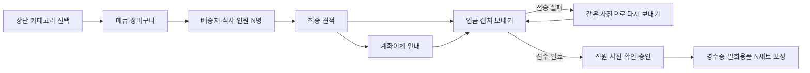

# 배달 주문 고객 화면·입금 캡처·포장 영수증 통합 개선 계획

작성·통합일: 2026-10-06, Asia/Ho_Chi_Minh.

상태: **소스 구현 완료 / 최신 main 통합·운영 release 진행 중**. 다음 세 계획의 요구사항·구현 순서·검증·배포 기준을 이 문서로 통합한다. 기존 문서는 조사 이력으로 보존하며 각각 따로 실행하지 않는다.

- 상단 메뉴 카테고리
- 입금 캡처 버튼·재시도
- 인원·일회용품 영수증

개별 원계획은 사용자 원래 작업 폴더에 보존했다. 릴리스 작업 트리에는 통합 계획만 포함한다.

기존 조사의 기준은 HEAD `cc4de81adb8870fd479cb12edd773cda635a01cd`와 로컬 수정이 포함된 작업 디렉터리다. 계획 통합 당시에는 코드 구현·검증·배포를 수행하지 않았다. 이후 사용자 실행 지시에 따라 2026-10-06 소스 구현과 로컬 검증을 진행했다. 운영 DB 적용·배포·물리 출력 증거는 아직 없다. 기존 사용자 수정과 untracked 파일을 보존한다. 소스 구현·migration 적용·운영 배포·현장 검증은 각각 별도의 증거로 기록한다.

## 1. 통합 목표와 현재 문제

**고객은 원하는 카테고리에서 메뉴를 고르고, 이미 송금한 뒤 캡처를 직접 보내거나 재시도하며, 포장 직원은 영수증에서 정확한 일회용품 세트 수를 확인한다.**

| 영역 | 확인된 현재 상태 | 개선 결과 |
|---|---|---|
| 메뉴 탐색 | 카테고리 데이터·다국어·순서는 있지만 메뉴 목록에 제목만 나열되어 있다. | 상단 고정 카테고리 바에서 한 번 선택해 원하는 메뉴를 본다. |
| 입금 캡처 | 사진 전송 버튼이 ‘결제하기’로 여는 계좌 안내창 안에만 있다. 선택 파일·경로·실패 상태가 호출 밖에 유지되지 않는다. | 주문 현황에서 직접 전송하고, 실패한 자리에서 같은 사진으로 재시도한다. |
| 접수 확인 | 기존 SQL은 동일 경로 commit의 중복 방지를 지원한다. Edge는 일부 Storage 조회·다운로드 오류를 이미지 불량과 혼합 처리한다. | 응답 유실을 복구하고 일시 오류 때문에 유효한 사진을 삭제하지 않는다. |
| 포장 수량 | 인원 저장·주방 표시·일부 종이 출력은 있다. 결제 상세의 네이티브 직접 출력과 디지털/PDF에는 전달·표시가 빠져 있다. | 고객이 선택한 N명과 일회용품 N세트를 실제 포장용 영수증에서 본다. |
| 현장 출력 | 기존 운영 기록에는 웹·DB 반영과 Windows 패키지 빌드가 있으나 물리 프린터 검증은 미실행으로 기록되어 있다. | 설치된 출력 프로그램과 실제 종이까지 확인한다. |

사용자는 Windows Print Station 자동 출력에서 누락을 확인했다. 직접 출력·디지털 전달과 일부 전표 표시 누락을 소스에서 보완했으며, 특정 운영 영수증의 원인과 설치 버전은 실제 주문의 값·출력 payload·문서 종류·설치 프로그램을 대조해야 확정할 수 있다. 기존 인원 저장과 정상적인 출력 큐를 유지한다.

## 2. 고객부터 포장까지의 목표 흐름



사진 전송은 계좌 안내를 먼저 열었는지와 무관하게 실행할 수 있다. 사진 접수만으로 결제·조리·주문 확정을 수행하지 않으며 기존 직원 사진 확인 승인 계약을 따른다.

## 3. 화면과 동작 사양

### A. 상단 메뉴 카테고리

위치는 기존 ‘메뉴·배송지·주문 현황’ 진행 탭 바로 아래다. 카테고리 바를 세로 메뉴 목록 밖에 두어 메뉴를 내려도 상단에 남도록 한다. 메뉴 화면에서만 표시한다.

```text
매장명                                      언어
메뉴                 배송지              주문 현황
[전체] [매장 카테고리 1] [카테고리 2] [음료] →
─────────────────────────────────────────────
선택한 범위의 메뉴 카드                ↕ 스크롤

장바구니 보기 · 총 수량 · 금액       배송지로 이동
```

| 행동·조건 | 규칙 |
|---|---|
| 최초 진입 | `전체`를 기본 선택하고 카테고리 제목·메뉴를 기존 순서로 표시한다. |
| 특정 카테고리 선택 | 그 카테고리 메뉴만 표시하고 세로 목록을 맨 위로 이동한다. |
| 같은 카테고리 다시 선택 | 선택과 스크롤 위치를 유지한다. |
| 수량 변경 | 선택과 스크롤 위치를 유지한다. 다른 카테고리의 장바구니 항목도 유지한다. |
| 배송지에서 메뉴로 복귀 | 유효한 카테고리 선택과 장바구니·메뉴 메모·입력 인원수를 유지한다. |
| 언어 변경 | 이름만 현재 KO/VI/EN으로 바꾸고 선택 ID·수량·메모·인원수를 유지한다. |
| 응답 갱신 | 선택 ID가 남아 있으면 유지, 사라지면 `전체`로 복귀하고 맨 위로 이동한다. |

카테고리와 메뉴는 서버 응답의 교집합을 공통 표시 목록으로 사용한다. `전체`도 이 범위만 표시하며, 비활성·카테고리 누락 메뉴를 새로 노출하지 않는다. 관리자 순서를 유지하고 음식 종류를 하드코딩하거나 이름순으로 재정렬하지 않는다.

카테고리가 많으면 모바일 가로 스와이프와 데스크톱 overflow 방향 버튼으로 탐색한다. 선택/언어 변경 뒤 선택한 칩이 보이도록 가로 위치를 보정한다. 긴 이름은 폭 상한·말줄임과 전체 접근성 이름/툴팁을 제공한다. 표시 메뉴가 없는 카테고리는 제외하고, 메뉴 전체가 비면 안내와 재조회 동작을 표시한다.

카테고리 선택은 로컬 필터 동작이며 서버·session·submit 호출을 추가하지 않는다. 기존 메뉴/배송지 진입 시 접수 가능 여부 재확인과 CLOSED 안내를 유지한다. DB migration과 Edge 변경은 이 카테고리 기능에는 필요하지 않다.

### B. 입금 캡처 버튼 분리와 실패 복구

주문 현황의 최종 입금액 아래에 **‘계좌이체 안내’와 ‘입금 캡처 보내기’**를 별도로 표시한다. 모바일에서는 세로로 배치한다. 현재 ‘결제하기’는 계좌 안내창을 여는 동작이므로 표시명을 실제 동작에 맞춘다.

```text
주문번호 · 최종 입금액 · 포함 VAT
[ 계좌이체 안내 ]          QR·계좌 확인
[ 입금 캡처 보내기 ]       사진 선택·미리보기·전송
이미 송금했다면 캡처만 보내 주세요.
```

계좌 안내창은 QR·계좌번호·금액·송금 메모 확인과 닫기를 담당한다. 업로드 버튼을 주문 현황으로 이동시키고, 미리보기에는 대상 주문번호·금액을 표시한다.

| 주문/전송 상태 | 표시·동작 |
|---|---|
| 견적 대기 | 사진 전송 버튼을 표시하지 않는다. |
| `quoted` + 유효한 `active` 견적 | 계좌 안내와 사진 전송을 각각 제공한다. |
| 파일 선택·미리보기 취소 | 주문 상태와 기존 버튼을 유지하고 업로드 API를 호출하지 않는다. |
| 선택·미리보기·전송 진행 | 시작부터 중복 실행을 막고 단계에 맞는 진행 표시를 제공한다. |
| 명확한 전송 실패 | 사진과 오류를 해당 영역에 남기고 ‘다시 보내기’·‘사진 바꾸기’를 제공한다. |
| 결과 불확실 | ‘전송 결과 확인 중…’을 표시하고 기존 시도의 접수 여부를 먼저 확인한다. |
| 접수 완료, 현황 갱신 실패 | 전송 완료를 유지하고 ‘상태 다시 확인’을 제공한다. |
| `awaiting_payment_review`, 재요청 없음 | ‘입금 캡처 전송 완료 · 매장 확인 대기’를 표시한다. |
| 직원 재요청, `canResubmit=true` | 사유·‘다시 송금하지 마세요’와 새 캡처 선택 버튼을 직접 제공한다. QR을 다시 제시하지 않는다. |
| 승인·조리·배달·완료 | 기존 진행 상태를 표시하며 신규 사진 전송을 요구하지 않는다. |
| 취소·거절·만료·충돌 | 전송을 차단하고 최신 주문/견적 상태를 확인한다. |

현재 화면 메모리에 이미지 bytes·MIME, request/quote/review ID, Storage 경로와 실패 단계를 보관한다. URL 발급 실패는 이미지를 유지하고 해당 단계부터 재시도한다. commit 실패·응답 유실은 **동일 경로·동일 견적·동일 재요청 ID**로 기존 `proof_commit_v2`를 다시 호출해 같은 message ID로 복구한다.

Storage 전송 응답이 불확실하면 같은 경로의 접수를 먼저 확인한다. 결과가 확정되기 전 사진 교체·새 경로 전송을 시작하지 않는다. 목록 조회·다운로드 일시 오류는 Edge의 임시 오류 응답으로 구분하고 파일을 삭제하지 않는다. 정상적으로 읽은 bytes가 실제 이미지 검증에 실패한 경우의 거절·삭제는 유지한다. V1/V2 공유 분기의 호환성을 검증한다.

전송 실패 재시도는 같은 사진을 사용하고, 직원 재요청은 사유를 확인해 새 사진을 선택한다. active 견적 최초 전송과 locked 견적 재요청의 허용 조건을 구분하며 locked 견적의 과거 TTL만으로 재제출을 차단하지 않는다.

다른 주문 선택·견적 변경·다른 기기의 사진 접수·승인이 발생하면 저장한 ID를 새 대상으로 바꾸지 않고 최신 상태를 확인한다. 오래된 응답이 다른 주문을 덮어쓰거나 이미 승인된 주문을 확인 대기로 되돌리지 않게 한다. JPEG/PNG/WebP·최대 5 MiB, 세션 소유권·private Storage·실제 이미지 검증을 유지한다.

페이지 재접속 시 서버 접수 상태를 복구한다. 미전송 사진은 메모리에만 보관하므로 다시 선택해야 한다. 새 영구 파일 저장·백그라운드 자동 전송·은행 연동은 이번 범위에 포함하지 않는다. 사진 전송·재시도에서 신규 주문 제출이나 결제 RPC를 호출하지 않는다.

### C. 인원수·일회용품 수량의 포장 영수증 표시

기존 입력 계약인 **1명당 일회용품 1세트, 1~100명**을 사용한다. 수량 원본은 `direct_order_requests.diner_count`, 승인·직원 수정 시 POS 복사 값은 `orders.guest_count`다. 메뉴 수량이나 금액으로 세트 수를 추정하지 않는다.

표시 위치는 **주문번호·배달/방문포장 구분 아래, 메뉴 목록 위**다. 숫자를 굵고 큰 글씨로 표시한다.

```text
주문번호 DXXXXXXXX         배달 / 방문포장
식사 인원: 3명
일회용품: 3세트            ← 포장 기준 수량
──────────────────────────────────────
메뉴명 · 메뉴 수량
```

실제 종이는 기존 베트남어·ESC/POS 호환성을 따라 `SO NGUOI: 3`, `DUNG CU: 3 BO`로 출력한다. 두 줄로 분리하고 세트 수는 bold·두 배 높이로 표시해 100명도 잘리지 않게 한다. 화면은 KO/VI/EN, PDF는 기존 베트남어 정책을 따른다.

| 출력/데이터 경로 | 보완 |
|---|---|
| 최초 고객 Bill·큐 재출력 | 실제 승인→자동 enqueue→enrichment→payload→agent→종이까지 수량 전달을 검증한다. |
| 결제 상세 네이티브 직접 출력 | 매장·Direct Order 연결을 검증하는 단건 포장 context 조회로 인원·수령 방법·참조번호를 받아 builder에 전달한다. 기존 프린터 사용 경로를 유지한다. |
| 디지털·PDF 출력 | 새 direct 영수증 snapshot에 포장 metadata를 추가하는 helper/trigger와 optional 모델 필드를 사용한다. 기존 금액 계산을 복제하지 않는다. |
| 전체 출력폼 | 고객 영수증·주방·층 전표·트레이 라벨·주문 확인 전표·인계전표·디지털/PDF 모두 배달/방문포장 주문에 한해 공통 포장 영역을 표시한다. 기존 출력 라우팅·부수는 유지한다. |
| NULL·정보 불완전 | direct 주문임이 확인되면 ‘인원 미입력 · 직원 확인 필요’를 표시한다. 0/1명으로 추정하거나 수령 방법 누락 때문에 수량을 조용히 생략하지 않는다. |
| 직원 인원 수정 | 기존 버전 검증 RPC를 사용한다. 최신 인원으로 새 인계전표/재출력을 제공하고 기존 출력 이력과 구분한다. |

단건 context 조회는 출력 job을 생성하지 않는 읽기 동작이다. 큐에 넣은 같은 문서를 네이티브에서도 출력하는 중복 경로를 만들지 않는다. 권한 없는 direct 테이블을 client에서 조회하거나 주문 메모로 연결을 추정하지 않는다. 목록마다 RPC를 호출하는 N+1 구조도 만들지 않는다.

포장 세트 수는 **주문별 총수량**이며 메뉴·조리 구역·출력 부수만큼 곱하지 않는다. 일반 홀 주문의 손님 수는 일회용품 수량으로 바꾸지 않는다. 기존 결제 전 안내 전표를 유료 배달 포장에 새로 배정하지 않는다. 직원·Direct Kitchen의 기존 표시도 같은 수량을 강조한다.

과거 디지털 snapshot·출력 완료 payload는 보존한다. 인원 수정 후 새 전표는 최신 수량과 재출력 표시를 사용한다. 예: 최초 3명 전표는 3세트, 인계 전 5명으로 수정한 뒤 새 인계전표는 5세트다. 동일한 과거 snapshot을 다시 읽는 행위와 최신 포장 정보로 새 전표를 만드는 행위를 구분한다.

`pending/failed/printing/done`별 재시도 정책을 검증하며 프린터가 이미 읽는 payload를 덮어쓰지 않는다. 인계·완료 후 수정 제한은 유지한다. 과거 주문을 지금 포장해야 하는 경우에는 확인된 인원과 기존 전용 인계전표 경로를 사용한다.

## 4. 공통 설계와 변경 범위

- 기존 테마와 최대 본문 폭 920을 사용한다. 최소 48 논리 픽셀 터치 영역, 선택 Semantics, 키보드 포커스, 큰 글씨를 지원한다.
- `DirectOrderCopy`의 KO/VI/EN 문구를 한 번에 정리한다. 언어 변경으로 선택 ID·장바구니·인원수·전송 시도 정보가 초기화되지 않게 한다.
- storefront와 서비스 변경은 같은 주문의 상태·견적·버전에 귀속한다. 비동기 완료의 대상과 현재 화면의 대상을 구분한다.
- CLOSED는 기존 신규 접수 제한과 기존 주문 처리 계약을 유지한다. 카테고리나 사진 전송 동작으로 이를 우회하지 않는다.
- 추가 DB 작업은 필요한 권한 검증 단건 포장 조회·새 디지털 snapshot 보강·확인된 print 전달 누락에 한정한다. 이미 있는 인원 column·submit API를 다시 만들지 않는다.
- `process_payment`, 결제 금액·VAT·재고·승인 atomic boundary와 비동기 MISA 처리를 유지한다. 재시도·재출력으로 결제·주방 티켓·재고 차감을 반복하지 않는다.

| 영역 | 예상 변경 파일/대상 |
|---|---|
| 고객 UI·번역 | `lib/features/direct_order/direct_order_storefront_screen.dart`, `direct_order_copy.dart` |
| 전송 단계·결과 | `direct_order_service.dart`, 필요한 optional 결과 모델, `supabase/functions/direct-order-public/index.ts` |
| 종이·출력 agent | `lib/core/hardware/receipt_builder.dart`, 필요한 `print_job_agent_service.dart` 전달 보완 |
| 직접 출력·PDF | `lib/features/direct_order/direct_order_staff_service.dart`, `lib/features/payment/payment_detail_screen.dart`, `lib/features/digital_receipt`, `lib/core/services/digital_receipt_pdf_service.dart` (`PaymentService` 원본 보존) |
| 포장 표시·조회 | 필요한 direct cashier/kitchen 표시, 권한 검증 SQL helper·snapshot 보강 migration |
| 테스트·문서 | storefront fixture·전송 실패·출력/PDF/SQL 테스트, 기존 Direct Delivery UI/API/locale 사양 |

메뉴 검색·추천 순위·카테고리 이미지, 장바구니 개편, 자동 입금 판독·은행 연동, 새 유료 일회용품 메뉴, 일반 POS/KDS 전면 개편은 이번 완료 조건에 포함하지 않는다.

## 5. 통합 작업 순서와 산출물

| 순서 | 작업 | 완료 산출물·의존성 |
|---|---|---|
| W01 | 실제 영수증 누락 구간과 현장 출력 경로 확인 | 요청 인원·order 값·job 필드·문서 종류·유효 trigger·설치 SHA 대조. 고객 상세정보를 진단 로그에 남기지 않는다. 인원 누락 원인을 확정한다. |
| W02 | 공유 상태·문구·테스트 fixture 준비 | 다중 카테고리, 주문별 캡처 시도, 인원/포장 metadata 계약과 안정적인 Key를 정한다. 사진 선택/Storage 테스트 주입 경계를 최소로 둔다. |
| W03 | 고객 storefront 개선 | A의 고정 바·필터와 B의 독립 버튼·미리보기·진행/실패/완료 영역을 같은 화면·copy 변경으로 구현한다. |
| W04 | 전송 서비스·Edge 재시도 보완 | 동일 경로 commit 복구, 일시 Storage 오류 분리, 성공과 상태 갱신 실패 구분. W03에서 표현할 결과를 제공한다. |
| W05 | 포장 조회·영수증 전달·표시 보완 | W01 결과에 따라 필요한 helper/trigger를 추가하고 C의 큐·직접 출력·PDF·인계전표를 맞춘다. payment 본문은 보존한다. |
| W06 | 통합 행동·회귀 검증과 사양 갱신 | 아래 고객→직원→종이 시나리오, 필요한 SQL·Edge·Dart 검증과 기존 UI/API/locale 문서를 같은 변경에서 완료한다. |
| W07 | CI·배포·Print Station 설치·현장 확인 | 정확한 release SHA의 필수 CI/Windows build, 공식 배포, 현장 프로그램 업데이트와 실제 3세트 종이 확인을 기록한다. |

W01의 현장 증거가 아직 없더라도 확정된 카테고리·캡처 UI 구현은 준비할 수 있다. 특정 출력 원인 해결과 물리 출력 확인 없이 전체 개선을 완료로 판정하지 않는다. 같은 파일의 변경과 fixture·번역·테스트는 한 통합 변경으로 검토해 중복 작업을 줄인다.

## 6. 통합 완료 기준

| 분야 | 통과 기준 |
|---|---|
| 카테고리 | 기본 `전체`, 정확한 필터·서버 순서, 세로 스크롤 중 고정, 선택 변경 후 상단 이동, 수량 변경 후 위치 유지. |
| 장바구니·입력 | 여러 카테고리에서 담은 수량·메모·합계와 입력 인원이 메뉴/배송지 왕복·언어 변경에서 보존된다. |
| 카테고리 경계 | 0·1·10개 이상, 긴 이름, 메뉴 없음, 응답 갱신에서 선택 소멸·정렬 변경, 마지막 카테고리 접근을 검증한다. 필터만으로 서버 호출이 증가하지 않는다. |
| 독립 캡처 | 계좌 안내를 열지 않고 직접 선택·전송한다. 취소 시 업로드 호출이 없고 연속 클릭이 중복 실행을 만들지 않는다. |
| 실패 단계 | URL 발급·Storage·commit 각각의 실패에서 사진과 적절한 단계 재개를 유지한다. commit 응답 유실 복구 후 사진 메시지는 1개다. |
| 서버 오류 | Storage 목록/다운로드 일시 오류에서 파일 삭제 0회, 실제 invalid bytes 거절·삭제와 V1/V2 호환성을 유지한다. |
| 전송 성공 | 접수 뒤 현황 조회 실패는 완료+상태 재확인으로 표시한다. 직원 재요청은 정확한 review ID·사유·재송금 금지로 처리한다. |
| 동시 변경·재접속 | 주문 전환·견적 변경·다른 기기 접수·승인/취소에서 잘못된 귀속이나 상태 역행이 없다. 재접속은 서버 상태를 복구하고 미전송 파일은 재선택한다. |
| 포장 최초 경로 | 고객 3명 → request 3 → order 3 → 최초 Bill payload 3 → agent → 실제 종이 3세트를 확인한다. |
| 출력 경로 | 같은 초기 snapshot 기준 자동 Bill·네이티브 재출력·PDF·인계전표의 수량이 일치한다. 배달→방문포장 전환에서도 인원을 보존한다. |
| 인원 경계·수정 | 1·3·10·100명 표시, NULL 확인 안내, 잘못된 값 거절. 인계 전 3→5명 수정 후 새 전표 5세트, 과거 snapshot 보존. |
| 권한·업무 | 다른 매장/고객의 직원 context 접근 차단, 주방 개인정보 비노출, 일반 홀 손님 수와 포장 수량 분리, 전표 부수만큼 수량을 곱하지 않음. |
| 금액·회귀 | 사진 재시도·재출력으로 신규 결제/재고/티켓이 없으며 홀·QR·합산·서비스·CLOSED·수기 주소·기존 진행 흐름이 유지된다. |
| 반응형·언어 | 360/390/768/1024/1440 폭, KO/VI/EN, 큰 글씨·터치·마우스·키보드에서 조작과 표시가 잘리지 않는다. |

격리 환경에서 다음 **연속 시나리오**를 완료한다:

1. 서로 다른 카테고리의 메뉴를 담고 언어를 바꾼다. 장바구니를 확인하고 3명을 입력한다.
2. 요청·견적을 만든 뒤 계좌 안내를 거치지 않고 캡처를 선택한다. URL/Storage/commit 실패를 각각 주입하고 같은 사진으로 복구한다.
3. commit 성공·응답 유실과 상태 재조회 실패를 분리해 확인한다. 직원 사진 승인 후 결제·티켓이 각각 한 번만 생성됨을 확인한다.
4. 최초 Bill과 인계전표/PDF에서 3세트를 확인한다. 방문포장 전환과 인계 전 5명 수정 후 새 전표를 확인하며 원결제·과거 snapshot을 보존한다.
5. CLOSED, 재요청, 다른 주문 선택·다른 기기 접수·다른 매장 접근을 검증한다. 실제 현장에서는 안전한 fixture/미리보기 출력으로 80mm 종이를 확인하며 가짜 주문·결제를 만들지 않는다.

## 7. 검증·배포와 상태 보고

검증은 변경 파일 `dart format`·`flutter analyze` → 관련 행동 테스트 → 격리 SQL/Edge 실패·권한·중복 검증 → `bash scripts/check_repo.sh` 순서로 진행한다. 신규 변경·실패가 생기면 관련 검증을 다시 수행한다.

공통 Flutter 대상은 `direct_delivery_storefront_widget_test.dart`, `direct_delivery_ui_contract_test.dart`, `direct_delivery_regression_isolation_test.dart`, `menu_language_switch_test.dart`, `direct_order_retry_contract_test.dart`, `direct_order_customer_payment_status_test.dart`, `direct_order_photo_approval_test.dart`, `receipt_builder_contract_test.dart`, `direct_delivery_driver_receipt_contract_test.dart`, `direct_order_delivery_fallback_test.dart`, `payment_detail_contract_test.dart`, `digital_receipt_pdf_service_test.dart`와 필요한 실제 print-agent/기존 출력 회귀 테스트다. 안정적인 Key로 가로 카테고리 목록과 세로 목록을 구분한다.

SQL은 실제 승인→enqueue→trigger→payload 경로, 동일 경로 commit, 단건 조회 권한과 최신 재출력을 검증한다. migration 전후 `process_payment` 정의와 결제·재고·티켓 횟수 보존을 확인한다. Edge는 일시 오류에 `remove()`를 호출하지 않는 검증과 실제 invalid image 검증을 포함한다. 운영 DB에는 실패 주입을 하지 않는다.

독립 리뷰·로컬 검증은 사전 증거다. 정확히 배포할 SHA의 필수 GitHub Actions와 Windows Print Station build 성공을 확인하고 `scripts/deploy_pos_production.sh`로 운영 반영한다. 필요한 DB helper/snapshot migration은 소비하는 앱보다 먼저 적용하고, 일시 오류 분리 Edge와 웹·호환되는 native package를 반영한다. Windows 패키지 빌드 성공과 현장 설치 완료를 구분한다. 기존 매장 IP/USB·destination 설정을 유지한다.

| 보고 상태 | 필요한 증거 |
|---|---|
| 소스 구현 완료 | 세 기능 코드·사양과 관련 로컬 검증 |
| DB/Edge/웹 반영 완료 | 유효 migration·배포 대상 SHA·필수 CI·공식 배포 기록 |
| 출력 프로그램 반영 완료 | 동일 release에 해당하는 현장 Print Station 설치본 확인 |
| 운영 검증 완료 | 실제 카테고리/직접 캡처·재시도 흐름과 종이의 3세트 표시 확인 |

현재 소스 구현과 로컬 관련 검증 증거는 확보했으며 [구현 기록](../implementation/direct_order_integrated_improvements_20261006.md)에 정리했다. 운영 DB/웹·출력 프로그램·현장 검증 증거는 아직 확보하지 않았다. 현장 프린터 미검증 상태에서는 전체 ‘해결 완료’로 보고하지 않는다.

## 8. 조사 근거와 우선 수정 목록

| 분류 | 근거·항목 | 우선 처리 |
|---|---|---|
| CONFIRMED | 기존 카테고리 데이터, V2 proof 동일 경로 중복 방지, 인원 저장·일부 출력 기능이 있다. | 재사용 |
| HIGH | 결제 상세 직접 출력/PDF의 포장 수량 전달·표시 누락 | W01·W05: 누락 경로와 설치본 확인·보완 |
| MEDIUM | 캡처 진입점이 안내창 내부이며 파일·실패·접수 상태를 유지하지 못한다. | W03·W04: 독립 버튼과 단계별 복구 |
| MEDIUM | Edge Storage 일시 오류가 invalid image 삭제 분기로 들어갈 수 있다. | W04: 오류 분리와 삭제 방지 검증 |
| MEDIUM | 상단 카테고리 선택·다중 카테고리 행동 검증이 없다. | W03·W06: 고정 바와 필터·상태 보존 |
| MEDIUM | NULL 포장 정보와 실제 출력 프로그램·종이 검증의 공백 | W05·W07: 확인 안내와 현장 검증 |

주요 현재 소스 위치:

- `lib/features/direct_order/direct_order_storefront_screen.dart`: `_buildMenu`, `_quoteCard`, `_showPaymentDetails`, `_uploadProof`, `_refreshStatus`, 인원 입력·submit.
- `lib/features/direct_order/direct_order_models.dart`, `direct_order_service.dart`, `direct_order_copy.dart`: 카테고리·인원 모델, proof 전송 단계·결과, 다국어.
- `lib/features/qr_order/qr_order_screen.dart`: 참고할 `ChoiceChip`·접근성 선택 패턴.
- `supabase/functions/direct-order-public/index.ts`: proof URL·Storage 존재/내용 검사·commit.
- `supabase/migrations/20260910130000_direct_order_customer_payment_and_status.sql`, `20261003060838_direct_order_customer_photo_approval.sql`: quote/review 귀속·중복 방지와 직원 사진 승인.
- `supabase/migrations/20261005010000_direct_order_delivery_fallback.sql`, `20261005020000_direct_order_fallback_set_based_reads.sql`: 인원·guest_count·print enrichment와 주방 포장 정보. 운영의 renumbered 적용 이력은 별도로 확인한다.
- `lib/core/hardware/receipt_builder.dart`, `print_job_agent_service.dart`, `lib/core/services/payment_service.dart`, `lib/features/payment/payment_detail_screen.dart`, `lib/features/digital_receipt`, `lib/core/services/digital_receipt_pdf_service.dart`: 실제 출력 전달·표시 경로.
- `.design/2026-08-direct-delivery-ordering/UI_SPEC.md`, `DIRECT_ORDER_API_CONTRACT.md`, `DIRECT_ORDER_LOCALE_CONTRACT.md`: 구현과 함께 갱신할 사양.
- `docs/operations/direct_order_deliberry_sample_release_20261005_70498547.md`, `.github/workflows/windows_print_station_build.yml`: 기존 배포 기록과 별도 native package 빌드. 기존 기록에서 물리 프린터 확인은 미실행이다.

## 9. 실행 결과 — 2026-10-06

- W02~W06: 상단 고정 카테고리, 독립 입금 캡처/같은 사진 재시도, 일시 Storage 오류의 파일 보존, 포장 context/종이/PDF/new snapshot 구현.
- W01: 결제 상세 직접 인쇄·디지털 경로 누락을 소스로 확인하고 보완. 특정 운영 주문·설치 프로그램·실제 종이의 누락 구간은 현장 증거 미확보.
- 격리 PostgreSQL에서 실제 사진 승인→financial trigger→receipt enqueue→payload 3명, 수정 후 새 전표 5명, 기존 3명 snapshot 보존 및 결제/재고 불변 확인.
- W07: 운영 migration·웹/Edge 배포, 정확한 SHA의 GitHub/Windows 빌드와 현장 설치·물리 출력은 미실행. 전체 운영 해결로 판정하지 않음.
- 관련 검증과 기존 작업의 전체 검사 실패는 구현 기록에서 별도 구분.

### 추가 실행 요구 반영

사용자는 누락 경로를 **Windows Print Station 자동 출력**으로 확인했다.
또한 배달/방문포장 주문은 **전체 출력폼**에서 인원·일회용품 수량을 표시하도록
범위를 명확히 했다. 고객 영수증, 주방, 층 전표, 트레이, 주문 확인 전표, 인계전표,
디지털/PDF를 모두 보완하고 각 일반 홀 주문 출력에서 세트 수가 나타나지 않는지
검증한다. 주문당 세트 수는 메뉴 수량·프린터 부수로 곱하지 않는다.
