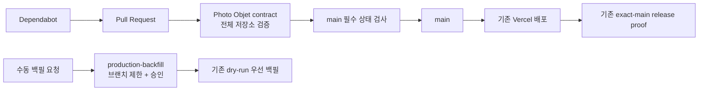

# GitHub Maintenance Guardrails v1 구현 계획

- 상태: 코드 및 GitHub 설정 재검증 완료, 실행 승인됨, 구현 진행 중
- 계획 기준일: 2026-07-19
- 대상 저장소: `ahc0403-commits/globospossystem`
- 기본 브랜치: `main`
- 목적: GitHub가 제공하는 기본 자동화와 기존 저장소 검증 체계를 이용해 시스템 유지보수 안전성을 높인다.

## 1. 목표

이번 v1의 목표는 새로운 운영 서비스를 만드는 것이 아니라 다음 세 가지 유지보수 경계선을 강화하는 것이다.

1. 모든 Pull Request가 동일한 전체 검증을 통과해야 병합될 수 있게 한다.
2. Flutter, npm, GitHub Actions 의존성 업데이트를 GitHub가 주기적으로 제안하게 한다.
3. 수동 프로덕션 백필은 GitHub Environment 승인 뒤에만 실행되게 한다.

기존 exact-main 배포 검증, Vercel 배포 SHA 확인, 프로덕션 헬스 체크, SQL 사전 검증은 유지하고 중복 자동화는 추가하지 않는다.



## 2. 재검증 결과

2026-07-19 기준 코드와 GitHub 설정을 함께 확인한 결과는 다음과 같다.

- 저장소에는 GitHub Actions workflow 6개와 약 900개의 추적 파일이 있다.
- `main`의 필수 상태 검사는 `Photo Objet contract` 하나이며 strict 모드와 관리자 적용이 켜져 있다.
- `.github/workflows/photo_objet_sales_contract.yml`은 Flutter 분석·테스트·웹 빌드, npm 테스트·감사·보안 스캔, 일부 배포 셸 계약 테스트를 이미 실행한다.
- 그러나 위 workflow의 Pull Request 트리거에는 경로 필터가 있어 일반 애플리케이션 변경이 필수 검사를 생성하지 않을 수 있다.
- `.github/workflows/photo_objet_release_proof.yml`은 `main`의 정확한 SHA, Vercel 배포 SHA, 프로덕션 HTTP 상태를 이미 검증한다.
- `.github/workflows/photo_objet_sales_backfill.yml`은 `production-backfill` Environment를 참조하지만, GitHub에는 해당 Environment가 아직 없다.
- 백필 스크립트는 기본 dry-run, 최대 7일 범위, 실행 확인 문자열, `main` ref 검사를 이미 구현한다. Environment 추가는 이 위에 놓이는 방어 계층이다.
- `scripts/deploy_pos_production.sh`는 허용 migration 목록과 migration별 사전 검증·사후 확인을 이미 구현한다.
- 배포 관련 셸 계약 테스트 4개 중 일부만 현재 CI에서 직접 실행된다.
- `.github/dependabot.yml`이 없고 Dependabot security updates가 꺼져 있다.
- 여섯 workflow의 외부 Action 참조는 기준선에서 19개이며 모두 이동 가능한 버전 태그를 사용한다. PR 1에서 clean-worktree 배포 계약 테스트에 필요한 `denoland/setup-deno`가 추가되므로 SHA 고정 시점의 대상은 총 20개다. GitHub의 SHA 고정 강제 설정은 꺼져 있다.
- 현재 로컬 작업 브랜치에서는 `flutter test`가 `test/qc_route_overlay_operational_test.dart`의 RenderFlex overflow로 1건 실패했다. 따라서 구현은 이 dirty/failing 작업 트리에서 시작하지 않는다.
- 원격 `main`의 기존 검사는 재검증 시점에 통과 상태였다.

결론적으로 유지보수상의 가장 큰 공백은 새로운 감시 서비스의 부재가 아니라, PR 검증 경로의 불완전성, 자동 의존성 업데이트 부재, Action 공급망 고정 미적용, 백필 Environment 승인 부재다.

## 3. 구속 조건

- 프로덕션 배포와 DB mutation을 자동화하지 않는다.
- 새로운 장기 토큰, GitHub App, 외부 SaaS 또는 상주 프로세스를 만들지 않는다.
- 기존 `GITHUB_TOKEN`과 GitHub 기본 기능만 사용한다.
- 기존 사용자 WIP와 untracked 파일을 보존한다.
- 각 단계는 독립된 PR 또는 설정 변경 묶음으로 검토·롤백할 수 있어야 한다.
- 필수 상태 검사 이름 `Photo Objet contract`는 v1에서 유지한다.
- `photo_objet_release_proof.yml`의 workflow 이름과 exact-main 검증 계약은 유지한다.
- Supabase schema, 함수, 데이터, Office 앱은 변경하지 않는다.

## 4. 범위

### 포함

- 저장소 전체 검증의 단일 진입점 추가
- 모든 Pull Request에서 필수 CI 실행
- 현재 누락된 배포 셸 계약 테스트의 CI 편입
- Dependabot 설정 및 GitHub 기본 dependency 보안 기능 활성화
- 모든 외부 GitHub Action을 전체 commit SHA로 고정
- GitHub의 Action SHA 고정 강제 설정 활성화
- `production-backfill` Environment와 수동 승인 추가

### v1 제외

- 별도 Repository Maintenance Sentinel workflow
- stale PR 자동 닫기 또는 정기 digest 봇
- CodeQL
- 실패 job 자동 재실행
- 자동 배포, 자동 migration, 자동 rollback
- secret 자동 교체, 사용자 비밀번호 재설정
- 모든 migration에 rollback 파일을 강제하는 일반 규칙
- 기존 PR 6개의 자동 정리

Sentinel은 기존 release proof와 기능이 겹치고 제어면 복잡도를 늘리므로 제외한다. 오래된 PR은 구현 전에 한 차례 수동으로 분류하고, 반복 비용이 실제로 확인될 때만 별도 자동화를 검토한다. CodeQL은 v1의 네 가지 공백보다 우선순위가 낮으며, 현재 CI 안정화 이후 독립 단계로 판단한다.

## 5. 변경 순서

구현은 아래 순서를 따른다.

1. 깨끗한 최신 `main`에서 사전 상태를 확정한다.
2. PR 1로 전체 CI 경로와 단일 검증 명령을 만든다.
3. `production-backfill` Environment를 설정하고 dry-run 승인 경로를 검증한다.
4. PR 2로 Dependabot을 도입하고 GitHub dependency 보안 설정을 켠다.
5. PR 3으로 외부 Action을 SHA 고정한 뒤 강제 설정을 켠다.

CI가 안정되기 전에 Dependabot PR을 생성하거나 SHA 강제를 켜면 원인 분리가 어려워지므로 위 순서를 바꾸지 않는다.

## 6. 구현 전 사전 점검

현재 checkout이 dirty 상태이므로 다음 절차를 사용한다.

1. 사용자 WIP를 stash, reset 또는 삭제하지 않는다.
2. 원격 `main`을 fetch한다.
3. 최신 `origin/main`을 기준으로 별도 clean worktree 또는 새 브랜치 `codex/github-maintenance-guardrails-v1`을 만든다.
4. GitHub의 다음 live 설정을 다시 읽어 계획 기준일 이후 drift가 없는지 확인한다.
   - 기본 브랜치와 branch protection
   - Actions permissions와 SHA pinning enforcement
   - Dependabot 및 secret scanning 상태
   - Environments
   - `main`의 최신 workflow 결과
5. clean `main`에서 아래 전체 검증을 한 번 실행해 기준선을 기록한다.

로컬 UI 테스트 실패가 최신 `main`에서도 재현되면 Guardrails 구현과 섞지 않고 해당 실패를 먼저 별도 작업으로 해결한다.

## 7. PR 1 — 전체 CI와 단일 검증 진입점

### 7.1 `scripts/check_repo.sh` 추가

저장소 루트에서 실행할 수 있는 단일 검증 스크립트를 추가한다. 이 스크립트는 `set -euo pipefail`을 사용하고, 호출 위치와 무관하게 저장소 루트를 계산한 뒤 다음 검증을 순서대로 실행한다.

```bash
flutter pub get --enforce-lockfile
dart analyze --fatal-infos
flutter test

cd scripts
PUPPETEER_SKIP_DOWNLOAD=true npm ci
npm test
npm audit
npm run security-scan
cd ..

bash -n scripts/deploy_pos_production.sh
bash test/pos_deploy_clean_worktree_checks_test.sh
bash test/pos_deploy_git_history_guard_test.sh
bash test/pos_deploy_psql_runner_test.sh
bash test/pos_production_sql_wrapper_test.sh
bash test/photo_objet_expected_slot_ledger_test.sh

flutter build web --release
git diff --check
git show --check --format= HEAD
```

요구사항은 다음과 같다.

- 첫 실패에서 non-zero로 종료한다.
- 프로덕션 URL 호출, DB write, 배포 또는 migration 실행을 하지 않는다.
- CI와 로컬 개발자가 동일한 명령 `bash scripts/check_repo.sh`을 사용한다.
- npm 의존성 설치는 `npm ci`로 lockfile을 준수한다.
- CI에서 `PUPPETEER_SKIP_DOWNLOAD=true`를 유지해 검증에 사용하지 않는 브라우저 binary를 내려받지 않는다.
- 기존 CI의 analyzer 강도인 `--fatal-infos`와 현재 HEAD whitespace 검사를 약화하지 않는다.
- Postgres client가 필요한 셸 테스트를 위해 기존 workflow의 client 설치 단계를 유지한다.

### 7.2 기존 필수 workflow 확장

`.github/workflows/photo_objet_sales_contract.yml`을 다음과 같이 수정한다.

- `pull_request.paths` 필터를 제거해 모든 Pull Request에서 workflow가 생성되게 한다.
- 기존 Ubuntu, Flutter, Node, PostgreSQL 설정 뒤에 `bash scripts/check_repo.sh`을 호출한다.
- 중복된 개별 검증 step은 wrapper 호출로 통합한다.
- job 이름 `Photo Objet contract`를 그대로 유지한다.
- `push: main` 트리거를 유지한다.

필수 상태 검사는 모든 PR에서 동일한 이름으로 생성되어야 한다. 따라서 docs-only PR도 v1에서는 전체 검증 비용을 지불한다. 공개 저장소의 표준 GitHub-hosted runner 비용보다 병합 규칙의 단순성과 누락 방지가 더 중요하다는 판단이다.

### 7.3 운영 문서 갱신

`CLAUDE.md`의 일반 검증 명령에 `bash scripts/check_repo.sh`을 전체 기본 검증으로 추가하되, 빠른 진단을 위한 개별 `flutter analyze`와 `flutter test` 명령은 유지한다.

현재 `CLAUDE.md`에는 사용자 수정이 있으므로 구현 시 파일을 다시 읽고 최소 범위 patch만 적용한다. 사용자 변경을 덮어쓰거나 재정렬하지 않는다.

### 7.4 PR 1 인수 기준

- clean 최신 `main`에서 `bash scripts/check_repo.sh`이 성공한다.
- `lib/**`만 변경한 PR에도 `Photo Objet contract`가 생성된다.
- 일반 migration 파일만 변경한 PR에도 검사가 생성된다.
- 문서만 변경한 PR에도 검사가 생성된다.
- Flutter 테스트, npm 감사, secret scan, 셸 계약 테스트 또는 웹 빌드 중 하나가 실패하면 전체 검사가 실패한다.
- branch protection의 기존 required context가 끊기지 않는다.
- `photo_objet_release_proof.yml`이 변경 없이 계속 성공한다.

## 8. 설정 변경 — 프로덕션 백필 승인 경계

GitHub repository settings에서 이름이 정확히 `production-backfill`인 Environment를 만든다.

설정값:

- Deployment branch: `main`만 허용
- Required reviewer: `ahc0403-commits`
- Prevent self-review: 끔

현재 실질적인 유지보수자가 한 명이므로 self-review를 막으면 정상적인 수동 운영까지 봉쇄된다. 두 번째 운영자가 생기면 reviewer를 추가하고 self-review 차단 여부를 재검토한다.

기존 repository secrets는 v1에서 Environment secrets로 이동하지 않는다. secret 위치 변경과 승인 경계 도입을 한 번에 수행하면 장애 원인과 롤백 범위가 커지기 때문이다.

### 승인 경로 검증

1. `photo_objet_sales_backfill.yml`을 `workflow_dispatch`로 실행한다.
2. `execute_backfill=false`를 선택한다.
3. job이 Environment 승인 대기 상태가 되는지 확인한다.
4. 승인한다.
5. 로그에 dry-run과 `BACKFILL_DRY_RUN` 결과가 나타나는지 확인한다.
6. DB write가 없었음을 확인한다.

프로덕션 검증 목적으로 `execute_backfill=true`를 사용하지 않는다. 실제 실행은 승인된 운영 필요가 있을 때 기존 확인 문자열과 날짜 범위 검사를 모두 거쳐 수행한다.

## 9. PR 2 — Dependabot

`.github/dependabot.yml`을 추가하고 다음 세 ecosystem을 등록한다.

| Ecosystem | Directory | Schedule | PR limit |
|---|---|---|---:|
| `pub` | `/` | 매주 월요일 09:00 | 2 |
| `npm` | `/scripts` | 매주 월요일 09:00 | 2 |
| `github-actions` | `/` | 매주 월요일 09:00 | 2 |

공통 timezone은 `Asia/Ho_Chi_Minh`으로 설정한다.

업데이트 정책:

- ecosystem별 patch와 minor 업데이트를 그룹화한다.
- major 업데이트는 그룹에 넣지 않고 독립 PR로 만든다.
- 자동 병합은 설정하지 않는다.
- private registry는 추가하지 않는다.
- reviewer 자동 지정은 v1에서 강제하지 않는다.

파일이 `main`에 병합된 뒤 GitHub settings에서 다음을 활성화한다.

- Dependency graph
- Dependabot alerts
- Dependabot security updates

### PR 2 인수 기준

- 설정 파일이 GitHub에서 오류 없이 로드된다.
- 세 ecosystem 모두 활성 상태로 표시된다.
- ecosystem별 open PR 수가 2개를 넘지 않는다.
- 생성된 Dependabot PR에도 `Photo Objet contract` 검사가 실행된다.
- major 버전 변경은 patch/minor 그룹에 섞이지 않는다.
- 자동 병합이 일어나지 않는다.

## 10. PR 3 — GitHub Actions 공급망 고정

PR 1 반영 후 여섯 workflow에 있는 외부 `uses:` 20개를 모두 전체 40자리 commit SHA로 고정한다.

대상 Action 계열:

- `actions/checkout`
- `actions/setup-node`
- `actions/github-script`
- `actions/upload-artifact`
- `denoland/setup-deno`
- `subosito/flutter-action`

구현 규칙:

- 구현 시점의 공식 upstream release/tag에서 commit을 해석한다.
- annotated tag라면 최종 commit까지 peel한다.
- repository owner와 Action 용도를 검토한다.
- `uses: owner/action@<40-char-sha> # vX.Y.Z` 형식으로 사람이 읽을 수 있는 release 주석을 같은 줄에 둔다.
- 현재 major tag가 가리키는 동작을 우선 유지하며, 기능 업그레이드와 SHA 고정을 한 PR에 섞지 않는다.
- local action이 생기면 SHA 고정 대상에서 제외하되 경로가 저장소 내부인지 검토한다.

구체 SHA 값은 시간이 지나면 달라질 수 있으므로 계획 문서에 고정하지 않는다. 구현 PR에서 공식 upstream tag와 해석된 commit을 증거로 남긴다.

### 활성화 순서

1. GitHub의 `sha_pinning_required`는 끈 상태로 둔다.
2. 20개 참조를 모두 고정한다.
3. 모든 workflow와 release proof가 성공하는지 확인한다.
4. merge 후 기본 브랜치의 workflow도 고정됐는지 확인한다.
5. GitHub settings에서 SHA pinning requirement를 켠다.
6. workflow_dispatch와 일반 PR로 강제가 정상 동작하는지 확인한다.

### PR 3 인수 기준

- `.github/workflows/**`의 외부 `uses:`에 버전 태그만 남아 있지 않다.
- 모든 외부 참조가 정확히 40자리 SHA를 사용한다.
- 동일 줄에 원래 의미를 설명하는 release 주석이 있다.
- 여섯 workflow가 모두 구문 오류 없이 로드된다.
- 전체 CI와 release proof가 성공한다.
- GitHub의 SHA pinning requirement가 활성화되어 있다.
- Dependabot이 이후 Action release 업데이트 PR을 만들 수 있다.

## 11. 변경 파일 예상

| 파일 | 변경 | 단계 |
|---|---|---|
| `scripts/check_repo.sh` | 전체 검증 단일 진입점 추가 | PR 1 |
| `.github/workflows/photo_objet_sales_contract.yml` | 모든 PR 실행 및 wrapper 호출 | PR 1 |
| `CLAUDE.md` | 기본 전체 검증 명령 추가 | PR 1 |
| `.github/dependabot.yml` | 3개 ecosystem 업데이트 정책 | PR 2 |
| `.github/workflows/*.yml` 6개 | 외부 Action 전체 SHA 고정 | PR 3 |

중복을 포함하면 최대 10개 repository file이 영향을 받는다. 별도로 GitHub repository settings에서 Environment, dependency security, SHA enforcement를 변경한다.

## 12. 검증 매트릭스

| 시나리오 | 기대 결과 |
|---|---|
| 일반 Dart 코드 PR | 전체 필수 검사 실행 |
| 일반 SQL migration PR | 전체 필수 검사 실행 |
| docs-only PR | 전체 필수 검사 실행 |
| Flutter analyzer/test 실패 | 병합 차단 |
| npm test/audit/secret scan 실패 | 병합 차단 |
| 배포 셸 계약 테스트 실패 | 병합 차단 |
| 웹 release build 실패 | 병합 차단 |
| 백필 승인 전 | job 대기, 코드 실행 안 함 |
| 백필 dry-run 승인 후 | 진단만 실행, DB write 없음 |
| 백필 잘못된 ref 또는 확인값 | 기존 guard가 실패 처리 |
| Dependabot patch/minor 업데이트 | ecosystem별 그룹 PR, 전체 CI 실행 |
| Dependabot major 업데이트 | 독립 PR |
| 이동 가능한 Action tag 사용 | GitHub 설정에서 거부 |
| 고정 SHA Action 사용 | workflow 정상 실행 |
| `main` 배포 SHA 불일치 | 기존 release proof 실패 |

## 13. 롤백 계획

### PR 1 롤백

- `photo_objet_sales_contract.yml`의 trigger와 wrapper 호출 변경을 revert한다.
- `scripts/check_repo.sh`과 문서 명령 변경을 revert한다.
- required status 이름을 바꾸지 않았으므로 GitHub branch protection 변경은 필요 없다.
- 데이터 또는 외부 상태 롤백은 없다.

### 백필 Environment 롤백

- 필요하면 reviewer와 branch protection rule만 제거한다.
- 감사 흔적 보존을 위해 빈 Environment 자체는 즉시 삭제하지 않아도 된다.
- workflow 코드와 백필 스크립트의 기존 실행 guard는 유지한다.
- 데이터 롤백은 없다.

### PR 2 롤백

- Dependabot security updates와 alerts를 끈다.
- `.github/dependabot.yml`을 revert한다.
- 이미 열린 자동 PR은 개별 검토 후 닫는다.
- 애플리케이션 runtime과 데이터에는 영향이 없다.

### PR 3 롤백

순서가 중요하다.

1. GitHub의 SHA pinning requirement를 먼저 끈다.
2. workflow SHA 변경을 revert한다.
3. workflow가 다시 로드되고 필수 검사가 생성되는지 확인한다.

강제를 켠 채 tag 참조로 되돌리면 모든 workflow가 동시에 막힐 수 있으므로 반대 순서로 롤백하지 않는다.

## 14. 위험과 완화

### 전체 PR CI로 실행 시간이 늘어남

경로 필터를 없애면 docs-only PR도 전체 CI를 실행한다. v1에서는 필수 검사 누락 방지를 우선한다. 30일간 실행 시간과 queue를 관찰한 뒤 비용이 실제 문제일 때만 `paths-ignore`가 아닌 항상 생성되는 경량 gate 설계를 별도로 검토한다.

### 기존 로컬 테스트 실패가 구현 검증을 오염시킴

현재 dirty 브랜치의 UI overflow 실패를 Guardrails 변경과 분리한다. 최신 clean `main` 기준선이 실패하면 먼저 별도 수정 PR을 만든다.

### Dependabot PR 과다 생성

ecosystem별 limit 2와 patch/minor grouping으로 초기에 열리는 PR 수를 제한한다. major는 사람이 독립적으로 판단한다.

### SHA 고정으로 Action 업데이트가 늦어짐

GitHub Actions ecosystem을 Dependabot에 등록하고 release 주석을 유지한다. 고정은 업데이트 금지가 아니라 검토 가능한 업데이트 경로로 바꾸는 것이다.

### 단일 유지보수자의 Environment 승인

self-review 허용은 완전한 상호 승인보다 약하지만, 현재 인원 구조에서 실행 로그·명시적 승인·기존 확인 문자열을 모두 남기는 현실적인 방어 계층이다. 운영자가 추가되면 설정을 강화한다.

## 15. 성공 기준

다음을 모두 만족하면 v1을 완료로 본다.

- 모든 Pull Request에서 `Photo Objet contract`가 생성되고 필수 검사가 된다.
- 로컬과 CI가 `bash scripts/check_repo.sh`이라는 동일한 전체 검증 진입점을 사용한다.
- clean 최신 `main`에서 전체 검증이 성공한다.
- 배포 관련 셸 계약 테스트가 모두 CI에서 실행된다.
- Dependabot 세 ecosystem이 활성화되고 PR 수 제한이 적용된다.
- dependency graph, alerts, security updates가 활성화된다.
- 외부 Action 참조가 전부 전체 SHA로 고정된다.
- SHA pinning requirement가 활성화된다.
- `production-backfill`이 `main` 제한과 required reviewer를 가진다.
- 백필 dry-run이 승인 대기 후 실행되고 DB write 없이 끝난다.
- exact-main Vercel release proof가 계속 통과한다.
- 새 secret, 장기 토큰, 외부 서비스, DB/schema 변경이 없다.

## 16. 구현 승인 경계

2026-07-19 사용자로부터 계획 전체의 실행 승인을 받았다. PR 1부터 순서대로 진행하며, 각 PR의 merge와 GitHub settings 변경은 해당 단계의 인수 기준이 확인된 뒤 수행한다.

30일 운영 후 다음 질문에 근거가 생길 때만 v2를 기획한다.

- Actions UI와 기본 알림만으로 실패를 놓치는가?
- 오래된 PR 정리가 반복적인 유지보수 비용인가?
- CodeQL이 현재 언어 구성에서 기존 분석보다 의미 있는 추가 신호를 제공하는가?

위 질문이 실제 문제로 확인되기 전에는 Sentinel, stale bot, CodeQL을 추가하지 않는다.
