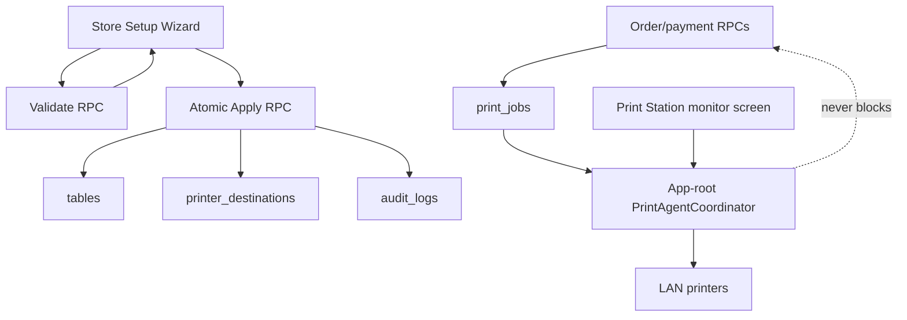

# Store Opening Setup Wizard Implementation Plan

- Status: Proposed for implementation
- Target opening date: 2026-08-06
- Plan date: 2026-07-17
- Product: GLOBOSVN POS
- Primary runtime: Flutter POS on Windows, Android tablets, Supabase/Postgres
- Decision method: `think_A` architecture and scope pressure-test

## 1. Outcome

Implement a data-driven **Store Opening Setup Wizard** inside POS so a new
restaurant can be configured without source-code changes or one-off production
SQL.

The first supported guided template is the 2026-08-06 operating shape:

- one Windows PC acting as both cashier and print agent;
- one cashier tablet that also exposes the normal POS and attendance surface;
- kitchen tablets running the kitchen workspace;
- four physical printers: cashier, kitchen, 2F, and 3F;
- five logical destinations: `receipt`, `kitchen`, `floor/1F`, `floor/2F`, and
  `floor/3F`;
- `receipt` and `floor/1F` sharing the cashier printer by default;
- real tables assigned to `1F`, `2F`, or `3F`.

The same Windows executable must be reusable at every store. Store-specific
printer IPs, ports, floor labels, table assignments, and agent enablement are
configuration data, not build-time constants.

## 2. Binding invariants

The implementation must preserve the following constraints:

1. Order creation and payment completion never depend on printer availability.
2. MISA/meInvoice behavior and the `process_payment` atomic anchor are not
   changed by this feature.
3. The physical `restaurants` table and its `id`, `name`, `address`, and
   `is_active` columns remain unchanged for Office compatibility.
4. All store mutations are checked server-side with the existing admin-like
   role and `user_accessible_stores()` boundary.
5. Clients do not receive or embed a Supabase service-role key.
6. Printer destination writes remain RPC-only and auditable.
7. A failed or interrupted setup apply leaves no partially written table or
   routing configuration.
8. Re-running the wizard with the same data is idempotent.
9. The wizard does not automatically delete tables or historical data.
10. Production release PASS requires the exact pushed SHA to pass GitHub
    Actions.

## 3. Think_A pressure-test

### 3.1 What breaks if this is not built?

- Each restaurant opening requires a developer to edit production data.
- Store IDs, table floors, or printer IPs can be applied to the wrong tenant.
- Five logical routes can be confused with four physical printers.
- Table-by-table floor editing creates avoidable setup time and inconsistency.
- Test prints do not prove the full Windows-agent-to-LAN-printer path unless
  the operator manually coordinates several screens.
- Opening-day recovery depends on the person who wrote the SQL instead of the
  store operator.

### 3.2 Who uses it and how often?

- `super_admin`: immediately after creating a new store and during pre-opening
  verification;
- `store_admin` or compatible admin role: initial local setup and later IP,
  floor, or table corrections for an accessible store;
- cashier operator: observes that the Windows print agent is running but does
  not change store topology;
- frequency: low per store, but business-critical and repeated for every new
  opening or printer/network replacement.

### 3.3 Root problem

The root problem is not missing CRUD. The current repository already provides:

- printer destination fetch/upsert/deactivate services and providers;
- store-scoped admin RPCs for destination writes;
- queued destination test jobs;
- per-table `floor_label` creation and editing;
- table layout administration;
- a native print-station screen and durable print queue;
- a Windows native build workflow.

The missing layer is safe orchestration: bulk input, preview, atomic apply,
readiness reporting, and a print agent whose lifetime is independent of the
monitoring screen.

### 3.4 Approaches considered

| Criterion | A. Improve existing screens | B. Wizard on current schema | C. Normalize printers/routes/devices |
|---|---:|---:|---:|
| Build complexity | Low | Medium | High |
| Operating complexity | High | Low | Low |
| Reversibility | High | High | Medium/Low |
| Blast radius | Low | Medium | High |
| Supabase schema cost | Minimal | Low | High |
| First usable version | 2–3 days | 7–9 engineering days | 3+ weeks |
| Repeatable openings | Weak | Strong | Strong |
| 2026-08-06 fit | Insufficient | **Recommended** | Too risky |

### 3.5 Decision

Implement approach B.

Do not introduce `physical_printers`, `print_routes`, station pairing, or a
device heartbeat registry before the opening. In the MVP, the UI models four
physical printers transiently and writes five rows into the existing
`printer_destinations` table. Sharing one IP across different logical routes
is allowed.

Approach C remains a later migration only if multiple active print agents,
remote fleet management, or frequent printer reassignment becomes a proven
operational need.

## 4. Scope

### 4.1 P0 — required for 2026-08-06

- separate store-opening wizard route;
- guided `3 floors / 4 printers` template;
- advanced/custom destination editing through the existing destination UI;
- bulk table generation and floor assignment;
- validation preview before writing;
- one atomic, idempotent apply RPC;
- derived store-opening readiness RPC;
- batch execution and tracking of all five destination test jobs;
- explicit human confirmation that each slip came from the expected printer;
- app-root print-agent coordinator;
- local per-device `print agent enabled` setting, default OFF;
- Windows cashier operation while the print agent continues in the background;
- Korean, Vietnamese, and English UI;
- complete SQL, Flutter, routing, security, regression, and Windows tests;
- production rollout and actual four-printer rehearsal before code freeze.

### 4.2 P1 — after the first opening

- copy configuration from an existing store;
- CSV import/export for table setup;
- additional guided templates;
- Windows launch-at-login integration or installer support;
- persistent setup-completion certificate/report;
- explicit print-station device registry, one-time pairing, heartbeat, and
  remote revocation;
- normalized physical printer and logical route schema if operational evidence
  justifies it.

### 4.3 Non-goals

- automatic LAN printer discovery;
- Windows Service implementation;
- automatic deletion of tables or routes;
- menu, staff, tax, inventory, or supplier onboarding in this wizard;
- blocking store sales because a printer or print agent is offline;
- changing `restaurants.is_active` semantics;
- changing MISA, payment, settlement, or Office integration contracts.

## 5. User flow


### 5.1 Entry points

Add a dedicated route:

```text
/store-setup/:storeId
```

Entry points:

1. Super Admin store creation success screen: `Continue store setup`.
2. Admin Settings for the current accessible store: `Store opening setup`.
3. Super Admin store detail action: `Open setup`.

Do not expand `/onboarding`. That flow creates the first workspace store and
super-admin profile and has different authorization and lifecycle semantics.

### 5.2 Wizard steps

#### Step 1 — Store and template

- show selected store name and ID;
- show legal entity, brand, and active status read-only;
- default template: `3 floors / 4 printers`;
- advanced mode opens generic existing destination controls without requiring
  a source-code change for a different layout.

#### Step 2 — Floors and tables

- default floors: `1F`, `2F`, `3F`;
- normalize floor labels to trimmed uppercase values;
- allow range generation, for example `201` through `218`;
- allow prefixed generation, for example `A01` through `A15`;
- allow a multiline paste of table numbers;
- allow seat-count default and per-table override;
- allow multi-select reassignment of existing tables;
- show duplicate numbers and invalid rows before apply;
- show existing occupied/reserved tables as non-editable blockers.

#### Step 3 — Physical printers

Collect these transient values:

| Physical slot | Required data |
|---|---|
| Cashier | display name, static IP, port |
| Kitchen | display name, static IP, port |
| 2F | display name, static IP, port |
| 3F | display name, static IP, port |

Default port is `9100`, but each printer can override it.

The IP field accepts only the supported static LAN addressing format for P0.
Hostnames and DHCP discovery are not part of P0.

#### Step 4 — Derived routing preview

The template derives:

| Logical route | Purpose | Floor | Physical slot |
|---|---|---|---|
| Receipt | `receipt` | null | Cashier |
| Kitchen | `kitchen` | null | Kitchen |
| 1F confirmation/routing | `floor` | `1F` | Cashier |
| 2F confirmation/routing | `floor` | `2F` | 2F |
| 3F confirmation/routing | `floor` | `3F` | 3F |

`1F shares cashier printer` defaults to true and is visible to the operator.
The preview must show that four physical printers become five logical rows.

Before apply, show:

- tables to create;
- tables to update;
- destinations to create;
- destinations to update or reactivate;
- unchanged rows;
- blockers and warnings;
- rows that remain untouched.

#### Step 5 — Windows print agent

On the cashier Windows PC, an admin enables:

```text
Use this device as the store print agent: ON
```

The setting is local to the device and defaults to OFF. After the admin logs
out and the cashier logs in, the preference remains enabled on that PC.

#### Step 6 — Test and readiness

Enqueue and track:

```text
TEST-RECEIPT
TEST-KITCHEN
TEST-1F
TEST-2F
TEST-3F
```

For each route, display `pending`, `printing`, `done`, or `failed` and require
the operator to confirm that the labeled slip came from the expected physical
printer.

## 6. Runtime architecture



### 6.1 Print-agent lifetime

The existing `PrintJobAgentService` is owned by `PrintStationScreen`, so leaving
that route stops polling. This is incompatible with one Windows PC acting as
both cashier and print station.

Introduce an app-root coordinator with one process-local agent instance:

```text
disabled -> starting -> running -> degraded -> stopped
```

Start conditions:

- runtime is native and printer-supported;
- local `print_agent_enabled` preference is true;
- the user is authenticated;
- a valid active store ID is available;
- the authenticated role satisfies the existing print queue ACL.

Stop/restart conditions:

- logout: stop and unsubscribe;
- store change: stop the previous subscription, then start for the new store;
- preference disabled: stop;
- application shutdown: stop;
- network failure: retain durable jobs and retry with bounded backoff.

`PrintStationScreen` becomes a monitor/controller of the shared coordinator and
must not construct a second agent instance.

### 6.2 Multiple-agent limitation

The existing queue claim contract prevents duplicate processing, but a device
on the wrong LAN could claim and fail a job before the correct device receives
it. P0 mitigations:

- print agent defaults OFF on every device;
- enable it only on the designated Windows cashier PC;
- show the enabled state prominently in Settings and Print Station;
- include this check in the opening runbook.

A station registry and heartbeat are deliberately deferred to P1.

## 7. Database plan

Create one additive migration, provisionally named:

```text
supabase/migrations/202607xxxxxx_store_opening_setup_wizard.sql
```

### 7.1 Reused relations

- `public.restaurants`
- `public.tables`
- `public.printer_destinations`
- `public.print_jobs`
- `public.audit_logs`

Do not add an opening-status table in P0. Readiness is derived from current
configuration and recent test jobs. Do not change `restaurants.is_active`.

### 7.2 Active route uniqueness

Add a partial unique expression index equivalent to:

```text
restaurant_id,
purpose,
coalesce(upper(btrim(floor_label)), '')
WHERE is_active = true
```

This allows `receipt` and `floor/1F` to share one IP while rejecting two active
`floor/2F` routes for the same store.

Deployment gate:

1. preflight for existing duplicate active route keys;
2. fail closed if duplicates exist;
3. remediate explicitly before creating the index;
4. never silently choose a winner.

### 7.3 Validation RPC

Provisional contract:

```sql
admin_validate_store_opening_config(
  p_store_id uuid,
  p_tables jsonb,
  p_destinations jsonb
) returns jsonb
```

Example table payload:

```json
[
  {"table_number":"A01","seat_count":4,"floor_label":"1F"},
  {"table_number":"201","seat_count":4,"floor_label":"2F"},
  {"table_number":"301","seat_count":4,"floor_label":"3F"}
]
```

Example destination payload:

```json
[
  {"name":"Cashier Receipt","ip":"192.168.1.10","port":9100,"purpose":"receipt","floor_label":null},
  {"name":"Kitchen","ip":"192.168.1.11","port":9100,"purpose":"kitchen","floor_label":null},
  {"name":"1F via Cashier","ip":"192.168.1.10","port":9100,"purpose":"floor","floor_label":"1F"},
  {"name":"2F","ip":"192.168.1.12","port":9100,"purpose":"floor","floor_label":"2F"},
  {"name":"3F","ip":"192.168.1.13","port":9100,"purpose":"floor","floor_label":"3F"}
]
```

Validation requirements:

- require admin-like actor and accessible store;
- require an existing store;
- reject duplicate table numbers in payload;
- reject duplicate route keys in payload;
- reject blank or malformed floor labels;
- reject unsupported purpose values;
- reject blank IPs and ports outside `1..65535`;
- require one `receipt`, one `kitchen`, and one `floor` route for each floor
  used by the submitted table set;
- permit the same IP/port across different route keys;
- cap payload at 500 tables and 20 destinations;
- identify occupied or reserved tables whose floor/identity would change;
- identify existing extra tables/routes without deleting them;
- return deterministic errors, warnings, and change counts.

Example return shape:

```json
{
  "valid": true,
  "errors": [],
  "warnings": [],
  "plan": {
    "tables_create": 20,
    "tables_update": 4,
    "destinations_create": 5,
    "destinations_update": 0,
    "untouched_existing_tables": 0,
    "untouched_existing_destinations": 0
  }
}
```

### 7.4 Atomic apply RPC

Provisional contract:

```sql
admin_apply_store_opening_config(
  p_store_id uuid,
  p_tables jsonb,
  p_destinations jsonb
) returns jsonb
```

Required behavior:

1. verify actor and store scope again;
2. lock the target restaurant row for the transaction;
3. rerun all validation server-side;
4. fail without writes when any blocker exists;
5. match tables by `(restaurant_id, table_number)`;
6. call or preserve the current audited table mutation contract;
7. match destinations by normalized route key, not by display name or IP;
8. update/reactivate a matching destination or create it when absent;
9. never delete a table;
10. never automatically deactivate unrelated `tray` or advanced routes;
11. preserve all store boundaries and existing RLS/RPC grants;
12. write one summary audit event in addition to row-level audit evidence;
13. return the saved rows and counts needed to refresh the wizard;
14. produce the same end state when the identical request is repeated.

If multiple inactive rows match one route key, validation must return a blocker
instead of selecting one implicitly.

### 7.5 Readiness RPC

Provisional contract:

```sql
admin_get_store_opening_readiness(p_store_id uuid) returns jsonb
```

Derived checks:

- store exists and actor can administer it;
- at least one configured table exists;
- no blank table floor labels;
- every used floor has exactly one active floor destination;
- exactly one active receipt destination;
- exactly one active kitchen destination;
- no duplicate active route keys;
- no recent `NO_DESTINATION` jobs after configuration;
- latest test job status for each required destination;
- counts of pending and failed print jobs.

Readiness is informational. It must not be referenced by order or payment RPCs.

### 7.6 Test-job tracking

Reuse `admin_enqueue_printer_test_job`. It already returns a `print_jobs` row
and tags the payload with `printed_reason = 'test_print'`.

Flutter changes must retain the returned job ID and query the store-scoped
`print_jobs` rows until each job reaches `done` or `failed`, with a bounded
timeout and visible retry action.

## 8. Flutter implementation plan

### 8.1 New feature package

```text
lib/features/store_setup/
  store_setup_models.dart
  store_setup_service.dart
  store_setup_provider.dart
  store_setup_screen.dart
  widgets/
    store_setup_stepper.dart
    table_bulk_editor.dart
    physical_printer_form.dart
    route_preview.dart
    print_test_checklist.dart
    readiness_summary.dart
```

### 8.2 Core models

`StoreOpeningDraft`:

- store ID;
- template ID;
- floor definitions;
- table drafts;
- physical printer drafts;
- derived destination drafts;
- validation result;
- apply result;
- test job states;
- local human-confirmation states.

Physical printer models are UI-only in P0. Only derived logical destinations
are persisted.

### 8.3 Provider state machine

Suggested state:

```text
loadingExisting
editing
validating
readyToApply
applying
applied
testing
ready
blocked
```

Provider responsibilities:

- load current tables and destinations;
- construct the template draft;
- generate and normalize table ranges;
- derive the five destination rows;
- call validation and apply services;
- retain returned test job IDs;
- poll test job status;
- refresh readiness;
- map stable server errors to localized messages;
- prevent double submission.

### 8.4 Routing and authorization

- add `/store-setup/:storeId` to `app_router.dart`;
- allow only admin-like roles;
- non-super-admin users may open only an accessible store;
- never rely solely on the route guard—the RPC repeats store-scope validation;
- redirect unsupported roles to their role home;
- keep QR public routes and all current native guards unchanged.

### 8.5 Print coordinator

Provisional files:

```text
lib/core/hardware/print_agent_coordinator.dart
lib/core/hardware/print_agent_coordinator_provider.dart
```

Responsibilities:

- own exactly one `PrintJobAgentService` instance;
- read/write local `print_agent_enabled` preference;
- observe authentication, role, active store, and connectivity;
- start, stop, and restart the agent deterministically;
- expose running state, last run summary, and last error;
- prevent overlapping `processOnce` calls;
- clean up realtime subscription and polling timer;
- keep running while the cashier navigates away from `/print-station`.

Update `PrintStationScreen` to consume this provider rather than owning a
private service instance.

### 8.6 Localization

Add every user-visible string to:

- `lib/l10n/app_en.arb`
- `lib/l10n/app_ko.arb`
- `lib/l10n/app_vi.arb`

Do not translate stable floor codes or server error codes. Translate labels,
instructions, warnings, readiness results, and recovery guidance.

## 9. Safety and failure behavior

| Failure | Required behavior |
|---|---|
| Wrong store ID | RPC rejects before writes |
| Role without admin scope | RPC rejects before writes |
| Network loss during validation | Draft remains editable; no writes |
| Network loss during apply response | Operator reloads; idempotent state proves result |
| One invalid table | Entire apply rolls back |
| Duplicate route | Validation blocker; no implicit winner |
| Printer offline | Job remains retryable; sales continue |
| Windows app closed | Jobs accumulate durably; sales continue |
| Logout or store switch | Agent unsubscribes before changing scope |
| Two agents enabled | Claim prevents duplicate job execution; operating warning remains |
| Wrong physical printer selected | Labeled test slip plus human confirmation catches it |
| 500 tables / 20 destinations | Supported upper bound with deterministic validation |
| Three languages | Same flow and error coverage in EN/KO/VI |

## 10. Test plan

### 10.1 SQL contract tests

Add:

```text
supabase/tests/store_opening_setup_contract_test.sql
test/store_opening_setup_sql_contract_test.dart
```

Required cases:

- valid 3-floor/4-printer payload produces five routes;
- receipt and 1F share the cashier IP successfully;
- duplicate active route is rejected;
- missing floor destination is rejected;
- cross-store table and destination IDs are rejected;
- unauthorized role is rejected;
- invalid IP/port/floor/table input rolls back all changes;
- re-running identical config creates no duplicates;
- occupied/reserved table mutation is blocked;
- existing unspecified table is not deleted;
- existing unrelated `tray` route is not deactivated;
- audit evidence contains store ID and summary counts;
- readiness is PASS only with required routes and successful recent tests;
- readiness has no dependency from payment/order functions.

### 10.2 Flutter unit and contract tests

Add:

```text
test/store_setup_template_test.dart
test/store_setup_provider_test.dart
test/store_setup_screen_contract_test.dart
test/print_agent_coordinator_test.dart
test/store_setup_localization_contract_test.dart
```

Required cases:

- template maps four physical printers to five destinations;
- 1F sharing can be disabled or remapped;
- table range and prefix generation is deterministic;
- duplicate table numbers are visible before apply;
- provider prevents concurrent validation/apply;
- returned test job IDs are retained and polled;
- agent default is OFF;
- enabled agent starts only after valid auth/store state;
- cashier navigation does not stop the agent;
- logout stops agent and subscription;
- store change cannot leak the prior store subscription;
- unsupported/web runtime never starts a native agent;
- payment code contains no readiness or printer success dependency;
- all new keys exist in EN/KO/VI.

### 10.3 Full regression

- `dart analyze --fatal-infos`
- full `flutter test`
- `flutter build web --release`
- targeted Windows print-station build tests
- Node contracts, npm audit, and repository secret scan
- SQL wrapper and clean-worktree gate tests
- whitespace and conflict-marker checks

### 10.4 Hardware rehearsal

On the actual store LAN:

1. configure fixed IPs on all four printers;
2. install the exact-SHA Windows package;
3. log in with an authorized admin and enable the local print agent;
4. log in as cashier and confirm the agent remains active;
5. run five labeled destination tests;
6. place real test orders for 1F, 2F, and 3F;
7. verify kitchen plus matching floor output;
8. complete a test payment and verify only the cashier receipt route;
9. power off one printer and prove order/payment still complete;
10. restore the printer and prove queued/retried output behavior;
11. close and restart the Windows app and verify durable jobs remain;
12. record printer models, IPs, ports, paper widths, output locations, and
    operator confirmation.

## 11. Implementation sequence and gates

### Phase 0 — Contract freeze

Tasks:

- approve this document;
- freeze P0/non-goal boundary;
- confirm 1F shares cashier printer by default;
- confirm the supported physical printer protocol is raw TCP/9100;
- define stable error codes and RPC JSON shapes.

Exit gate:

- no unresolved product decision changes the DB or agent architecture.

### Phase 1 — Database validation and apply

Tasks:

- write duplicate-route production preflight;
- add unique active-route index;
- implement validate/apply/readiness RPCs;
- add grants, comments, audit logging, rollback SQL, and contract tests.

Exit gate:

- SQL tests prove cross-store denial, rollback, and idempotency.

### Phase 2 — Wizard data and UI

Tasks:

- implement models, service, provider, and route;
- implement table bulk editor and printer template;
- implement preview/apply/readiness surfaces;
- connect Super Admin and Settings entry points;
- add EN/KO/VI localization.

Exit gate:

- a new local/test store can be configured without direct SQL.

### Phase 3 — App-root print agent

Tasks:

- implement local device toggle;
- move agent lifetime to the app-root coordinator;
- update Print Station to monitor the coordinator;
- verify cashier navigation, logout, store switch, and network recovery.

Exit gate:

- the Windows cashier screen and background printing work simultaneously.

### Phase 4 — Test orchestration

Tasks:

- retain test job IDs;
- show live status per destination;
- add physical-output confirmation checklist;
- connect readiness refresh and recovery guidance.

Exit gate:

- all five logical routes have automated queue evidence and human physical
  confirmation.

### Phase 5 — Release and rehearsal

Tasks:

- run full local regression;
- push a review branch and open PR;
- require exact-head GitHub Actions checks;
- merge only after green checks;
- require exact-main-SHA Windows artifact and release proof;
- deploy DB migration through the production gates with rollback ready;
- download, hash, and inspect the Windows ZIP;
- complete hardware rehearsal.

Exit gate:

- code, DB, Windows artifact, and physical four-printer evidence all refer to
  the intended production version.

## 12. Schedule

| Date | Target |
|---|---|
| 2026-07-17 to 2026-07-18 | Contract and plan freeze |
| 2026-07-19 to 2026-07-21 | DB preflight, migration, RPCs, SQL tests |
| 2026-07-22 to 2026-07-25 | Wizard UI, bulk tables, template, localization |
| 2026-07-26 to 2026-07-28 | App-root print agent and monitoring integration |
| 2026-07-29 to 2026-07-31 | Test orchestration, full regression, review fixes |
| 2026-08-01 | Exact-SHA CI and guarded production deployment |
| 2026-08-02 to 2026-08-03 | Actual Windows PC and four-printer rehearsal |
| 2026-08-04 | Code, DB, and artifact freeze |
| 2026-08-05 | On-site installation and contingency checks |
| 2026-08-06 | Restaurant setup through POS wizard and opening validation |

## 13. Definition of done

- A new store can be configured without code changes or direct production SQL.
- The same Windows ZIP is usable for all stores.
- Software configuration takes no more than 20 minutes excluding cabling and
  printer network setup.
- Four physical printers produce the required five logical outputs.
- Tables are assigned to real floors in bulk.
- Re-running the wizard is safe and does not duplicate rows.
- The server rejects cross-store or unauthorized mutations.
- The Windows cashier can remain on the cashier screen while printing runs.
- Printer or agent failure never blocks orders or payments.
- Five destination test jobs complete and are physically confirmed.
- EN/KO/VI UI and error paths are complete.
- Full regression and exact-SHA GitHub checks pass.
- Production DB migration has preflight, verification, and rollback evidence.
- Actual store-LAN hardware rehearsal passes before the 2026-08-04 freeze.

## 14. Residual risks

| Risk | P0 mitigation | Later improvement |
|---|---|---|
| Two devices enabled as agents | default OFF; designated Windows PC only; claim semantics | device registry and heartbeat |
| Wrong IP points to valid but wrong printer | labeled test slips and human confirmation | printer identity handshake where supported |
| App closes during service | durable queue and visible restart procedure | launch-at-login or Windows Service |
| Future store topology differs | advanced existing CRUD remains available | data-defined templates and physical printer model |
| Floor text variations | uppercase/trim normalization and wizard-controlled values | normalized store service-area relation |
| Existing duplicate routes | fail-closed preflight before unique index | ongoing DB uniqueness enforcement |

## 15. Implementation checklist

- [ ] Approve plan and freeze P0 scope.
- [ ] Add duplicate-route production preflight.
- [ ] Add additive migration and rollback.
- [ ] Implement validation RPC.
- [ ] Implement atomic apply RPC.
- [ ] Implement readiness RPC.
- [ ] Add SQL contract tests.
- [ ] Implement store-setup models/service/provider.
- [ ] Implement route and authorization guards.
- [ ] Implement six-step wizard.
- [ ] Implement table bulk generation and assignment.
- [ ] Implement 3-floor/4-printer template and advanced path.
- [ ] Implement route preview and atomic apply result.
- [ ] Implement test job tracking and operator confirmation.
- [ ] Implement app-root print-agent coordinator.
- [ ] Add local print-agent enable/disable setting.
- [ ] Refactor Print Station to use the coordinator.
- [ ] Add EN/KO/VI localization.
- [ ] Add Flutter/unit/contract tests.
- [ ] Run full regression and web release build.
- [ ] Obtain exact-head PR checks.
- [ ] Obtain exact-main-SHA Windows artifact and release proof.
- [ ] Deploy DB through production gates with rollback ready.
- [ ] Complete actual Windows/four-printer rehearsal.
- [ ] Freeze on 2026-08-04.
