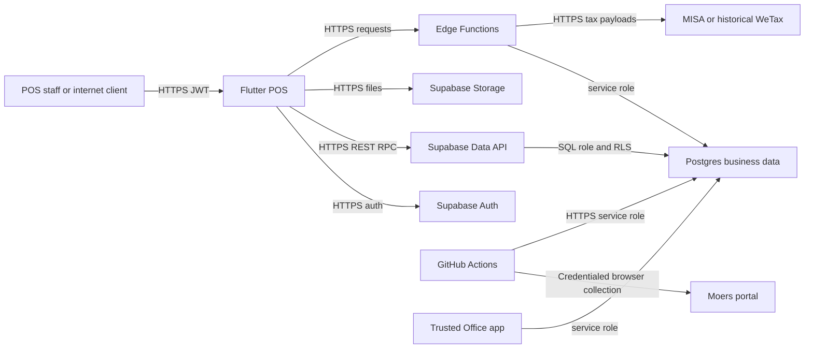

# GLOBOSVN POS Security Threat Model

Assessment date: 2026-07-15

Repository: `/Users/andreahn/globos_pos_system`

Assessed branch/commit: `main` / `ef484e8ad8957caf6906211b12845f51ac780d15`

Method: repository-grounded threat modeling followed by source-only remediation; no production queries, secret access, migration apply, deployment, or release-gate decision

## Executive summary

The model identifies a database exposure mismatch, public execution of internal `SECURITY DEFINER` functions, an unconditional audit policy, deactivated-account authorization gaps, secret-bearing CI jobs using mutable action tags, payment retry/proof weaknesses, provisioning partial failure, dangerous Auth maintenance tooling, mutable Edge imports, client-side payroll PIN verification, and unvalidated vendor links. Source remediations now exist for those paths. The payment/proof/PIN changes were reshaped into a mixed-version-safe Expand migration, a restart-safe Flutter client, and a guarded later Contract outside normal migrations. Disposable local PostgreSQL tests exercised old/new clients, concurrent replay, Contract, and emergency regrant, but production risk is not declared closed. Moers credentialed browser collection remains an accepted vendor constraint, WeTax is preserved/deferred, and MISA is confirmed unimplemented.

### Source remediation overlay

| Threats/findings | Repository status | Residual requirement |
|---|---|---|
| TM-001 / SBP-001 | Remediated in source: 12 views use invoker security and deny `PUBLIC`/`anon` | Apply migration; verify catalog ACLs and cross-tenant reads |
| TM-002 / SBP-002 | Remediated in source: permissive audit policy is dropped | Apply migration; test effective policy set |
| TM-003 / SBP-003 | Remediated in source: seven internal helpers and future default ACLs are restricted | Apply migration; verify live function ACLs and internal callers |
| TM-004 / SBP-004 | Remediated in source: active-only identity/Storage/Edge caller checks | Apply/deploy; test stale sessions and add Auth-session revocation |
| SBP-005 | Confirmed accepted constraint: Moers provides no API, so the integration uses a credentialed browser session | No security remediation required; preserve collector behavior and operational controls |
| TM-006 / SBP-006 | Remediated in source: immutable action pins and step-only secrets | Merge/deploy workflows; review GitHub environment protections |
| TM-007 / SBP-007 | Deferred by user direction: WeTax remains preserved; only its dependency URL was exact-pinned under SBP-013 | No behavior change; assess deployed exposure separately if scope changes |
| TM-008 / SBP-008 | Remediated in source and locally engine-tested: old/new payment RPCs coexist; attempt IDs persist across restart and concurrent replay creates one result | Apply Audit and Expand separately, smoke old client, then deploy/observe new client |
| TM-009 / SBP-010 | Partially remediated in source: new proofs use object paths/JWT reads; legacy queue deletion occurs only after upload plus v2 attach | Deploy staged client; later perform bounded copy/hash/authenticated-read/delete cleanup for old URLs |
| SBP-009 | Remediated in source: staff creation rejects new legacy `admin`, rolls back on every failure, and verifies returned claims | Deploy Function; inject every failure branch and verify no orphaned identity/access |
| SBP-012 / SBP-013 | Remediated in source: bulk reset is disabled and all assessed Edge imports exact-pin `2.110.2` | Merge/deploy; compare deployed Function hashes/imports |
| SBP-014 / SBP-015 | Remediated in source: Expand-safe private bcrypt plus temporary legacy SHA compatibility/lockout, and current WeTax HTTPS host validation | Stage deployment; mask/revoke legacy PIN only in a later Contract release |
| TM-010 / SBP-011 | Accepted current state: MISA is not implemented and was excluded from this improvement pass | Re-model against the authoritative contract when implementation begins |

## Scope and assumptions

### In scope

- Flutter client and routing: `lib/**`, platform manifests, dependency manifests.
- Supabase reflected schema, migrations, RLS/RPC/storage policies: `supabase/schema.sql`, `supabase/migrations/**`.
- Edge Functions: `supabase/functions/**`.
- Tests and operational scripts: `test/**`, `scripts/**`.
- CI and operational automation: `.github/workflows/**`.
- Authoritative repository rules and current architecture/scope documents: `CLAUDE.md`, `README.md`, and current documents directly referenced by active code or workflows.
- Git history and local refs only to establish whether MISA sources are merged into `main`.

### Out of scope

- Production Supabase data, secrets, Auth sessions, database grants, migration ledger, Edge Function deployment inventory, logs, and runtime configuration.
- GitHub repository settings, current workflow enablement/run results, environment protection rules, and secret values.
- Vercel deployment state, Office repository code, MISA/WeTax/Moers runtime systems, network interception, and vendor accounts.
- Applying migrations, invoking production functions, deploying, or declaring a release gate PASS.
- Redesigning, removing, or undeploying WeTax. The user explicitly directed that WeTax remain preserved even though repository documents describe it as historical.
- Implementing MISA. The user confirmed it is not implemented and excluded it from this improvement pass.

### Code-based resolution of the three context questions

1. **Operational source baseline: current `main`.** The checkout is `main`; the production proof workflow accepts only an exact validated `main` SHA and matches it to the Vercel deployment (`.github/workflows/photo_objet_release_proof.yml:3-7`, `:28-77`, `:103-130`). The MISA commits are present only on `codex/meinvoice-misa-main`, which is not an ancestor of assessed `main`. Therefore findings are ranked against `main`; the unmerged branch is an evidence gap, not assumed production code.
2. **Manual production DB hardening: not evidenced.** Repository evidence cannot prove or disprove console-only changes. The assessment conservatively treats tracked migrations plus the reflected schema as the auditable baseline. The reflected schema was last committed on 2026-05-12, and later migrations harden selected views only; no tracked change fixes the exposed views or permissive audit policy identified below.
3. **Automation status: Moers active by code; WeTax preserved but runtime reachability unverified.** Moers has seven scheduled collection triggers and seven scheduled health triggers (`.github/workflows/photo_objet_sales_collect.yml:3-12`, `.github/workflows/photo_objet_sales_health.yml:3-13`), so it is modeled as active. WeTax source and a Flutter call remain (`lib/core/services/einvoice_service.dart:3-8`); the user requires that they remain. No current GitHub workflow schedules WeTax, so TM-007 reachability still depends on deployment/invocation evidence.

### Explicit assumptions

- Supabase Data API, Auth, Storage, and deployed Edge Functions are internet-reachable through normal Supabase endpoints.
- A public/anon key is obtainable from the client by design; security must therefore come from grants, RLS, and function authorization, not key secrecy.
- The Office service-role integration is trusted and must retain `restaurants(id, name, address, is_active)` (`CLAUDE.md:61-80`).
- `generate-settlement` and `generate_delivery_settlement` are intentionally separate dine-in and Deliberry domains (`CLAUDE.md:57-59`).
- POS financial, staff, attendance, QSC, invoice, and payment-proof data are business-sensitive across tenants.

### Open questions that materially change risk

- Whether current production has untracked view/grant/function hardening. Verified production hardening would lower TM-001 through TM-004; its absence preserves the stated rankings.
- Whether preserved WeTax functions are deployed and whether `CRON_SECRET`/`INTERNAL_SECRET` are non-empty. This controls whether deferred TM-007 is reachable.
- When MISA implementation will begin and which contract/source will become authoritative for its credential, token-cache, polling, response-validation, and portal-host controls.

## System model

### Primary components

- **Flutter POS client:** authenticates with Supabase, calls PostgREST/RPC/Storage/Edge Functions, renders role-specific workspaces, uploads payment proofs directly, and migrates the legacy proof queue without deleting failed entries (`lib/main.dart:15-44`; `lib/core/services/payment_proof_service.dart`).
- **Supabase Auth and Data API:** JWT identity, public-schema table/view/RPC exposure, RLS, and Storage policies (`supabase/schema.sql:13206-13662`, `:14823-14836`).
- **Postgres business core:** restaurants/brands/users, orders/payments, inventory, attendance/payroll, QSC, audit logs, and invoice queues.
- **Edge Functions:** staff provisioning, two domain-specific settlement workers, and historical WeTax integration (`supabase/functions/**`).
- **GitHub Actions Photo Objet control plane:** scheduled Puppeteer collection, service-role writes, health monitoring, bounded backfill, and release evidence (`.github/workflows/photo_objet_sales_*.yml`, `.github/workflows/photo_objet_release_proof.yml`).
- **External systems:** Moers web portal, authoritative MISA/meInvoice, historical WeTax, Vercel-hosted Flutter web app, and the trusted Office application.

### Data flows and trust boundaries

- **Staff device → Flutter → Supabase Auth:** email/password and refresh tokens over HTTPS. Supabase verifies credentials; client additionally signs out an inactive profile, but server-side authorization must remain authoritative (`lib/features/auth/auth_provider.dart:26-57`). Rate-limit and MFA settings are not in the repository.
- **Flutter/Internet → Data API/RPC:** public key, JWT, tenant identifiers, order/payment inputs, reports, and administrative mutations over HTTPS. RLS and RPC checks are the intended controls. Public views and default grants create bypasses; no application-level rate limiter is evidenced.
- **Flutter → Storage:** attendance/QSC/payment-proof images over HTTPS. Buckets are private and path policies exist, but some policies do not require `users.is_active` (`supabase/migrations/20260408000000_security_hardening.sql:135-203`).
- **Flutter/admin → `create_staff_user`:** caller JWT and new-staff credentials over HTTPS. JWT/active state/roles/scopes are checked; provisioning uses service-role privileges, but every failed post-create phase now invokes compensating cleanup and claim postconditions are mandatory (`supabase/functions/create_staff_user/index.ts:30-58`, `:65-180`, `:309-455`).
- **Postgres → invoice queue → MISA/WeTax worker:** legal/tax identifiers, sale lines, payment method, buyer data, vendor token, and vendor responses. Payment is intended to commit before asynchronous invoice delivery (`CLAUDE.md:51-56`, `supabase/migrations/20260428000002_vat_pricing_mode.sql:337-390`). The MISA worker is absent from assessed `main`.
- **GitHub-hosted runner → Moers:** vendor usernames/passwords and downloaded sales data via the approved browser automation path because Moers provides no API. Credentials are supplied by GitHub Secrets only to the consuming collector steps; source hashes, mapping preflight, and health ledgers protect ingestion integrity (`scripts/pull_moers_sales.js:500-623`; `.github/workflows/photo_objet_sales_collect.yml:49-85`).
- **GitHub-hosted runner → Supabase:** service-role key and collected sales/health data over HTTPS. Current workflow source maps these credentials only onto the repository-controlled steps that use them, and every external action is full-SHA pinned (`.github/workflows/photo_objet_sales_collect.yml:27-88`).
- **Office app → POS Supabase:** service-role direct access to the `restaurants` compatibility contract; this is a trusted privileged boundary, not a tenant-user boundary (`CLAUDE.md:61-80`).

#### Diagram

## Assets and security objectives

| Asset | Why it matters | Security objective (C/I/A) |
|---|---|---|
| Orders, payments, payment-method allocation | Revenue recognition and customer settlement must be correct | I, A |
| E-invoice jobs, UUIDv7 references, buyer/tax data | Legal invoice integrity and taxpayer/customer privacy | C, I, A |
| Tenant/brand/store access mappings and roles | Primary cross-tenant authorization boundary | C, I |
| Staff identities, attendance, payroll, payroll PIN | Employee privacy and wage integrity | C, I |
| Inventory cost, supplier, QSC notes/photos | Competitive and operationally sensitive tenant data | C, I |
| Payment-proof photos and object references; legacy signed URLs | Evidence may contain financial/PII content; old bearer URLs can outlive current authorization | C, I |
| Supabase service-role, vendor passwords, cron/internal secrets | Bypass RLS or control privileged automation | C, I, A |
| Audit logs and immutable Photo Objet ledgers | Attribution, fraud investigation, and replay detection | I, A, C |
| CI workflows and release artifacts | Production provenance and secret-bearing control plane | I, C |
| `restaurants` compatibility contract | Required Office integration and production availability | I, A |

## Attacker model

### Capabilities

- Unauthenticated internet caller who possesses the public client configuration/anon key.
- Authenticated low-privilege waiter, kitchen user, cashier, or tenant admin capable of making direct REST/RPC calls outside the Flutter UI.
- Deactivated user retaining an unexpired/refreshable JWT.
- Attacker who compromises a mutable GitHub Action tag, a developer/workflow change path, or an upstream dependency at deployment time.
- Malicious or compromised invoice/Moers vendor returning crafted payloads or URLs.
- Operator who accidentally runs a dangerous service-role maintenance script.

### Non-capabilities

- No assumed database-owner, Supabase dashboard, GitHub admin, vendor-admin, or device-root access.
- No assumed knowledge of UUID resource identifiers unless exposed by another finding.
- No assumption that WeTax is deployed; its threats are conditional.
- No assumption that MISA branch code is deployed because it is absent from `main`.
- No finding relies on changing the documented Office table contract or merging the two settlement functions.

## Entry points and attack surfaces

| Surface | How reached | Trust boundary | Notes | Evidence (repo path / symbol) |
|---|---|---|---|---|
| Public views | Data API with anon/auth key | Internet → Postgres owner-privileged view | Several lack `security_invoker` and have anon grants | `supabase/schema.sql:11087-11096`, `:14675-14803` |
| Public RPCs | `/rest/v1/rpc/<function>` | Internet → `SECURITY DEFINER` | Default and explicit anon execute grants | `supabase/schema.sql:7101-7158`, `:8075-8149`, `:14273-14281`, `:14363-14377`, `:14823-14826` |
| Core table API | PostgREST from Flutter/direct client | Authenticated user → RLS | Broadly protected, but legacy helpers omit active check | `supabase/schema.sql:5398-5488`, `:13202-13650` |
| Storage | Supabase Storage API | Authenticated user → private buckets | Path scoping; inactive check gap in attendance/QSC and super-admin proof branches | `supabase/migrations/20260408000000_security_hardening.sql:135-203`, `20260414000012_payment_proof_and_wt09_access.sql:13-47` |
| Staff provisioning | `create_staff_user` Edge Function | Admin JWT → service role/Auth admin | Source now checks active caller, rejects new legacy `admin`, rolls back failures, and verifies claims; deployment pending | `supabase/functions/create_staff_user/index.ts:30-58`, `:93-164`, `:309-455` |
| Payment RPC | `process_payment` | Cashier/admin JWT → financial transaction | Expand preserves four arguments and adds idempotent five arguments; Flutter persists scoped IDs before calling | `supabase/migrations/20260715020000_security_expand_compat.sql`; `lib/core/services/payment_attempt_store.dart` |
| Payment-proof upload/read | Camera/file → Storage/RPC | Device → private cloud storage | v2 stores validated path, JWT/RLS download returns bytes, and legacy queued files survive every pre-attach failure; legacy URLs remain | `supabase/migrations/20260715020000_security_expand_compat.sql`; `lib/core/services/payment_proof_service.dart` |
| Historical WeTax functions | Edge Function URL or Flutter lookup | Internet/JWT/cron → service role/vendor | Conditional residual surface; some auth is fail-open | `supabase/functions/wetax-onboarding/index.ts:217-284`, `wetax-dispatcher/index.ts:249-287` |
| Moers collector | Scheduled/manual GitHub Action | Hosted runner → vendor portal → service-role DB | Accepted credentialed browser integration because the vendor provides no API; passwords are secret-scoped to collector steps | `scripts/pull_moers_sales.js:500-623`; `.github/workflows/photo_objet_sales_collect.yml:49-85` |
| CI/release workflows | Push, schedule, workflow dispatch/run | GitHub actions → secrets/production APIs | Source uses least-privilege token permissions, full-SHA action pins, and step-only secret mappings | `.github/workflows/photo_objet_release_proof.yml:9-26`, `:43-146`; `scripts/tests/workflow_security.test.js:35-64` |
| Operator reset script | Local Node | Operator workstation | Quarantined: performs no Auth/network mutation and exits non-zero | `scripts/reset_all_auth_passwords.js:1-12`; `scripts/tests/reset_all_auth_passwords.test.js` |

## Top abuse paths

The first five paths and path 7 are mitigated in the current source tree but remain residual production paths until independent review, application/deployment, and runtime verification. Path 6 is intentionally deferred because WeTax must remain preserved.

1. **Unauthenticated tenant-data exfiltration:** obtain the client anon key → query owner-privileged views → bypass base-table RLS → download cross-tenant sales, attendance, cost/supplier, QSC evidence, settings, and payroll hashes.
2. **Privileged anonymous RPC abuse:** call internal `SECURITY DEFINER` functions through PostgREST → recompute access/QC/inventory or force auth-claim refreshes → cause integrity changes, metadata disclosure, or database load.
3. **Audit intelligence leak:** authenticate as any staff role → query `audit_logs` → permissive `USING (true)` policy ORs with scoped policy → enumerate all tenants' operational mutations and identifiers.
4. **Deactivated-admin persistence:** retain a valid JWT after deactivation → legacy role/store helpers still resolve privileges → read/write through RLS/storage; an inactive super-admin can call staff provisioning and create a fresh privileged account.
5. **CI supply-chain secret theft:** compromise/move a referenced action tag → action runs inside a job containing service-role/vendor/Vercel secrets → exfiltrate credentials and tamper with production data or evidence.
6. **Residual WeTax control-plane abuse (user-deferred):** if preserved functions are deployed and secrets are absent/misconfigured, call cron functions unauthenticated or use a cashier JWT for seller/shop registration operations → mutate vendor/tenant invoice state with service-role backing.
7. **Ambiguous split-payment replay:** complete a partial split RPC but lose the response → reload/restart → persisted attempt UUID is reused and the source ledger returns the original payment. Production remains exposed until staged rollout completes.
8. **Legacy payment-proof leakage:** obtain a previously issued ten-year signed URL → read payment evidence until authorized operational revocation/rotation. New source capture creates no durable URL or plaintext offline queue copy.
9. **Future MISA implementation drift:** implement MISA outside the canonical contract/source lineage → credential, replay, SSRF, retention, and failure-isolation controls escape review. MISA is currently confirmed unimplemented.

## Threat model table

| Threat ID | Threat source | Prerequisites | Threat action | Impact | Impacted assets | Existing controls (evidence) | Gaps | Recommended mitigations | Detection ideas | Likelihood | Impact severity | Priority |
|---|---|---|---|---|---|---|---|---|---|---|---|---|
| TM-001 | Unauthenticated internet caller | Public Data API and anon key; production grants match tracked schema | Select owner-privileged public views and bypass base-table RLS | Cross-tenant bulk disclosure, payroll PIN cracking, operational intelligence | Sales, attendance, payroll, QSC, inventory | RLS on base tables; selected Deliberry views are hardened (`supabase/migrations/299_deliberry_integration_security_closure.sql:5-30`) | Exposed views omit `security_invoker`; broad anon grants | Set `security_invoker=true`, revoke anon by default, explicitly grant only intended roles, add tenant predicates where needed | Alert on anon requests to non-public views; inventory grants/view options from catalogs | High | High | critical |
| TM-002 | Any authenticated staff | Valid low-privilege JWT | Read all `audit_logs` through permissive policy | Cross-tenant mutation history and identifier disclosure; improves later targeting | Audit trail, tenant metadata | A scoped admin policy exists (`20260425000001_harden_audit_logs_scope_for_reports.sql:3-43`) | `audit_logs_authenticated_select USING (true)` remains and policies OR together | Drop permissive policy; retain active, role, and store-scoped policy; add negative-role SQL test | Monitor non-admin selects and unusually large audit exports | High | High | high |
| TM-003 | Unauthenticated internet caller | Public RPC schema; exposed function names | Invoke internal `SECURITY DEFINER` maintenance/recompute functions with attacker parameters | Unauthorized writes, auth metadata disclosure, DB workload/DoS, invoice queue manipulation where MISA objects exist | Roles/access, QC, inventory, Auth claims, invoice queue | Functions generally use fixed `search_path`; many business RPCs validate active actor | Default/explicit anon execute; named internal helpers omit caller auth | Revoke `PUBLIC/anon/authenticated` execute by default; move internals to unexposed schema; grant per signature; add caller checks where public use is required | Log PostgREST RPC caller role, function, latency, and mutation count; alert on anon privileged RPCs | High | High | high |
| TM-004 | Deactivated employee/admin | Unexpired JWT; profile row still has role/store | Use legacy helpers/storage policies; inactive super-admin provisions a replacement account | Persistent privileged access and cross-tenant compromise | Accounts, tenant data, staff admin | Client signs out inactive users; newer access helpers filter active (`lib/features/auth/auth_provider.dart:45-57`) | Server helpers and some storage/Edge checks omit active status | Add `is_active` to every identity helper and Edge caller query; ban/revoke Auth user on deactivation; test inactive JWTs across REST/RPC/Storage | Alert on any request whose `auth.uid()` maps to inactive user; record deactivation/session revocation | Medium | High | high |
| TM-006 | Compromised action/upstream repository | Mutable action tag resolves to attacker-controlled commit | Read job-wide secrets and call production/vendor APIs | RLS bypass, vendor account theft, production data/evidence tampering | Service-role/vendor/Vercel secrets, CI integrity | Workflow `permissions` are narrow; npm dependencies are locked; exact-main release proof | Actions use tags; sensitive values are job-wide | Pin actions to reviewed full SHAs; scope secrets to only steps that require them; use protected environments and short-lived credentials where possible | Action allowlist/SHA policy; secret-use audit; alert on new outbound destinations/workflow changes | Medium | High | high |
| TM-007 | Internet caller or low-privilege cashier | Preserved WeTax functions are deployed; cron/internal secret absent or caller has cashier JWT | Trigger service-role workers or seller/shop/onboarding operations | Invoice control-plane mutation, vendor calls, sensitive response retention | Vendor credentials/tokens, tax/invoice state | Feature flags can skip dispatcher/poller; actor must be active in onboarding; dependency URL is exact-pinned | Cron checks can fail open when secret missing; all operations share broad cashier authorization; raw vendor bodies retained | **User-deferred:** preserve current behavior; reassess only if scope changes | Deployment inventory alert; calls to historical function names; missing-secret metric | Medium (conditional) | High | deferred |
| TM-008 | Cashier, flaky network, retrying client | Partial payment commits but response is lost; order remains incomplete | Replay the same split attempt | Duplicate payment portions, wrong method allocation, reconciliation disputes | Payment ledger, reports, audit | Private attempt ledger, order/attempt uniqueness, advisory lock, caller/parameter binding, and restart-persistent scoped Flutter IDs; isolated concurrent calls produced one payment/job | Production Audit/Expand/client rollout is incomplete | Apply Audit and Expand one at a time; smoke old client; deploy/refresh new client; observe exact replay/mismatch signals before Contract | Reconcile attempt ledger/payment rows; alert on mismatch/incomplete exceptions | Low after deployment; Medium before | Medium | medium pending deployment |
| TM-009 | Token/link recipient or device user | Legacy signed URL leaks; or pre-remediation queued device storage is accessible | Reuse bearer URL or copy legacy local file | Payment-evidence privacy breach | Payment-proof photos, customer/merchant data | Private bucket/path policy, v2 path attach, authenticated byte download, no new offline queue, and fail-preserving legacy queue migrator | Previously issued URLs remain valid until separately authorized operational invalidation; source changes are undeployed | Deploy staged path flow; inventory aggregate-only; canary copy, size/hash verify, DB path update, authenticated read, then delete old object | Count legacy rows without emitting URLs; monitor denied reads and batch stop conditions | Low for new capture after deployment; Medium for legacy | Medium | medium residual |
| TM-010 | Future implementer or deployment process | MISA implementation begins outside canonical source/contract | Introduce unreviewed schema, worker, credential, or response behavior | Unverifiable credential handling, invoice integrity/availability failure, stale vulnerable worker | Invoice integrity, credentials, recovery | User confirms MISA is currently unimplemented; architecture requires asynchronous isolation | No active implementation exists to verify token cache, retry, SSRF, response validation, retention, or portal hosts | Re-model and implement from the authoritative MISA contract in canonical source; prove clean replay and deployed-source parity before activation | CI clean replay; deployed-source hash drift alert; contract tests for auth/retry/idempotency/SSRF/redaction | Not currently reachable | High if poorly implemented | accepted gap |

## Criticality calibration

- **Critical:** remotely reachable without a user account and capable of broad cross-tenant disclosure or financial/control-plane compromise. Examples: anon selection of RLS-bypassing views; pre-auth service-role credential disclosure; pre-auth arbitrary payment mutation.
- **High:** practical privilege persistence, tenant-boundary failure, material financial/invoice integrity impact, or service-role/vendor credential compromise with one additional precondition. Examples: inactive super-admin account persistence, anonymous privileged RPCs, and a compromised action reading service-role secrets.
- **Medium:** targeted privacy/integrity loss, operationally likely replay/partial failure, or high-impact behavior requiring privileged operator/vendor compromise. Examples: split-payment retry duplication, ten-year payment-proof URLs, unsafe bulk password reset tooling.
- **Low:** defense-in-depth issue with limited standalone impact and strong prerequisites. Examples: payroll UI PIN fail-open when payroll RPC authorization still holds; arbitrary outbound lookup scheme requiring vendor/DB compromise; mutable major dependency only at a future redeploy.

## Focus paths for security review

| Path | Why it matters | Related Threat IDs |
|---|---|---|
| `supabase/schema.sql` | Reflected grants, policies, helper definitions, and exposed view state | TM-001, TM-002, TM-003, TM-004 |
| `supabase/migrations/20260405000012_store_type_classification.sql` | Creates sensitive cross-tenant aggregate views without invoker security | TM-001 |
| `supabase/migrations/20260507000002_qsc_v2_monitoring_views.sql` | QSC evidence/note views and dependent wrappers | TM-001 |
| `supabase/migrations/20260507000006_qsc_v2_office_read_model_views.sql` | Office-facing QSC issue views exposed in public schema | TM-001 |
| `supabase/migrations/20260425000001_harden_audit_logs_scope_for_reports.sql` | Intended scoped audit policy does not remove permissive sibling policy | TM-002 |
| `supabase/migrations/20260507000003_qsc_v2_rpc_extensions.sql` | Internal privileged recompute helper exposed through public schema | TM-003 |
| `supabase/functions/create_staff_user/index.ts` | Auth admin/service-role boundary and rollback semantics | TM-004 |
| `supabase/migrations/20260408000000_security_hardening.sql` | Storage policies lack inactive-user condition | TM-004 |
| `supabase/migrations/20260428000002_vat_pricing_mode.sql` | Active payment atomic anchor and invoice queue creation | TM-008 |
| `lib/core/services/payment_service.dart` | Retry-stable client attempt IDs for single/split payments | TM-008 |
| `lib/core/services/payment_proof_service.dart` | Direct path-only upload/JWT read and fail-preserving legacy queue migration | TM-009 |
| `scripts/pull_moers_sales.js` | Approved vendor browser integration, parsing, and service-role ingestion | Accepted constraint; not a threat finding |
| `.github/workflows/photo_objet_sales_collect.yml` | Scheduled secret-bearing automation | TM-006 |
| `.github/workflows/photo_objet_release_proof.yml` | Production proof credentials and supply-chain actions | TM-006, TM-010 |
| `supabase/functions/wetax-onboarding/index.ts` | Conditional broad historical vendor administration surface | TM-007 |
| `supabase/functions/wetax-dispatcher/index.ts` | Conditional fail-open cron service-role worker | TM-007 |
| `supabase/migrations/20260630007000_photo_objet_raw_meinvoice_queue.sql` | References absent MISA foundation and exposes privileged queue helper | TM-003, TM-010 |
| `scripts/reset_all_auth_passwords.js` | Quarantined former Auth-admin bulk-reset path | Operator abuse resistance |
| `supabase/migrations/20260715000000_security_audit_hardening.sql` | Source remediation for view ACLs, audit/function ACLs, active identity, and Storage | TM-001, TM-002, TM-003, TM-004 |
| `supabase/migrations/20260715020000_security_expand_compat.sql` | Source remediation for payment idempotency, proof references, and payroll PIN isolation/rate limiting | TM-008, TM-009, SBP-014 |
| `lib/core/utils/vendor_portal_url.dart` | Shared HTTPS/current-WeTax-host navigation boundary | SBP-015 |
| `scripts/tests/workflow_security.test.js` | Enforces immutable Actions and rejects broad secret mappings | TM-006 |

## Confirmed security controls

- `process_payment` validates an active privileged actor and tenant scope, locks the order, rejects completed/cancelled orders and overpayment, recomputes the order total server-side, commits payment/inventory/order/invoice-job/audit work in one Postgres transaction, and creates UUIDv7 invoice references (`supabase/migrations/20260428000002_vat_pricing_mode.sql:17-110`, `:248-420`; UUID constraint in `20260412145159_phase_2_step_4_wetax_tables.sql:198-225`).
- Invoice dispatch is asynchronous relative to payment by design (`CLAUDE.md:51-56`), and invoice job insertion occurs after the payment/order calculations inside the RPC (`20260428000002_vat_pricing_mode.sql:337-390`).
- Base business tables broadly enable RLS (`supabase/schema.sql:13206-13662`); newer access helpers such as `user_accessible_stores` and many active RPCs check `users.is_active`.
- Payment-proof bucket is private, MIME/size constrained, and store-path scoped (`supabase/migrations/20260414000012_payment_proof_and_wt09_access.sql:3-47`).
- Photo Objet ledger uses stable hashes/unique constraints, bounded backfill, exact-main provenance checks, fail-closed mapping validation, health ledgers, and narrow `GITHUB_TOKEN` permissions (`scripts/pull_moers_sales.js:500-537`, `.github/workflows/photo_objet_sales_backfill.yml:3-31`, `.github/workflows/photo_objet_release_proof.yml:28-130`).
- Moers credentialed browser collection is the approved integration because the vendor provides no API. Vendor passwords remain in GitHub Secrets and are mapped only onto the collector steps that use them (`scripts/pull_moers_sales.js:540-623`; `.github/workflows/photo_objet_sales_collect.yml:49-85`).
- Node production dependencies are exact-pinned and `npm audit` returned zero known vulnerabilities (`scripts/package.json:5-16`). Flutter's git dependency resolves to a specific commit in `pubspec.lock:1452-1460`.
- Repository secret scanner passed and its tests verify that detected values are not echoed. No committed high-risk credential value was confirmed.
- Both settlement functions fail closed when `CRON_SECRET` is absent and remain separate business domains; they were not flagged as duplicates.
- The Office `restaurants` coupling was preserved as a binding architectural constraint and no remediation recommends renaming/removing it (`CLAUDE.md:61-80`).
- **Source-only control, pending deployment:** one forward transactional migration hardens all 12 named views, the audit policy, internal function ACLs/defaults, active-user helpers, and affected Storage policies without altering `restaurants` (`supabase/migrations/20260715000000_security_audit_hardening.sql`).
- **Source-only control, pending deployment:** `create_staff_user` rejects inactive callers before role authorization (`supabase/functions/create_staff_user/index.ts:61-94`).
- **Source-only control, pending deployment:** all reviewed Actions are full-SHA pinned with step-only secrets (`.github/workflows/photo_objet_*.yml`).
- **Source-only control, locally verified:** payment attempts are caller/parameter-bound, serialized, unique per order/attempt, and replay the original result; Flutter persists bounded hashed scope metadata across restart (`lib/core/services/payment_attempt_store.dart`; `test/security_expand_sql_test.sh`).
- **Source-only control, pending deployment:** staff provisioning rejects new legacy `admin`, treats sync/claim failures as fatal, validates claim postconditions, and cleans up Auth/profile/access artifacts on failure (`supabase/functions/create_staff_user/index.ts:30-58`, `:146-164`, `:309-455`).
- **Source-only control, locally verified:** new payment proofs store validated private paths, download with the caller JWT, and create neither durable signed URLs nor new plaintext copies; legacy files/records delete only after upload and attach succeed.
- **Source-only control:** the bulk password reset entry point is quarantined and has no Supabase/Auth mutation path (`scripts/reset_all_auth_passwords.js:1-12`).
- **Source-only control, pending deployment:** every assessed Edge Function exact-pins Supabase JS `2.110.2`.
- **Source-only control, locally verified:** Expand keeps legacy SHA compatibility while storing bcrypt in a client-inaccessible column; new clients verify server-side with per-actor/store rate limiting and fail closed. Contract later masks/revokes the legacy path.
- **Source-only control, pending deployment:** external invoice links permit only HTTPS current-WeTax hosts without userinfo or unexpected ports (`lib/core/utils/vendor_portal_url.dart:1-20`).

## Unverified assumptions and evidence gaps

- Actual production catalog state (`pg_views`, `reloptions`, grants, policies, default privileges, function ACLs) was not queried. Findings are repository-confirmed and deployment-conditional.
- Neither new security migration was applied, and the Flutter/Function/workflow changes were not deployed; the remediation overlay describes source state only.
- Actual Supabase Auth JWT expiry, refresh-token revocation, CAPTCHA, password policy, MFA, and rate limits are dashboard settings outside the repository.
- MISA is user-confirmed as unimplemented. Credential-source enforcement, token caching, retry/idempotency, response validation, SSRF controls, retention, and authoritative portal hosts must be assessed when implementation begins.
- GitHub Actions may be disabled or protected by organization SHA policies/environment approvals not visible in code. The workflow definitions themselves remain reachable design evidence.
- WeTax is intentionally preserved and its deployment/secret presence is unknown; deferred TM-007 applies only if those functions are deployed/invokable.
- Previously issued payment-proof signed URLs remain a legacy risk until a separately authorized operational cleanup invalidates them.
- Payment concurrency, PIN lockout/reset/legacy upgrade, proof-path RPC behavior, Contract, and regrant were exercised only in a disposable local PostgreSQL database. Staff rollback under an actual Edge/Auth runtime remains unverified.
- Moers API availability and portal transport are vendor-controlled. The approved credentialed browser integration is recorded as an accepted constraint rather than a vulnerability.
- No live scale, row count, alert routing, or incident-response SLA was available; availability rankings use the business-critical POS context.

## Top attack paths

Paths 1–5 and 7 have source mitigations but remain residual production paths until the migrations and code/workflow changes are independently reviewed, deployed, and verified. Path 6 is explicitly deferred.

1. TM-001: anon Data API → RLS-bypassing views → all-tenant sensitive data and payroll hashes.
2. TM-003: anon RPC → privileged maintenance/helper function → unauthorized state mutation or database load.
3. TM-004: inactive privileged JWT → legacy helper/storage/Edge authorization → persistent access or fresh admin account.
4. TM-006: pre-remediation/undeployed mutable Action with job-wide secrets → production/vendor compromise.
5. TM-002: low-privilege staff → permissive audit policy → cross-tenant operational intelligence.
6. TM-007: preserved WeTax deployment → fail-open cron or broad cashier operation → invoice/vendor control-plane mutation (user-deferred).
7. TM-008: undeployed old payment boundary → ambiguous split retry → duplicate method allocation; source ledger closes this after coordinated deployment.
8. TM-009: legacy proof bearer URL → long-lived evidence access until operational invalidation.
9. TM-010: future MISA work outside canonical contract/source → unverifiable credential and invoice security; not currently implemented.

## Priority Fix List

1. TM-001 source remediation exists: independently review/apply it, then verify view options, ACLs, and cross-tenant behavior under `anon` and multiple tenant JWTs.
2. TM-003 source remediation exists: apply it and verify every named internal helper and future default ACL in the live catalog.
3. TM-002 source remediation exists: apply it and evaluate the complete effective audit policy set, not only migration text.
4. TM-004 source remediation exists: apply/deploy it, test inactive stale sessions across RLS/Storage/Edge, and add Auth ban/revocation during deactivation.
5. TM-006 source remediation exists: merge/deploy the full-SHA workflows and verify GitHub environment protections and secret scopes.
6. Apply Security Audit and Expand separately with their preflight/verification scripts; smoke the old client before deploying the compatible Flutter build, refresh all terminals, and observe one full business cycle.
7. Deploy strict `create_staff_user` only after new-client cutover; inject provisioning failures and verify no orphan Auth/profile/access state.
8. Promote Contract only in a separate release after evidence gates; perform legacy proof URL cleanup later with bounded copy/size/hash/authenticated-read/delete steps and no bearer logging.
9. Merge the quarantined reset script and deploy the shared WeTax portal URL validator.
10. Do not change WeTax or invent MISA behavior in this pass. Reassess TM-007 only if its scope changes, and re-run the MISA threat model when implementation begins.

## Commands and checks executed

- Read project and inherited global `CLAUDE.md`, `README.md`, authoritative repository scope/architecture references, and both requested security skill instructions.
- Repository/Git mapping: `git status`, `git branch`, `git log`, `git show`, `git merge-base`, `rg --files`, and targeted `rg -n`/`nl -ba` inspection across Flutter, Supabase, tests, scripts, and workflows.
- Static secret/configuration review without printing secret values: `node scripts/scan_repository_secrets.js` → `REPOSITORY_SECRET_SCAN_PASS`.
- Node validation: `npm test` in `scripts` → 44/44 tests passed; `npm audit --omit=dev --audit-level=low` → 0 known vulnerabilities.
- Flutter validation: `flutter analyze` → no issues; `flutter test` → 127/127 tests passed; release web build and Flutter 3.41.6 cache-rollover contract passed.
- `bash test/security_expand_sql_test.sh` applied Security Audit and replay-safe Expand to a disposable local database and verified old/new client RPCs, concurrent deduplication, PIN behavior, proof v2, guarded Contract, and emergency regrant.
- Deployment shell dry-run/contracts verified one approved migration, migration-specific pre/post checks, exact-main/history guards, separation from Vercel for security migrations, and hard refusal of the Contract draft.
- Edge validation: `deno check --quiet` passed for changed non-WeTax Functions (`create_staff_user`, `generate-settlement`, `generate_delivery_settlement`). A final report-search command accidentally invoked repository-wide `deno check` through shell quoting; it reproduced five pre-existing WeTax typing errors but made no runtime request or file change. No WeTax Function was edited.
- Source hygiene: `node scripts/scan_repository_secrets.js` → `REPOSITORY_SECRET_SCAN_PASS`; `git diff --check` → exit 0.
- Dependency/config review: `pubspec.yaml`, `pubspec.lock`, `scripts/package.json`, workflow action references, and Edge Function URL imports.
- Official primary guidance checked: [Supabase RLS views](https://supabase.com/docs/guides/database/postgres/row-level-security), [Supabase function privileges](https://supabase.com/docs/guides/database/functions), [Supabase API security/default privileges](https://supabase.com/docs/guides/api/securing-your-api), [PostgreSQL `CREATE VIEW`](https://www.postgresql.org/docs/current/sql-createview.html), and [GitHub Actions secure use](https://docs.github.com/en/actions/reference/security/secure-use).
- A prior unauthenticated TLS observation was not used to classify the approved Moers browser integration as a vulnerability.
- Official action tag references were resolved with `git ls-remote`; the five pinned commit hashes match the documented version comments.

## Checks that were not executed and why

- No `supabase db push/reset`, linked/production SQL, Edge invocation, Storage upload/download, or Auth mutation. SQL migrations executed only inside a disposable local PostgreSQL database that the harness created and dropped.
- No production secret/config retrieval, function deployment inventory, logs, token cache, vendor credential, or database catalog query: explicitly prohibited or unavailable from repository evidence.
- No GitHub Actions rerun, Vercel query, deployment, release proof, or release-gate PASS declaration: completed deployment phases were not re-run and release state is out of scope.
- No authenticated Moers login/report request, MISA/WeTax request, TLS interception, SSRF probe, brute force, replay, rate test, or webhook/polling simulation.
- No production concurrent payment/PIN test, staff rollback injection, signed-URL revocation, or legacy proof cleanup. Payment/PIN concurrency and rate behavior were local-fixture tests only.
- No device forensics of Android/iOS secure storage and no dynamic deep-link/custom-scheme testing: no instrumented device was provided; conclusions are source-based.
- No full third-party SAST/SCA suite such as CodeQL, Semgrep, gitleaks, or Trivy: not configured/installed in the repository; the repository scanner, package audit, static review, analyzer, and tests were used instead.

**No migration or migration-history change, Function deployment, Vercel deployment, production query, Storage mutation, secret rotation, or release-gate PASS occurred.**
